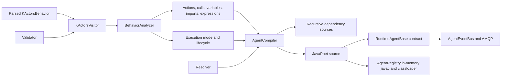

# k.Actors agent compiler

This document describes the current k.Actors analysis and Java source-generation pipeline in
`klab-services`. It is intended for contributors working on semantic validation, component and
behavior resolution, Java actor integration, generated code, or the runtime execution model.

For the language itself, see [AGENTS.md](AGENTS.md). The parsed model contracts are
`KActorsBehavior`, `KActorsAction`, `KActorsStatement`, and `KActorsValue` in `klab.core.api`.

## 1. Scope and current status

`AgentCompiler` accepts an already parsed `KActorsBehavior` and generates a Java source file for a
final class backed by `RuntimeAgentBase`. Parsing is outside the compiler: syntax must already be
correct, but semantic errors may still prevent generation.

The current pipeline implements:

- semantic traversal, lexical scopes, diagnostics, and compiler indexes;
- function/supplier/emitter inference, including transitive local and external calls;
- finite versus persistent lifecycle inference;
- recursive source generation for imported k.Actors behaviors;
- lookup of Java actor descriptors and reflective implementations through `ComponentRegistry`;
- JavaPoet generation of fields, constructors, actions, `main`, and a minimal CLI;
- Groovy expression fields and contextual evaluation;
- control flow, assignments, returns, firing, matching, assertions, and text;
- supplier and emitter event handlers;
- `then` barriers for one reactive call or all reactive calls in a preceding group;
- bidirectional AMQP lifecycle and custom-message routing by agent URN;
- generated `@handle(CONSTANT)` dispatch, including inherited handlers and sender reply handles;
- reflective invocation of generated actions and Java actor verbs.

`AgentCompiler.compile()` performs semantic analysis and Java source generation. `AgentRegistry`
then compiles all generated sources in memory and loads them into the running JVM. Several parts of
descriptor-driven Java integration and runtime mediation remain deliberately simple; they are
listed in [Section 12](#12-known-gaps-and-future-work).

## 2. Pipeline overview



The stages are intentionally separate:

1. A resources service or test harness parses and adapts a `.kactor` file into a
   `KActorsBehavior`.
2. `KActorsVisitor` validates the model, maintains lexical context, and records facts needed by
   compilation.
3. `BehaviorAnalyzer` owns the visitor result and determines the generated agent's effective
   execution mode and lifecycle.
4. `AgentCompiler` resolves imports and recursively generates dependency sources.
5. `AgentCompiler` emits the Java class through JavaPoet.
6. `AgentRegistry` compiles all generated sources in memory, loads the resulting classes, and
   instantiates the primary generated class.
7. The generated class delegates runtime behavior to `RuntimeAgentBase` and `AgentScope`.

## 3. Entry points and outputs

The main constructors are:

```java
new AgentCompiler(String behaviorUrn, UserScope scope)
new AgentCompiler(KActorsBehavior behavior, UserScope scope)
new AgentCompiler(KActorsBehavior behavior)
new AgentCompiler(behavior, scope, validator, resolver)
```

The URN constructor retrieves the behavior with:

```java
scope.getService(ResourcesService.class)
    .retrieve(behaviorUrn, KActorsBehavior.class, scope)
```

The full constructor is the integration entry point. It accepts:

- a parsed behavior;
- an optional `UserScope` for resource and component resolution;
- a `KActorsVisitor.Validator` for environment-dependent validation and classification;
- an `AgentCompiler.Resolver` for imported behaviors and Java actors.

After `compile()`:

- `getSourceCode()` returns the primary behavior's Java source;
- `getGeneratedSources()` returns the primary and recursively generated dependency sources keyed
  by behavior URN;
- `getNotifications()` returns analysis/compiler notifications;
- `getAgentExecutionMode()` returns `FUNCTION`, `SUPPLIER`, or `EMITTER`;
- `getLifecycle()` returns `FINITE` or `PERSISTENT`;
- `getQualifiedClassName()` returns the binary name needed by a class loader;
- `getGeneratedSource(urn)` consults the process-wide generated-source cache.

`AgentRegistry` calls `AgentCompiler.registerCompiledClass(...)` after successful class loading, so
the legacy `getCompiledClass(urn)` lookup is populated as well.

### 3.1 Runtime compilation and instances

`AgentRegistry.INSTANCE.getOrCreateAgent(...)` is the deployment entry point. It:

- resolves a behavior URN through `ResourcesService`, unless the caller already has the parsed
  behavior;
- caches successful classes and compilation failures by behavior URN, version, and creation
  timestamp;
- submits the primary and recursively generated sources to the JDK `JavaCompiler` in one task;
- retains bytecode in memory and loads it through a registry-owned class loader;
- invokes the generated
  `(KActorsBehavior, SessionScope, Map<String, Object>, Object...)` constructor;
- assigns a unique `<scope-id>:agent:<id>` URN and indexes the stopped instance by that URN;
- returns Java diagnostics as error notifications if class compilation or loading fails.

`INCLUDE_JAVA_CODE` includes generated source in the returned service handle.
`DO_NOT_COMPILE_JAVA` stops after source translation and validation and does not create a class or
instance. Explicitly stopped agents remove themselves from the instance registry; naturally
finished finite agents may remain available for inspection until `releaseAgent(urn)` is called.

## 4. Semantic analysis

### 4.1 Visitor context

`KActorsVisitor.KActorsContext` represents one lexical point. Child contexts retain:

- the current behavior and action;
- the parent context;
- the chain of upstream statements;
- the previous sibling statement;
- visible `VariableInfo` records;
- loop depth;
- the active validator.

Blocks copy their parent's variables. Frame assignments become visible to following siblings in
the same block and to nested blocks, but do not escape their group. Match captures and loop
variables are introduced only in their nested body. Actor fields are collected from actor-scoped
assignments in `init` before actions are visited, so state references can be validated throughout
the behavior.

The visitor attaches lexical context to its diagnostics using the statement offsets and lengths in
the parsed model. This lets services and IDEs position errors on the original source.

### 4.2 Compiler records

The visitor exposes immutable records consumed by the analyzer and compiler:

| Record | Purpose |
| --- | --- |
| `ActionInfo` | Declared action, parameters, direct returns/fires, directly or transitively called execution types, and effective type. |
| `ImportInfo` | Import declaration, local alias, behavior/actor URN, and optional Java class slot. |
| `CallInfo` | Exact verb syntax bean, receiver, verb, containing action, arguments, visible variables, classified type, and whether a value is required. |
| `VariableInfo` | Variable declaration, name, inferred value type, and source actor/verb for matched values. |
| `ExpressionInfo` | Expression value and variables visible where it appears. |

`AgentCompiler` indexes calls and expression fields with `IdentityHashMap`. Identity is important:
two syntactically equal calls or expressions in different source locations can require different
classification, scope, or generated fields.

### 4.3 Validation extension point

`KActorsVisitor.Validator` separates model-level validation from checks that need services,
components, or language processors. Its methods are:

```java
Verb.Type classifyActionCall(Verb verb, KActorsContext context)
List<Notification> validateBehavior(KActorsBehavior behavior, KActorsContext context)
List<Notification> validateImport(KActorsBehavior.Import imported, KActorsContext context)
List<Notification> validateAction(KActorsAction action, KActorsContext context)
List<Notification> validateAssignment(Assignment assignment, KActorsContext context)
List<Notification> validateVerbCall(Verb verb, KActorsContext context)
List<Notification> validateArguments(Verb verb, Arguments arguments, KActorsContext context)
List<Notification> validateExpression(Expression.Descriptor expression, KActorsContext context)
```

`classifyActionCall` must return the **effective** type of an external or inherited target. For
example, an imported action that contains no `fire` itself but calls an emitter must still classify
as `EMITTER`. The classification affects legal value positions, match actions, containing action
types, generated invocation methods, and actor lifecycle.

`LenientValidator` accepts all environment-dependent constructs and classifies otherwise unknown
calls as functions. It is useful for syntax-focused tests, but production compilation should use a
validator backed by behavior resources, component descriptors, expression services, and argument
prototypes.

### 4.4 Action type inference

The visitor initially counts direct statements:

- any `fire` makes the action an emitter;
- a `return` inside a match handler makes an otherwise non-emitting action a supplier;
- ordinary synchronous returns leave the action a function.

It then classifies every call and computes a fixed point over local call edges. The effective type
precedence is:

```text
EMITTER > SUPPLIER > FUNCTION
```

Thus emitter behavior propagates through any number of local calls. Supplier behavior propagates
unless an emitter is also reachable. The final effective type is written back to
`KActorsAction.setActionType(...)`; source generation relies on that value for Java method shape.

An emitter may contain a reactive valued `return`. It remains an emitter; the value is an exit code
for terminating scheduled emission and disposing listeners.

### 4.5 Agent execution mode and lifecycle

`BehaviorAnalyzer` combines the effective types of `init` and `main`. If there is no `main`, actor
types such as behavior, application, user, and component default to emitter mode so they remain
available. The inferred lifecycle is currently:

| Effective mode | Lifecycle |
| --- | --- |
| `FUNCTION` | `FINITE` |
| `SUPPLIER` | `FINITE` |
| `EMITTER` | `PERSISTENT` |

`BehaviorAnalyzer.agentClass` currently remains `RuntimeAgentBase.class`. Selecting specialized
bases such as `ScriptBase`, `TestCaseBase`, or `ApplicationBase` is an open extension point.

## 5. Import and actor resolution

### 5.1 Resolver contract

`AgentCompiler.Resolver` has two independent methods:

```java
KActorsBehavior resolveBehavior(String urn, UserScope scope)
ResolvedActor resolveActor(String urn, UserScope scope)
```

The default `resolveBehavior` retrieves through `ResourcesService`; the default `resolveActor`
returns `null`. Resolution tries a Java actor first, then a k.Actors behavior.

`ResolvedActor` contains:

- an `Extensions.ActorDescriptor` suitable for validation and serialization;
- a map from verb names to non-serializable `ComponentRegistry.ServiceImplementation` objects.

The latter holds the actual implementation class, global instance, constructor, wrapping instance,
and reflective method.

### 5.2 Component-backed resolver

`AgentCompiler.componentResolver(registry)` adapts a `ComponentRegistry` by calling:

```java
registry.getActorDescriptors(urn, null)
registry.implementation(functionDescriptor)
```

It currently selects the first descriptor returned for the latest compatible component and maps
each implementation under both its fully qualified service name and its final name segment. The
first implementation class found becomes `ResolvedActor.implementationClass()`.

This adapter is a starting point, not final overload resolution. A production validator/resolver
should agree on the exact actor descriptor and verb overload selected for each call.

### 5.3 Recursive behavior dependencies

For an imported k.Actors behavior, the compiler:

1. resolves its `KActorsBehavior`;
2. prevents recursion using the URNs in the current resolution path;
3. creates another `AgentCompiler` with the same scope, validator, and resolver;
4. analyzes it and recursively resolves its imports;
5. generates its Java source;
6. merges all dependency sources into `getGeneratedSources()`.

The path set prevents infinite recursion, but dependency cycles are currently skipped rather than
reported or linked through a formal dependency graph.

### 5.4 Runtime import binding

Every import becomes an `Object actor_<alias>` field. Constructor initialization uses one of two
strategies:

- a resolved Java actor stores its implementation `Class`, which supports static verbs;
- otherwise `resolveImportedActor(urn, alias, importedActors)` checks explicit bindings first by
  alias and then by URN.

An unresolved binding is represented by `RuntimeAgentBase.UnresolvedActor` and fails only when a
verb is invoked. This allows generated source to exist before its deployment environment supplies
all actors.

Recursively generating an imported behavior's source does not yet automatically instantiate that
generated dependency or inject it into the importing actor.

## 6. Generated class structure

Generated classes are placed in:

```text
org.integratedmodelling.klab.runtime.kactors.generated
```

The class name is the behavior URN converted to upper camel case. It is `public final` and currently
extends the analyzer's selected base, normally `RuntimeAgentBase`.

### 6.1 Fields and constructors

The compiler emits:

- one final `Expression` field per distinct expression syntax bean;
- one final `Object` field per import alias;
- a no-argument constructor;
- a `(SessionScope, Object... initArguments)` constructor;
- a full `(KActorsBehavior, SessionScope, Map<String,Object> importedActors,
  Object... initArguments)` constructor.

The full constructor:

1. calls `super(behavior, scope)`;
2. compiles expression fields with `compileExpression(source)`;
3. resolves imported actor fields;
4. invokes `init` according to its effective type.

A function `init` runs synchronously. A supplier `init` is joined. An emitter `init` is started and
left active.

### 6.2 Action methods

Each action becomes a private method named `action_<sanitized-name>`:

```java
private Object action_function(AgentScope scope, Object... arguments)
private CompletableFuture<Object> action_supplier(AgentScope scope, Object... arguments)
private void action_emitter(AgentScope scope, Object... arguments)
```

Arguments are bound into a frame map. Supplier actions create an `actionResult` future. If control
can reach the end, functions return `VOID_VALUE` and suppliers return their still-live result
future. The current `definitelyReturns` analysis recognizes terminal `return`/`fail`, terminal
groups, and fully covered `if`/`else if`/`else` branches.

Generated action dispatch currently uses reflection in `invokeGeneratedAction`, which searches for
the private `action_<name>` method through the class hierarchy.

### 6.3 Generated `main` and CLI

The generated `main(AgentScope)` delegates to the k.Actors `main` action:

- functions return an `ExitValue` immediately;
- suppliers attach completion to the root scope and return `TASK_RUNNING`;
- emitters start and return `TASK_RUNNING`.

`getAgentExecutionMode()` returns the analyzer's inferred mode. `RuntimeAgentBase.run()` executes a
function directly and starts non-functions on a virtual thread.

Persistent agents receive a minimal CLI with `start`, `stop`, and `status`. Finite agents construct
the actor with CLI strings as `init` arguments and invoke it once.

### 6.4 Agent-message handler generation

For each action annotated with `@handle`, `AgentCompiler` reads the annotation's named `class`
argument first and otherwise its main unnamed argument. The value must be a
`KActorsValue.Type.CONSTANT`; invalid or missing values produce a compiler warning and do not
install a handler.

Generated classes override:

```java
protected Map<String, RuntimeAgentBase.AgentMessageHandler> agentMessageHandlers()
```

The map key is the constant's string value. Each descriptor records the generated action name,
effective `Verb.Type`, and declared argument names. The generated map starts with superclass
handlers, merges retained inherited-behavior delegates in declaration order with `putIfAbsent`,
then inserts local handlers with `put`. Consequently local handlers override inherited ones and
the first inherited behavior wins inherited collisions.

Inherited handlers target the actual inherited behavior instance, not the outer agent. This is
required to preserve inherited initialization and actor state. The outer agent retains those
delegates and stops and disposes them with its own lifecycle.

## 7. Statement generation

| k.Actors statement | Current Java strategy |
| --- | --- |
| Verb call | Select function/supplier/emitter invocation from `CallInfo`; reactive calls install event handlers. |
| Frame assignment | Put the evaluated value in the current frame map. |
| Actor assignment | Put the value in the root `AgentScope`. |
| `return` | Return normally, complete a supplier future, or terminate a reactive/emitter scope with an exit value. |
| `fire` | Call `AgentScope.doFire(value)`. |
| Group | Copy the current frame and emit child statements against it. |
| `if` / `else if` / `else` | Evaluate through `truthy(...)` and emit Java branches. |
| `while` / `do while` | Emit Java loops using a value or verb condition. |
| `for` | Convert with `asIterable(...)`, bind the optional loop variable, and emit the body. |
| `break` | Emit Java `break`. |
| `fail` | Throw `KlabActorException`. |
| Text | Delegate to `handleText(...)`, currently printing to the action scope writer. |
| Assertion | Evaluate an expression or the last call and delegate to `assertValue(...)`. |

Metadata, tags, and annotations are traversed and validated but generally do not yet affect emitted
Java.

## 8. Reactive calls, matching, and `then`

### 8.1 Event scopes

A supplier or emitter statement is generated as:

1. `onEvent(parentScope, handler, RETURN/FIRE, EXCEPTION)` creates a child `AgentScope` with a unique
   action ID and subscribes to the shared Reactor sink;
2. `runSupplier(...)` starts a `CompletableFuture` source, translating completion into `RETURN`;
3. or `runEmitter(...)` starts the Java emitter on a virtual thread and listens for `FIRE`;
4. the event bus filters events by child action ID;
5. termination disposes the subscription and registered resources.

Supplier futures are cancelled when their action scope is disposed. Emitter code is expected to
register or observe scope termination for its own scheduled resources.

### 8.2 Match handlers

The compiler emits an ordered `if`/`else if` chain using:

```java
matches(payload, ValueType, criterion, exclusive)
```

A successful match creates a child frame, binds positional variables and `captureAs`, and executes
the match body in reactive context. `bindMatch` destructures lists and arrays and fills missing
positions with `null`.

Implemented runtime categories include catch-all/truthy, no-data, empty, error, regular expression,
class/type, list/set membership, and equality. Some corresponding literal criteria are not yet
fully mediated into runtime objects; see Section 12.

### 8.3 Sequential barriers

A statement marked `then` causes the compiler to place the wait on its preceding statement. Each
preceding reactive call receives a `CompletableFuture<Void>` signal. The signal completes only
after the matching handler has run; a reactive `return` still executes the generated `finally`
block. Exceptions complete the signal exceptionally.

For a preceding group, the compiler collects signals from all reactive calls in that group,
including nested groups, and emits:

```java
awaitReactions(reaction_1, reaction_2, ...);
```

This delegates to `CompletableFuture.allOf(...).join()`. Calls that are only created later inside a
match handler, conditional branch, or loop body are not incorrectly added to the enclosing group's
barrier.

For emitters, the first `FIRE` releases the signal; the emitter may continue firing afterward. For
suppliers, `RETURN` releases it. A `then` without a preceding call/group carrying match actions is
reported as a warning by the visitor.

## 9. Expressions, values, and frames

Every expression is compiled once in the generated constructor. `RuntimeAgentBase.compileExpression`
currently uses `GroovyProcessor` and the Groovy language ID. Evaluation passes the current context
or session scope plus the current frame map.

Value emission currently distinguishes:

- Java literals for strings, booleans, characters, and numeric primitives;
- frame/root lookup through `resolveIdentifier`;
- compiled expression evaluation;
- `null` for no-data/empty and wildcard match values;
- `literalValue(type, encoded)` for quantities, ranges, observables, localized strings, ternaries,
  and other non-POD values.

`literalValue` currently returns the encoded string. It is a deliberate runtime extension point for
language-aware mediation.

Frames are `LinkedHashMap<String,Object>` instances:

- action arguments create the initial frame;
- groups and match actions copy it with `childFrame`;
- identifier lookup checks the frame, then root actor state;
- `self` resolves to the generated agent.

## 10. Invocation and parameter matching

### 10.1 Generated k.Actors actions

Generated actions accept positional `Object...` arguments. `bindArguments` maps them to declared
action parameter names in order. A single `Map` argument is treated as named bindings. Missing
arguments become `null`; the current binder does not reject extra positional arguments.

The compiler currently serializes `verb.getArguments().values()` into an `Object[]`. This preserves
the parameter container's value iteration order but does not emit the original named keys or call
metadata. A production validator can diagnose bad calls, but full named/default argument transport
still needs generation support.

### 10.2 Java actors

External calls use one of:

```java
invokeFunction(actor, verb, scope, arguments)
invokeSupplier(actor, verb, scope, arguments)
invokeEmitter(actor, verb, scope, arguments)
```

At runtime, Java method selection:

1. scans public methods;
2. uses `@Verb.name()` when present, otherwise the Java method name;
3. requires a static method when the actor binding is a `Class`;
4. tries to prepare the supplied arguments;
5. selects the first compatible method.

Argument preparation:

- injects the current scope into any `RuntimeAgent.Scope` parameter without consuming a source
  argument;
- consumes remaining source arguments positionally;
- packs remaining arguments into a Java varargs array;
- accepts `null` or already assignable objects;
- converts numeric wrappers to primitive numeric targets;
- accepts booleans for primitive `boolean`;
- converts strings to enum constants;
- converts any non-null value to `String` with `toString()`.

The execution shape is normalized by the invocation wrapper:

- functions join an accidentally returned future;
- suppliers accept a `CompletableFuture`, or wrap a plain value in a completed future;
- emitters ignore the Java return and are expected to call `scope.doFire(...)`.

This reflection path is intentionally permissive and is not yet the final descriptor-selected
parameter matcher.

### 10.3 Constructor and `new` matching

`Extensions.ActorDescriptor` and `FunctionDescriptor` can describe Java actors and verbs, while
`ComponentRegistry.ServiceImplementation` can carry constructors and instances. However, the
compiler currently binds a resolved Java actor as its implementation `Class`. It does not yet:

- enforce or invoke a `new` verb for actors with non-static verbs;
- select and invoke actor constructors;
- preserve per-instance actor state;
- match named/default arguments from `ServiceInfo`;
- split compound values such as `Quantity` into separate value/unit parameters;
- use the validator's selected overload directly at runtime.

These should be implemented as one descriptor-driven matching strategy shared by validation,
construction, and invocation, rather than by adding more independent reflection heuristics.

## 11. Relevant runtime and component APIs

The generated source relies most heavily on these protected `RuntimeAgentBase` methods:

| API | Role |
| --- | --- |
| `compileExpression`, `evaluateExpression` | Compile immutable expression fields and evaluate in scope/frame. |
| `bindArguments`, `childFrame`, `resolveIdentifier`, `setActorState` | Maintain action, group, match, and actor state. |
| `literalValue`, `truthy`, `asIterable` | Mediate values used by expressions and control flow. |
| `matches`, `bindMatch` | Implement reactive pattern selection and local captures. |
| `invokeSelfFunction/Supplier/Emitter` | Dispatch generated actions. |
| `invokeFunction/Supplier/Emitter` | Dispatch imported behaviors or Java actors. |
| `resolveImportedActor` | Accept deployment-provided actor bindings. |
| `onEvent`, `runSupplier`, `runEmitter` | Install and run reactive calls. |
| `completeReaction`, `awaitReactions` | Implement `then` first-value barriers. |
| `handleText`, `assertValue` | Extension hooks for text/application output and assertions. |

The component side exposes:

| API/type | Role |
| --- | --- |
| `ComponentRegistry.getActorDescriptors(urn, version)` | Retrieve serializable Java actor descriptions. |
| `ComponentRegistry.implementation(FunctionDescriptor)` | Retrieve reflective classes, instances, constructors, and methods. |
| `Extensions.ActorDescriptor` | Actor URN, version, description, Java class name, and verb descriptors. |
| `Extensions.FunctionDescriptor` | Service prototype and static/call-style information. |
| `ComponentRegistry.ServiceImplementation` | Non-serializable implementation details retained by the live registry. |

`CoreActorLibrary` contains small examples of all three execution shapes: console functions, timer
suppliers returning `CompletableFuture`, and timer emitters calling `RuntimeAgent.Scope.doFire`.

### 11.1 Agent messaging architecture

All agent traffic has `Message.MessageClass.AgentCommunication`. Its currently supported
`MessageType` values are:

| Type | Direction and payload |
| --- | --- |
| `AgentStartRequested` | Handle or agent to runtime peer; no payload. |
| `AgentStopRequested` | Handle or agent to runtime peer; no payload. |
| `AgentStatusRequested` | Handle or agent to runtime peer; no payload. |
| `AgentStarted` | Runtime peer to subscribers; `RuntimeAgent.Status`. |
| `AgentStopped` | Runtime peer to subscribers; `RuntimeAgent.Status`. |
| `AgentStatusChanged` | Runtime peer to subscribers; `RuntimeAgent.Status`. |
| `AgentFailed` | Runtime peer to subscribers; `RuntimeAgent.Status`. |
| `CustomAgentMessage` | Either direction; `RuntimeAgent.CustomMessage`. |

`RuntimeAgent.Status` carries the agent URN, lifecycle state, viability, optional detail, and
timestamp. `RuntimeAgent.CustomMessage` carries a mandatory `Constant` discriminator, a
serializable payload, and the sender-side payload class name used only as a mediation hint.

`AgentEventBus.INSTANCE` lives in `klab.core.common`, where both clients and services can use it.
It owns all live transport state so that `AgentImpl` remains a serializable data object. A
transport is keyed by federation ID, broker, and agent URN. Multiple local handles subscribe by
URN and object identity to one transport; unsubscribing the last owner closes that transport.

`AMQPChannel.forAgent(...)` creates the symmetric agent channel. Agent exchanges are addressed by
URN, and each receiving peer uses a transient queue. A sender-only transport avoids creating a
consumer until a subscription requires one. This avoids routing all agents through a shared queue
and then filtering high-volume traffic after reception. Both service agents and client handles may
publish and receive; the asymmetric sender/receiver convention used by ordinary service scopes
does not restrict agent channels.

Publications accept separate sender and recipient URNs. The event bus rebuilds the message
envelope with the selected sender identity before local or AMQP delivery, so a payload cannot
override its source by supplying a forged dispatch ID. The sender's connected federation selects
the destination transport.

`AgentRegistry` calls `RuntimeAgentBase.initializeMessaging(...)` only after assigning the
canonical instance URN. The method requires a creating scope that is a connected
`MessagingChannel`. Missing or disconnected messaging is not an agent-creation failure: it
returns `false` and adds an info notification to the returned agent. Explicit stop and registry
release close the runtime subscription.

### 11.2 Runtime dispatch and reply handles

`RuntimeAgentBase` consumes lifecycle requests directly. It publishes start, stop, status, and
failure reports as lifecycle changes occur. Client `AgentImpl` instances subscribe through
`connect(MessagingChannel)`, request current status after connecting, update their local status
from reports, and publish remote start, stop, and custom messages through the same bus.

At the public API boundary, use `Agent.tell(...)`. To target a language handler, construct the
custom envelope explicitly:

```java
agent.tell(
    new RuntimeAgent.CustomMessage(
        Constant.create("TEMPERATURE_CHANGED"), componentMessage));
```

Passing a `Constant` alone sends that discriminator with a null payload. Passing any other
serializable object directly uses the generic `message` discriminator, so it will not reach a
more specific `@handle(CONSTANT)` action. Extensions that already own sender and recipient URNs
may use `AgentEventBus.publish(senderUrn, recipientUrn, ...)` directly, but should normally prefer
the handle API so endpoint and source semantics remain centralized.

For `CustomAgentMessage`, the runtime looks up the exact constant string in
`agentMessageHandlers()`. A message without a matching language handler is emitted as an
`EXTERNAL` runtime event so lower-level extensions can still observe it. A matched handler runs on
a named virtual thread with a new action scope:

- the exact parameter name `sender` receives an `AgentImpl` targeting the incoming dispatch URN;
- all other parameters receive the mediated payload, including multiple unrecognized parameters;
- functions use `invokeSelfFunction`, suppliers use `invokeSelfSupplier`, and emitters use
  `invokeSelfEmitter`;
- handler failures complete the owning root scope exceptionally and therefore publish failure
  status.

The injected sender handle also stores the receiving agent's URN as its runtime-only source.
Calling `tell(...)` on it therefore replies to the original sender while preserving the current
agent as the new message source. This field is deliberately not serialized. Request correlation
and response-producing handlers are not installed yet, so `ask(...)` remains unsupported.

`RuntimeAgentBase.sendToScope(Message)` sends through the connected creating scope. It returns
`false` when no usable scope channel exists, matching the graceful agent-messaging fallback.

### 11.3 Custom payload mediation and extension safety

Jackson handles payload classes already configured in `JacksonConfiguration` normally. A custom
DTO carried through an `Object` property may instead arrive as a map. Components that define such
DTOs must register the concrete class on **both** communicating runtimes after the component is
loaded and before messages are exchanged:

```java
AgentEventBus.INSTANCE.registerPayloadType(MyComponentMessage.class);
```

The class must implement `Serializable`, be concrete, and be convertible by the configured Jackson
mapper. Prefer a stable bean or record schema with ordinary data properties. Keep the same binary
class name and compatible property contract on both peers.

The registry stores the supplied `Class` object, so a class loaded on demand by PF4J is mediated
with that component classloader. The receiver never calls `Class.forName` on the untrusted
`payloadClass` string. An unregistered advertised type is delivered as its decoded map with a
warning; a registered type that cannot be converted is likewise left as a map. The wire class name
is therefore a lookup hint, not authority to load or instantiate arbitrary code.

Extension payloads should be data only. Do not send `Class`, `ClassLoader`, reflective objects,
open resources, credentials, executable callbacks, or large/cyclic object graphs. Prefer scalar
values, lists, maps, or small versioned DTOs, and use distinct constants or explicit schema fields
when introducing incompatible revisions. Registration is currently process-wide and has no
component-unload invalidation hook, so hot replacement of a DTO class requires coordinated
component lifecycle handling.

This payload registry solves PF4J class identity for message rehydration. It does not yet make the
generated-source compiler's parent classloader and classpath fully component-aware; generated
agents that directly reference dynamically loaded implementation classes still require the
classloader work listed below.

### 11.4 Interactive console protocol

Interactive consoles use the same `CustomAgentMessage` transport and reserve these
`RuntimeAgent.ConsoleMessageType` constants:

| Constant | Purpose |
| --- | --- |
| `CONSOLE_ATTACH` | Mark the agent endpoint as having an interested console peer. |
| `CONSOLE_DETACH` | Remove that attachment. |
| `STDIN` | Carry one input line from the client to a generated action. |
| `STDOUT` | Carry one standard-output text chunk from the agent. |
| `STDERR` | Carry one standard-error text chunk from the agent. |

`AgentCompiler` translates an action annotation named `stdin` into an
`AgentMessageHandler` keyed by `STDIN`; it needs no constant argument. Dispatch, sender injection,
execution type, inheritance, failure handling, and override precedence are therefore identical to
ordinary `@handle` actions.

`RuntimeAgentBase` intercepts attach/detach and output constants before general language dispatch.
Input implicitly attaches the console and continues to the generated `STDIN` handler. The
`sendToConsole(...)` API accepts only `STDOUT` and `STDERR`, publishes from and to the canonical
agent URN, and returns false if messaging or console attachment is unavailable.

`CoreActorLibrary.Console` uses `sendToConsole(...)` for `print`, `println`, `format`/`printf`,
`error`, `errorln`, and `errorf`. Output is sent as already formatted text chunks, including line
terminators where appropriate, so transports and UIs must not add their own newline. If
`sendToConsole(...)` returns false, the implementation writes to the local agent writer or
`System.err`.

The common `AgentConsole` class is deliberately UI-neutral. It adds a runtime-only listener to
`AgentImpl`, sends attach/detach automatically, exposes `sendLine` and `onOutput`, and can run a
blocking stream-based terminal. It does not own the agent lifecycle or its AMQP connection.
JavaFX or other UI peers must marshal output callbacks to their UI thread and close listener
subscriptions when changing targets.

## 12. Known gaps and future work

The following items are either explicit TODOs or incomplete integration boundaries.

### 12.1 Compilation and deployment

- Extend cache identity beyond URN, version, and behavior timestamp when validator, worldview,
  component-set, or component-classloader changes must invalidate a class.
- Instantiate and wire recursively generated behavior imports.
- Detect and report dependency cycles and unresolved imports consistently.
- Carry initialization arguments into construction. The registry constructor seam is ready, but
  `Agent.start(Object...)` currently warns when arguments are supplied after construction.

### 12.2 Class and behavior composition

- Select specialized runtime bases for scripts, tests, applications, and other behavior types.
- Generalize inherited action/state composition beyond the retained delegates currently used for
  `@handle` actions.
- Decide how imported behavior versions are selected.
- Complete actor URL, correlated ask/reply, rich failure details, and retained finite-agent
  event-bus cleanup semantics.

### 12.3 Java actor resolution

- Make the validator return or record the exact selected actor/verb descriptor, not only its type.
- Support overload selection from `ServiceInfo` argument prototypes.
- Implement non-static actor construction and the `new` contract.
- Reuse `ServiceImplementation.mainClassInstance`, `constructor`, `wrappingClassInstance`, and
  `method` instead of reducing an actor to an implementation class.
- Complete component verb descriptors: argument, return, fire, and execution-type metadata are
  still partially marked TODO in `ComponentRegistry`.
- Add quantity/unit, geometry, observable, scope, and service-specific parameter mediation.
- Make the generated-code compiler and cache component-classloader aware. Custom message DTO
  mediation is PF4J-safe through explicit class registration, but direct generated references are
  a separate classloading boundary.

### 12.4 Generated language semantics

- Preserve named call arguments, defaults, and argument metadata in generated invocations.
- Mediate non-POD values in `literalValue` instead of returning encoded strings.
- Compile regular expressions, class/type criteria, semantic observables, annotations, ranges,
  quantities, localized strings, ternaries, lists, maps, and deferred values to their definitive
  runtime forms.
- Expand match semantics where semantic or component services are required.
- Apply statement metadata, tags, and annotations to runtime/application behavior.
- Implement assertion call chains and richer assertion operators rather than evaluating only the
  last call and a simple truth/equality check.
- Decide whether assertions should be omitted outside test builds.
- Improve control-flow termination analysis beyond the current conservative `definitelyReturns`.
- Replace generated-action reflection with direct calls or generated dispatch where appropriate.

### 12.5 Error handling

- Fill in `ExitValue.failure(...)` with the actual error code/message/payload contract.
- Route errors to the narrowest available action scope and preserve causality across reactor
  boundaries.
- Define whether handled `EXCEPTION` match actions may release a `then` barrier normally or whether
  all exception events must remain exceptional. The current barrier propagates them.
- Surface recursive dependency compiler notifications uniformly, including resolver failures.

## 13. Extension patterns

### Add component-aware validation

Implement `KActorsVisitor.Validator` and use the current `KActorsContext` to:

1. resolve an import or inherited action;
2. select a descriptor and overload;
3. validate positional/named arguments and match patterns;
4. return the target's effective `Verb.Type` from `classifyActionCall`;
5. retain the selection in a resolver-owned index if code generation needs it later.

The validator should emit `Notification` objects rather than throwing for user-code errors.

### Add another resolution source

Implement `AgentCompiler.Resolver`. A resolver may consult a workspace catalog, remote resource
service, component registry, test map, or precompiled actor catalog. Keep behavior resolution and
Java actor resolution independent so their precedence remains explicit.

### Add a statement translation

Add the model to the visitor's exhaustive switch and validation traversal first. Then add a case to
`AgentCompiler.emitStatement`, emit through JavaPoet `CodeBlock`, and provide any runtime primitive
as a protected `RuntimeAgentBase` method. Add both a model-level unit test and a real `.kactor`
fixture when parser adaptation is involved.

### Add a value or matching category

Keep source serialization in `AgentCompiler.value(...)` small and move environment-sensitive
construction into `RuntimeAgentBase.literalValue(...)` or a more specific runtime hook. Extend
`matches(...)` only after defining the runtime representation produced by the literal mediator.

### Add a compiler backend

The in-memory backend is implemented by `AgentRegistry`. Backend extensions should preserve its
single-task compilation of all `getGeneratedSources()` entries and atomic result caching. Likely
extensions are mapping Java diagnostics back to original k.Actors lexical locations and choosing a
component-aware parent classloader when imported Java actors come from plug-ins.

## 14. Tests and development workflow

`BehaviorAnalyzerTest` constructs syntax beans directly and covers validation, type propagation,
lifecycle, source generation, recursive imports, Java source compilation, reactive handlers,
generated `@handle` metadata and inheritance, and group `then` barriers.

`AgentRegistryTest` performs the full source-to-bytecode-to-instance round trip and covers class
reuse, canonical URN lookup, stop-time deregistration, and source-only translation.

`RuntimeAgentBaseTest` covers event routing, scope disposal, supplier completion, nested emitter
relay, execution lifecycle, lifecycle message types, disconnected messaging, custom payload
mediation and handler dispatch, reflective Java actor calls, and the all-reactions barrier.

Run the focused core suite with:

```powershell
.\mvnw.cmd -pl klab.core.services '-Dtest=BehaviorAnalyzerTest,RuntimeAgentBaseTest' test
```

Real parser/adaptation coverage belongs in `klab.services.resources`. `KActorsFileTest` is an
extensible dynamic test suite backed by `.kactor` resources and `KActorsTestSupport`; it keeps
parser, adaptation, and analysis diagnostics separate. Run it with:

```powershell
.\mvnw.cmd -pl klab.services.resources -Dtest=KActorsFileTest test
```

`BehaviorTranslator` remains a useful manual round-trip smoke test: it parses a real resource,
adapts it, analyzes it, invokes `AgentCompiler`, and prints the generated Java source.

When extending the compiler, prefer tests at both levels:

1. a syntax-bean unit test for precise analyzer/compiler behavior;
2. a real `.kactor` fixture when grammar-to-bean adaptation matters;
3. a runtime test when event ordering, lifecycle, reflection, or parameter mediation changes.
