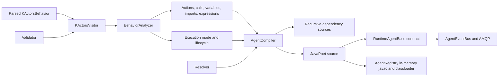

# k.Actors agent compiler

This document describes the current k.Actors analysis and Java source-generation pipeline in
`klab-services`. It is intended for contributors working on semantic validation, component and
behavior resolution, Java actor integration, generated code, or the runtime execution model.

For the language itself, see [AGENTS.md](../AGENTS.md). The parsed model contracts are
`KActorsBehavior`, `KActorsAction`, `KActorsStatement`, and `KActorsValue` in `klab.core.api`.

## 1. Scope and current status

`AgentCompiler` accepts an already parsed `KActorsBehavior` and generates a Java source file for a
final class backed by `RuntimeAgentBase`. Parsing is outside the compiler: syntax must already be
correct, but semantic errors may still prevent generation.

The current pipeline implements:

- semantic traversal, lexical scopes, diagnostics, and compiler indexes;
- function/supplier/emitter inference, including transitive local and external calls;
- finite versus persistent lifecycle inference;
- recursive source generation for imported k.Actors behaviors;
- lookup of Java actor descriptors and reflective implementations through `ComponentRegistry`;
- JavaPoet generation of fields, constructors, actions, `main`, and a minimal CLI;
- Groovy expression fields and contextual evaluation;
- control flow, assignments, returns, firing, matching, assertions, and text;
- supplier and emitter event handlers;
- `then` barriers for one reactive call or all reactive calls in a preceding group;
- bidirectional AMQP lifecycle and custom-message routing by agent URN;
- generated `@handle(CONSTANT)` dispatch, including inherited handlers and sender reply handles;
- reflective invocation of generated actions and Java actor verbs.

`AgentCompiler.compile()` performs semantic analysis and Java source generation. `AgentRegistry`
then compiles all generated sources in memory and loads them into the running JVM. Several parts of
descriptor-driven Java integration and runtime mediation remain deliberately simple; they are
listed in [Section 12](#12-known-gaps-and-future-work).

## 2. Pipeline overview



The stages are intentionally separate:

1. A resources service or test harness parses and adapts a `.kactor` file into a
   `KActorsBehavior`.
2. `KActorsVisitor` validates the model, maintains lexical context, and records facts needed by
   compilation.
3. `BehaviorAnalyzer` owns the visitor result and determines the generated agent's effective
   execution mode and lifecycle.
4. `AgentCompiler` resolves imports and recursively generates dependency sources.
5. `AgentCompiler` emits the Java class through JavaPoet.
6. `AgentRegistry` compiles all generated sources in memory, loads the resulting classes, and
   instantiates the primary generated class.
7. The generated class delegates runtime behavior to `RuntimeAgentBase` and `AgentScope`.

## 3. Entry points and outputs

The main constructors are:

```java
new AgentCompiler(String behaviorUrn, UserScope scope)
new AgentCompiler(KActorsBehavior behavior, UserScope scope)
new AgentCompiler(KActorsBehavior behavior)
new AgentCompiler(behavior, scope, validator, resolver)
```

The URN constructor retrieves the behavior with:

```java
scope.getService(ResourcesService.class)
    .retrieve(behaviorUrn, KActorsBehavior.class, scope)
```

The full constructor is the integration entry point. It accepts:

- a parsed behavior;
- an optional `UserScope` for resource and component resolution;
- a `KActorsVisitor.Validator` for environment-dependent validation and classification;
- an `AgentCompiler.Resolver` for imported behaviors and Java actors.

After `compile()`:

- `getSourceCode()` returns the primary behavior's Java source;
- `getGeneratedSources()` returns the primary and recursively generated dependency sources keyed
  by behavior URN;
- `getNotifications()` returns analysis/compiler notifications;
- `getAgentExecutionMode()` returns `FUNCTION`, `SUPPLIER`, or `EMITTER`;
- `getLifecycle()` returns `FINITE` or `PERSISTENT`;
- `getQualifiedClassName()` returns the binary name needed by a class loader;
- `getGeneratedSource(urn)` consults the process-wide generated-source cache.

`AgentRegistry` calls `AgentCompiler.registerCompiledClass(...)` after successful class loading, so
the legacy `getCompiledClass(urn)` lookup is populated as well.

### 3.1 Runtime compilation and instances

`AgentRegistry.INSTANCE.getOrCreateAgent(...)` is the deployment entry point. It:

- resolves a behavior URN through `ResourcesService`, unless the caller already has the parsed
  behavior;
- accepts the same `KActorsVisitor.Validator` and `AgentCompiler.Resolver` used by direct compiler
  calls, and uses them for both source-only translation and class compilation;
- caches successful classes and compilation failures by behavior URN, version, maintained
  last-update timestamp, source SHA-256 fingerprint, and compiler-environment identity;
- submits the primary and recursively generated sources to the JDK `JavaCompiler` in one task;
- retains bytecode in memory and loads it through a registry-owned class loader;
- invokes the generated
  `(KActorsBehavior, SessionScope, Observation, Scope, Map<String, Object>, Object...)`
  constructor, where the separate `Scope` is the exact creation scope;
- assigns a globally unique
  `<scope-id>:agent:<runtime-incarnation-uuid>:<sequence>` URN and indexes the stopped instance by
  that URN; the incarnation UUID prevents endpoint reuse after a service restart or across runtime
  JVMs;
- returns Java diagnostics as error notifications if class compilation or loading fails.

`INCLUDE_JAVA_CODE` includes generated source in the returned service handle.
`DO_NOT_COMPILE_JAVA` stops after source translation and validation and does not create a class or
instance. Explicitly stopped agents remove themselves from the instance registry; naturally
finished finite agents may remain available for inspection until `releaseAgent(urn)` is called.

`AgentCompiler.runtimeEnvironment(componentRegistry, scope)` builds the production pair used by
`RuntimeService`. Its resolver combines scope-visible k.Actors resources with actors and reflective
implementations from the live component registry. Its validator uses the same environment to
validate imports and classify imported k.Actors actions and Java verbs. `RuntimeService` retains a
stable environment per scope identity so the registry cache can safely distinguish it from
lenient or caller-supplied environments.

When compilation represents or monitors an observation, `RuntimeService` selects that observation
before calling the registry. A `BEHAVIOR` or `TASK` may own the focused observation; other behavior
kinds and `DO_NOT_BIND_OBSERVATION` remain unbound. The runtime owns the actual `Observation`
object and exposes it through `RuntimeAgent.getObservation()`; serialized handles expose only its
ID.

Creation scope ownership is selected before compilation. `TASK` and `BEHAVIOR` retain the exact
authorized user, session, or context scope. A positive observation ID is accepted only for these
two kinds, requires a `ServiceContextScope`, and is resolved through that context's knowledge graph
before a child scope is focused on it. `SCRIPT`, `APPLICATION`, and `TESTCASE` instead receive a
new session traced from the requesting scope's root `ServiceUserScope`. That session is registered
before construction and released when the root agent scope terminates, including startup failure
and explicit stop. Source-only translation creates no dedicated session.

`USER` behaviors are moved to that same root `ServiceUserScope`, even when requested from a
session or context. `COMPONENT` and `TRAIT` are rejected by direct runtime creation; recursive
compilation and construction through imports or inheritance remain valid.

`RuntimeAgent.getCreationScope()` exposes the selected scope to Java implementations. It is
available during generated construction and `init`, not merely after messaging is connected.

## 4. Semantic analysis

### 4.1 Visitor context

`KActorsVisitor.KActorsContext` represents one lexical point. Child contexts retain:

- the current behavior and action;
- the parent context;
- the chain of upstream statements;
- the previous sibling statement;
- visible `VariableInfo` records;
- loop depth;
- the active validator.

Blocks copy their parent's variables. Frame assignments become visible to following siblings in
the same block and to nested blocks, but do not escape their group. Match captures and loop
variables are introduced only in their nested body. Actor fields are collected from actor-scoped
assignments in `init` before actions are visited, so state references can be validated throughout
the behavior.

The visitor attaches lexical context to its diagnostics using the statement offsets and lengths in
the parsed model. This lets services and IDEs position errors on the original source.

### 4.2 Compiler records

The visitor exposes immutable records consumed by the analyzer and compiler:

| Record | Purpose |
| --- | --- |
| `ActionInfo` | Declared action, immutable semantic annotations, parameters, direct returns/fires, directly or transitively called execution types, and effective type. |
| `ImportInfo` | Import declaration, local alias, behavior/actor URN, and optional Java class slot. |
| `CallInfo` | Exact verb syntax bean, receiver, verb, containing action, arguments, visible variables, classified execution/static types, produced-agent behavior URN, and whether a value is required. |
| `VariableInfo` | Variable declaration, name, inferred value type, produced-agent behavior URN, and producer-call provenance. |
| `ExpressionInfo` | Expression value and variables visible where it appears. |

`AgentCompiler` indexes calls and expression fields with `IdentityHashMap`. Identity is important:
two syntactically equal calls or expressions in different source locations can require different
classification, scope, or generated fields.

### 4.3 Validation extension point

`KActorsVisitor.Validator` separates model-level validation from checks that need services,
components, or language processors. Its methods are:

```java
Verb.Type classifyActionCall(Verb verb, KActorsContext context)
String classifyActionResultBehavior(Verb verb, KActorsContext context)
List<Notification> validateBehavior(KActorsBehavior behavior, KActorsContext context)
List<Notification> validateImport(KActorsBehavior.Import imported, KActorsContext context)
List<Notification> validateInheritance(
    KActorsBehavior.Import inheritedBehavior, KActorsContext context)
List<String> getHandledMessageClasses(String behaviorUrn, KActorsContext context)
List<Notification> validateAction(KActorsAction action, KActorsContext context)
List<Notification> validateAssignment(Assignment assignment, KActorsContext context)
List<Notification> validateAdaptation(
    KActorsCodeStatement statement,
    String behaviorUrn,
    VariableInfo sourceVariable,
    KActorsContext context)
List<Notification> validateBooleanAdaptation(
    KActorsCodeStatement statement,
    String behaviorUrn,
    VariableInfo sourceVariable,
    KActorsContext context)
List<Notification> validateIterableAdaptation(
    KActorsCodeStatement statement,
    String behaviorUrn,
    VariableInfo sourceVariable,
    KActorsContext context)
List<Notification> validateVerbCall(Verb verb, KActorsContext context)
List<Notification> validateArguments(Verb verb, Arguments arguments, KActorsContext context)
List<Notification> validateExpression(Expression.Descriptor expression, KActorsContext context)
```

`classifyActionCall` must return the **effective** type of an external or inherited target. For
example, an imported action that contains no `fire` itself but calls an emitter must still classify
as `EMITTER`. The classification affects legal value positions, match actions, containing action
types, generated invocation methods, and actor lifecycle.

`classifyActionResultBehavior` returns the behavior URN implemented by an agent produced by a
call, independently of function/supplier/emitter classification and staticity. A null result keeps
the value dynamically typed. `LenientValidator` accepts environment-dependent constructs and
leaves unknown calls and results unclassified. It is useful for syntax-focused tests, but
production compilation should use a validator backed by behavior resources, component
descriptors, expression services, and argument prototypes.

The runtime validator resolves every URN in an `inherits` clause and applies
`KActorsBehavior.Type.canInherit(...)`. A trait is valid for every child type; otherwise parent and
child types must match, with the additional allowance that USER and TASK may inherit BEHAVIOR.
Unresolved parents and incompatible types are compilation errors. The same validator is used
recursively, so the rule also applies throughout the inherited behavior graph. Its
`getHandledMessageClasses(...)` callback returns the custom message classes exposed by that graph.
When a local `@handle` action replaces one of them, the visitor warns unless the action also carries
`@override`.

All behavior graphs also have one implicit Java root, `core.agent`, supplied by
`CoreActorLibrary.Agent`. The compiler maintains a built-in descriptor for it so the contract is
available even before component-catalog discovery, while the normal component scan also advertises
it as a Java actor. This creates a hybrid graph: any number of retained k.Actors parent delegates
may coexist below the Java root. Explicitly writing `inherits core.agent` is accepted but
redundant; other Java actors remain imports rather than direct parents. Self-call resolution checks
local actions, retained k.Actors parents in declaration order, and finally `core.agent`.
`RuntimeAgentBase.invokeGeneratedAction(...)` follows the same delegate order at execution time.
Local actions matching any inherited action, including the core verbs, produce an ordinary warning
unless annotated with `@override`.

For any statement with an adaptation clause, `sourceVariable` describes the value before
conversion, including its `ValueType`, source behavior identity, or producer call when known. The
runtime compiler environment first resolves the target as a `KActorsBehavior`, then delegates
adapter compatibility to `AgentCompiler.Resolver.validateBehaviorAdaptation(...)`. Conditions and
iterables additionally invoke `validateBooleanAdaptation(...)` or
`validateIterableAdaptation(...)`, which in turn delegate to the corresponding resolver callback.
Error notifications prevent compilation. On a successful frame assignment its
`VariableInfo.agentUrn` is the target behavior URN, so subsequent calls are classified and
validated against that behavior. The assignment-specific validator overload remains as a
compatibility bridge for extensions compiled against the earlier API.

The same variable typing is applied without adaptation when a producer declares its result
behavior. Parsed actions use `@return("URN")` or `@return(urn="URN")`; Java verbs use
`@Verb.producesAgent()`, copied into `FunctionDescriptor.behaviorUrn`. The behavior URN propagates
to frame assignments, function-backed `for` variables, and single match variables or explicit
match captures. Multiple tuple-destructuring variables remain untyped because one result URN
cannot describe each member. Calls without a declared result behavior retain their producer call
for runtime classification.

### 4.4 Action type inference

The visitor initially counts direct statements:

- any `fire` makes the action an emitter;
- a `return` inside a match handler makes an otherwise non-emitting action a supplier;
- ordinary synchronous returns leave the action a function.

It then classifies every call and computes a fixed point over local call edges. The effective type
precedence is:

```text
EMITTER > SUPPLIER > FUNCTION
```

Thus emitter behavior propagates through any number of local calls. Supplier behavior propagates
unless an emitter is also reachable. The final effective type is written back to
`KActorsAction.setActionType(...)`; source generation relies on that value for Java method shape.

An emitter may contain a reactive valued `return`. It remains an emitter; the value is an exit code
for terminating scheduled emission and disposing listeners.

### 4.5 Agent execution mode and lifecycle

`BehaviorAnalyzer` combines the effective types of `init` and `main`. If there is no `main`, actor
types such as behavior, application, user, and component default to emitter mode so they remain
available. The inferred lifecycle is currently:

| Effective mode | Lifecycle |
| --- | --- |
| `FUNCTION` | `FINITE` |
| `SUPPLIER` | `FINITE` |
| `EMITTER` | `PERSISTENT` |

`BehaviorAnalyzer.agentClass` selects `ScriptBase`, `TestCaseBase`, or `ApplicationBase` for
`SCRIPT`, `UNITTEST`, and `APP` respectively; other compilable types use `RuntimeAgentBase`. Each
specialized base owns a nested `AgentScope` subtype and overrides `initializeScope()`. Its
covariant `withId(...)` creates the same specialized type, retaining session and context bindings
in every derived action scope.

The root `RuntimeAgent.Scope` lifecycle is bracketed by two overridable hooks. `setup()` runs once
immediately before `main`; `dispose()` is registered as root-scope cleanup and runs once after
normal completion, failure, or explicit stop. A stop before start skips setup but still disposes
the scope. Derived scopes can use these hooks to install and clean up behavior-specific runtime
facilities.

Each generated action is similarly bracketed by `RuntimeAgent.Scope.beforeAction(name,
annotations)` and `afterAction(name, annotations)`. Parameter validation, frame binding, and
supplier-result allocation precede `beforeAction`; function and emitter instruction bodies are
enclosed in `try/finally`, so `afterAction` runs for normal completion, explicit returns, and
exceptions. Supplier actions register `afterAction` on their result future instead, so the hook
runs after the eventual reactive result or failure rather than merely after listener setup. The
annotations originate in `ActionInfo` and are resolved from the retained semantic behavior as an
immutable list. Inherited action methods resolve annotations against their retained inherited
behavior instance.

Immediately before reflective dispatch, `RuntimeAgentBase` derives a distinct `AgentScope` for
every k.Actors action invocation. `Scope.getCurrentAction()` is therefore stable for that
invocation, including when sibling actions execute concurrently, and the root scope reports no
current action. The derived scope retains the caller's event-correlation ID: a nested supplier or
emitter must still publish into the channel on which its caller installed match listeners. This
separates action-local bookkeeping without breaking `fire`, `return`, or reactor routing.

Runtime agent instances are non-reentrant. `RuntimeAgentBase.run()` rejects a second invocation and
also rejects starting a scope that has already terminated. Managed handles accept at most one
start and one stop; explicit stop removes the instance from `AgentRegistry`, and the old handle
cannot recreate or restart it.

## 5. Import and actor resolution

### 5.1 Resolver contract

`AgentCompiler.Resolver` separates resource/component lookup from adaptation policy:

```java
KActorsBehavior resolveBehavior(String urn, UserScope scope)
ResolvedActor resolveActor(String urn, UserScope scope)
List<Object> negotiateParameterMatch(
    List<Class<?>> unmatchedParameterTypes, List<?> suppliedParameters)
Object adaptToBehavior(
    String behaviorUrn, Object source, RuntimeAgent.Scope runtimeScope)
List<Notification> validateBehaviorAdaptation(
    KActorsBehavior target, VariableInfo source, UserScope scope)
List<Notification> validateBooleanAdaptation(KActorsBehavior target, UserScope scope)
List<Notification> validateIterableAdaptation(KActorsBehavior target, UserScope scope)
```

The default `resolveBehavior` retrieves through `ResourcesService`; the default `resolveActor`
returns `null`. Resolution tries a Java actor first, then a k.Actors behavior. The default
parameter negotiator also returns `null`, explicitly rejecting calls that cannot use the ordinary
positional matcher.

`ResolvedActor` contains:

- an `Extensions.ActorDescriptor` suitable for validation and serialization;
- a map from verb names to non-serializable `ComponentRegistry.ServiceImplementation` objects.
- the `ServiceImplementation` for the descriptor's optional `@AgentAdapter`.

The latter holds the actual implementation class, global instance, constructor, wrapping instance,
and reflective method.

### 5.2 Component-backed resolver

`AgentCompiler.componentResolver(registry)` adapts a `ComponentRegistry` by calling:

```java
registry.getActorDescriptors(urn, null)
registry.implementation(functionDescriptor)
registry.negotiateAgentParameters(unmatchedParameterTypes, suppliedParameters)
registry.invokeAgentAdapter(actorDescriptor, source, runtimeScope)
```

It currently selects the first descriptor returned for the latest compatible component and maps
each implementation under both its fully qualified service name and its final name segment. The
first implementation class found becomes `ResolvedActor.implementationClass()`. Component
discovery accepts one public, non-void `@AgentAdapter` method per actor. The method has exactly one
source parameter and at most one injectable `RuntimeAgent.Scope`; it may be static or instance
based. Runtime matching accepts assignable references and primitive/wrapper pairs. A returned
`CompletableFuture` is joined before the generated statement continues.

This adapter is a starting point, not final overload resolution. A production validator/resolver
should agree on the exact actor descriptor and verb overload selected for each call.

### 5.3 Recursive behavior dependencies

For an imported k.Actors behavior, the compiler:

1. resolves its `KActorsBehavior`;
2. prevents recursion using the URNs in the current resolution path;
3. creates another `AgentCompiler` with the same scope, validator, and resolver;
4. analyzes it and recursively resolves its imports;
5. generates its Java source;
6. merges all dependency sources into `getGeneratedSources()`.

The same recursive compilation is performed for a k.Actors URN referenced only by an `as` clause.
The dependency must expose one unary `@adapt` action. Generated construction registers that action
against the target URN; functions are invoked directly and suppliers are joined. Emitters and
duplicate adapters are rejected during behavior analysis.

The path set prevents infinite recursion, but dependency cycles are currently skipped rather than
reported or linked through a formal dependency graph.

### 5.4 Runtime import binding

Every import becomes an `Object actor_<alias>` field. Constructor initialization uses one of two
strategies:

- a resolved Java actor stores its implementation `Class`, which supports static verbs;
- otherwise `resolveImportedActor(urn, alias, importedActors)` checks explicit bindings first by
  alias and then by URN.

An unresolved binding is represented by `RuntimeAgentBase.UnresolvedActor` and fails only when a
verb is invoked. This allows generated source to exist before its deployment environment supplies
all actors.

Recursively generating an imported behavior's source does not yet automatically instantiate that
generated dependency or inject it into the importing actor.

## 6. Generated class structure

Generated classes are placed in:

```text
org.integratedmodelling.klab.runtime.kactors.generated
```

The class name is the behavior URN converted to upper camel case. It is `public final` and currently
extends the analyzer's selected base, normally `RuntimeAgentBase`.

### 6.1 Fields and constructors

The compiler emits:

- one final `Expression` field per distinct expression syntax bean;
- one final `Object` field per import alias;
- a no-argument constructor;
- a `(SessionScope, Object... initArguments)` constructor;
- a full `(KActorsBehavior, SessionScope, Map<String,Object> importedActors,
  Object... initArguments)` compatibility constructor;
- the registry constructor `(KActorsBehavior, SessionScope, Observation, Scope creationScope,
  Map<String,Object> importedActors, Object... initArguments)`.

The full constructor:

1. calls `super(behavior, scope, observation, creationScope)`;
2. compiles expression fields with `compileExpression(source)`;
3. resolves imported actor fields;
4. invokes `init` according to its effective type.

A function `init` runs synchronously. A supplier `init` is joined. An emitter `init` is started and
left active.

### 6.2 Action methods

Each action becomes a private method named `action_<sanitized-name>`:

```java
private Object action_function(AgentScope scope, Object... arguments)
private CompletableFuture<Object> action_supplier(AgentScope scope, Object... arguments)
private void action_emitter(AgentScope scope, Object... arguments)
```

Arguments are bound into a frame map. Before binding, actions with `@type`-annotated parameters
invoke `validateActionArguments`. Behavior contracts accept an `Agent` handle or generated runtime
agent implementing the required behavior; generated classes advertise their own and inherited
behavior URNs. Java contracts accept a case-insensitive simple class name or a case-sensitive
canonical class assignable from the incoming value. This runtime guard complements the analyzer
when a value's type cannot be established statically.

Supplier actions create an `actionResult` future. If control can reach the end, functions return
`VOID_VALUE` and suppliers return their still-live result future. The current `definitelyReturns`
analysis recognizes terminal `return`/`fail`, terminal groups, and fully covered
`if`/`else if`/`else` branches.

Generated action dispatch currently uses reflection in `invokeGeneratedAction`, which searches for
the private `action_<name>` method through the class hierarchy. The generated Java method remains
an instance method even when the source action is declared `static`: source staticity controls
which recipient may invoke the action, while the internal method still needs its owning runtime
agent and action scope.

Immediately before the generated instruction body, the compiler calls the scope's action-start
hook. Function and emitter bodies invoke the finish hook from `finally`; supplier result futures
invoke it from `whenComplete`. Callback code therefore must be lightweight and should not mutate
the supplied annotation list.

### 6.3 Generated `main` and CLI

The generated `main(AgentScope)` delegates to the k.Actors `main` action:

- functions return an `ExitValue` immediately;
- suppliers attach completion to the root scope and return `TASK_RUNNING`;
- emitters start and return `TASK_RUNNING`.

For `UNITTEST`, generation uses a specialized sequence. The optional `main` runs first, then the
generated `runDeclaredTests(rootScope)` passes every local `@test` action, in semantic declaration
order, to `TestCaseBase.runTests(...)`. With no `parallel` property (or with `false`), function tests
complete directly and supplier tests are joined before the next test begins. With the boolean
property `parallel=true`, the runner launches one virtual thread per test and waits for all finite
tests. Generated action boundaries record exceptions and failed assertions in each test report;
the runner consumes those ordinary test failures and continues, allowing the finite testcase agent
to terminate normally after publishing the complete report. Fatal JVM errors still escape.
Emitter tests start their emitter and keep the testcase alive under the normal emitter lifecycle;
unresolved dynamic calls retain the same conservative persistent behavior used by ordinary
generated `main` actions. Test report-tree mutation is serialized while action scopes remain
independent, so concurrent tests cannot corrupt reporting state.

`getAgentExecutionMode()` returns the analyzer's inferred mode. `RuntimeAgentBase.run()` executes a
function directly and starts non-functions on a virtual thread.

Generated code marks every `return` lexically belonging to a persistent `main` action as an agent
termination point. The marker is preserved through nested control flow and reactive callbacks, so
the root scope is completed only if execution actually reaches that return; merely containing a
conditional return does not make the agent finite or stop it after every invocation. Returns in
other actions complete only their current action scope according to their function, supplier, or
emitter contract.

Persistent agents receive a minimal CLI with `start`, `stop`, and `status`. Finite agents construct
the actor with CLI strings as `init` arguments and invoke it once.

### 6.4 Agent-message handler generation

For each action annotated with `@handle`, `AgentCompiler` reads the annotation's named `class`
argument first and otherwise its main unnamed argument. The value must be a
`KActorsValue.Type.CONSTANT`; invalid or missing values produce a compiler warning and do not
install a handler.

Generated classes override:

```java
protected Map<String, RuntimeAgentBase.AgentMessageHandler> agentMessageHandlers()
```

The map key is the constant's string value. Each descriptor records the generated action name,
effective `Verb.Type`, and declared argument names. The generated map starts with superclass
handlers, merges retained inherited-behavior delegates in declaration order with `putIfAbsent`,
then inserts local handlers with `put`. Consequently local handlers override inherited ones and
the first inherited behavior wins inherited collisions. Validation requires these local
replacements to carry `@override`; omission is a warning rather than an error so the generated
dispatch remains deterministic.

Inherited handlers target the actual inherited behavior instance, not the outer agent. This is
required to preserve inherited initialization and actor state. The outer agent retains those
delegates and stops and disposes them with its own lifecycle.

## 7. Statement generation

| k.Actors statement | Current Java strategy |
| --- | --- |
| Verb call | Select function/supplier/emitter invocation from `CallInfo`; reactive calls install event handlers. |
| Frame assignment | Put the evaluated value in the current frame map. |
| Adapted frame assignment | Evaluate once, call `adaptToBehavior(value, behaviorUrn, scope)`, then put the returned agent/object in the frame. |
| Actor assignment | Put the value in the root `AgentScope`. |
| `return` | Evaluate and optionally adapt the value, then return normally, complete a supplier future, or terminate a reactive/emitter scope with an exit value. |
| `fire` | Evaluate and optionally adapt the value, then call `AgentScope.doFire(value)`. |
| Group | Copy the current frame and emit child statements against it. |
| `if` / `else if` / `else` | Evaluate through `truthy(...)`, or `adaptToBehavior(...)` followed by `adaptToBoolean(...)`, and emit Java branches. |
| `while` / `do while` | Emit Java loops using the same boolean adaptation pipeline. |
| `for` | Convert with `asIterable(...)`, or adapt then call `adaptToIterable(...)`; bind the optional loop variable and emit the body. |
| `switch` | Evaluate the selector once, optionally adapt it, then run the first matching branch synchronously. |
| `yield` | In a switch, throw the internal `SwitchYield` signal for the nearest generated switch to catch. In a reactive verb match, complete the enclosing supplier action result and close the event scope. |
| `break` | Emit Java `break`. |
| `fail` | Throw `KlabActorException`. |
| Text | Delegate to `handleText(...)`, currently printing to the action scope writer. |
| Assertion | Evaluate an expression or the last call and delegate to `assertValue(...)`. |

Statement metadata, tags, and annotations are traversed and validated but generally do not yet
affect emitted Java. Inline verb metadata is the exception: it is compiled into a `Metadata`
object and delivered to Java extensions as described in Section 10.2.

### 7.1 Synchronous switch generation

Switch cases reuse `Verb.MatchAction`, `matches(...)`, and `bindMatch(...)`, but execute in a
synchronous compilation context. A supplier call made in that context is evaluated with
`CompletableFuture.join()` before its match actions or the next statement run. Unknown dynamic
calls also use the value-returning dispatch path so a dynamically resolved supplier can be joined.

The compiler initializes a functional switch result to `null`. A `yield` is compiled as a
stackless `RuntimeAgentBase.SwitchYield`; the nearest switch catches it and stores its payload.
This gives non-yielding matched branches the specified null/unknown result and naturally scopes a
nested switch's yields to that nested switch. An ordinary `return` is emitted unchanged inside
the `try`, so it continues to return from the generated action rather than from the switch.

## 8. Reactive calls, matching, and `then`

### 8.1 Event scopes

A supplier or emitter statement is generated as:

1. `onEvent(parentScope, handler, RETURN/FIRE, EXCEPTION)` creates a child `AgentScope` with a unique
   action ID and subscribes to the shared Reactor sink;
2. `runSupplier(...)` starts a `CompletableFuture` source, translating completion into `RETURN`;
3. or `runEmitter(...)` starts the Java emitter on a virtual thread and listens for `FIRE`;
4. the event bus filters events by child action ID;
5. termination disposes the subscription and registered resources.

Supplier futures are cancelled when their action scope is disposed. Emitter code is expected to
register or observe scope termination for its own scheduled resources.

### 8.2 Match handlers

The compiler emits an ordered `if`/`else if` chain using:

```java
matches(payload, ValueType, criterion, exclusive)
```

A successful match creates a child frame, binds positional variables and `captureAs`, and executes
the match body in reactive context. `bindMatch` destructures lists and arrays and fills missing
positions with `null`.

When a reactive match executes `yield`, analysis records a reactive result and classifies the
enclosing k.Actors action as a supplier (unless `fire` makes it an emitter). Generated code
completes that action's `CompletableFuture<Object>`, calls `done(value)` on the event scope to
remove its listener and resources, and returns from the handler. The upstream reactor remains an
ordinary statement; callers obtain the yielded value by invoking the enclosing action as a
supplier. A switch nested inside the handler still catches its own `SwitchYield` locally.

Implemented runtime categories include catch-all/truthy, no-data, empty, error, regular expression,
class/type, list/set membership, and equality. Some corresponding literal criteria are not yet
fully mediated into runtime objects; see Section 12.

### 8.3 Sequential barriers

A statement marked `then` causes the compiler to place the wait on its preceding statement. Each
preceding reactive call receives a `CompletableFuture<Void>` signal. The signal completes only
after the matching handler has run; a reactive `return` still executes the generated `finally`
block. Exceptions complete the signal exceptionally.

For a preceding group, the compiler collects signals from all reactive calls in that group,
including nested groups, and emits:

```java
awaitReactions(reaction_1, reaction_2, ...);
```

This delegates to `CompletableFuture.allOf(...).join()`. Calls that are only created later inside a
match handler, conditional branch, or loop body are not incorrectly added to the enclosing group's
barrier.

For emitters, the first `FIRE` releases the signal; the emitter may continue firing afterward. For
suppliers, `RETURN` releases it. A `then` without a preceding call/group carrying match actions is
reported as a warning by the visitor.

## 9. Expressions, values, and frames

Every expression is compiled once in the generated constructor. `RuntimeAgentBase.compileExpression`
currently uses `GroovyProcessor` and the Groovy language ID. Evaluation passes the current context
or session scope plus the current frame map.

Value emission currently distinguishes:

- Java literals for strings, booleans, characters, and numeric primitives;
- `Constant.create(...)` for uppercase constants, including dot-separated constant paths;
- frame/root lookup through `resolveIdentifier`;
- compiled expression evaluation;
- Java conditional expressions for ternaries, whose branches may be values, functional verbs, or
  functional switches;
- closure-like deferred values through `defer(...)` and `resolveDeferred(...)`;
- `null` for no-data/empty and wildcard match values;
- compiler-embedded, typed JSON for semantic observables, reconstructed through
  `observableLiteral(...)` as complete `KimObservable` objects;
- typed `Quantity` construction preserving the parsed number, unit, and currency;
- `literalValue(type, encoded)` for ranges, localized strings, and other non-POD values.

`literalValue` currently returns the encoded string. It is a deliberate runtime extension point for
language-aware mediation. Observable and quantity reconstruction are deliberately separate. The
compiler uses the k.LAB Jackson configuration for observables and the runtime caches each
reconstructed observable per agent. The same typed emission is applied recursively to observables
and quantities stored in list, set, and map literals.

Frames are `LinkedHashMap<String,Object>` instances:

- action arguments create the initial frame;
- groups and match actions copy it with `childFrame`;
- identifier lookup checks the frame, then root actor state;
- `self` resolves to the generated agent.

### 9.1 Deferred values

`LanguageAdapter` copies the parser's back-tick flag into `KActorsValue.isDeferred()`. When that
flag is set, `AgentCompiler` wraps the normal generated value expression in:

```java
defer(() -> <ordinary generated evaluation>)
```

The lambda captures the scope and frame at the source location. `RuntimeAgentBase` retains it as a
non-memoizing deferred value, so binding it to an action parameter, frame variable, or actor-state
name does not evaluate it. Each `resolveIdentifier(...)` call forces it independently. Before a
compiled Groovy expression runs, deferred entries in its input frame are also forced so that the
expression receives their computed objects rather than runtime wrapper objects.

This implements closure-like lexical behavior: the receiving parameter aliases the computation,
while its identifiers are resolved from the frame captured at the call site. Repeated references
to the parameter rerun the computation; results are never cached. The wrapper works for expression
and ternary-expression semantic values as well as all other `KActorsValue` forms, although
deferring a POD literal has no useful observable effect. Standalone expressions now propagate the
grammar's backtick flag through `ValueSyntax` and `LanguageAdapter`, so `` `[a + b] `` reaches this
path directly.

k.Actors-to-k.Actors calls transport the wrapper unchanged. A Java invocation is a consumption
boundary: direct generated calls force deferred arguments in `adaptJavaArgument`, and reflected
calls force them in the common coercion path. A deferred argument carrying a k.Actors `@type`
contract is wrapped with the validation operation rather than evaluated at action entry, preserving
both laziness and runtime type safety. The wrapper is a generated-agent runtime detail, not part of
the semantic POJO model and not intended for JSON transport.

### 9.2 Functional value sources

`Assignment`, `Return`, `Yield`, and `Fire` are ordinary serializable POJOs with three mutually
exclusive source properties: `value`, `function`, and `switch`. `LanguageAdapter` copies the
corresponding syntax-bean alternative without retaining parser objects. Actor-state `set` uses the
same `Assignment` bean and therefore supports functional verbs and switches as well as literal and
expression values.

`AgentCompiler.valueSource(...)` is the common lowering point. Values use normal value emission,
verbs use `callValue(...)` (joining suppliers), and switches use `emitFunctionalSwitch(...)`.
The visitor marks these positions as value-required, rejects emitters, and requires a functional
switch to contain a reachable `yield`.

`TernaryImpl` remains a JavaBean. Its condition is a `KActorsValue`; each branch is a
`KActorsValue`, `KActorsStatement.Verb`, or `KActorsStatement.Switch`. The visitor traverses branch
verbs and switches in a value-required context. The compiler emits a real Java conditional
expression, so Java evaluates only the selected branch; a switch branch is wrapped in a local
`Supplier<Object>` solely to provide expression form. Jackson registers the ternary and the
concrete k.Actors value/verb/switch POJOs so this union survives service transport.

Behavior adaptation is available at every modelled value boundary: frame assignments, `return`,
`fire`, switch selectors and yields, conditions, and loop iterables. It remains invalid on
actor-state assignment. Generated code calls `RuntimeAgentBase.adaptToBehavior(...)`.

The runtime first checks the generated registry of k.Actors adapters. A function executes on the
compiled target behavior instance; a supplier returns a future which is joined at this value
boundary. If no k.Actors adapter is registered, the runtime delegates to the
`ExternalBehaviorAdapter` installed by `AgentRegistry` from the compiler resolver. The
component-backed resolver invokes the selected Java `@AgentAdapter` through `ComponentRegistry`.
`AgentRegistry` also exposes this callback through a thread-local construction context, so an
`init` action can adapt values before the generated instance has been returned to the registry.
The context is restored after construction and isolated between threads. Failure to find either
form is explicit rather than silently returning the source value.

Adapted control-flow values then pass through the separately overridable
`adaptToBoolean(...)` or `adaptToIterable(...)` hooks. Their base implementations retain the
normal `truthy(...)` and `asIterable(...)` mediation, while runtime extensions can enforce a
target behavior's explicit conversion contract.

## 10. Invocation and parameter matching

### 10.1 Generated k.Actors actions

Generated actions accept positional `Object...` arguments. `bindArguments` maps them to declared
action parameter names in order. A single `Map` argument is treated as named bindings. Missing
untyped arguments become `null`; a missing or null `@type`-constrained argument fails the action's
runtime guard. The current binder does not reject extra positional arguments.

The compiler currently serializes the ordinary `verb.getArguments().values()` into an `Object[]`.
This preserves the parameter container's value iteration order but does not emit the original
named keys. Inline metadata is carried separately and is never bound as a k.Actors action
parameter. Full named/default argument transport still needs generation support.

### 10.2 Java actors

External calls use one of:

```java
invokeFunction(actor, verb, scope, arguments)
invokeSupplier(actor, verb, scope, arguments)
invokeEmitter(actor, verb, scope, arguments)
```

At runtime, Java method selection:

1. scans public methods;
2. uses `@Verb.name()` when present, otherwise the Java method name;
3. requires a static method when the actor binding is a `Class`;
4. tries to prepare the supplied arguments;
5. selects the first compatible method.

Argument preparation:

- injects the current scope into any `RuntimeAgent.Scope` parameter without consuming a source
  argument;
- collects inline call metadata into one `Metadata` object and injects it into a `Metadata`
  parameter without consuming a source argument;
- when there is no explicit `Metadata` parameter and the verb ends in `Object...`, appends that
  metadata object as the final vararg element;
- consumes remaining source arguments positionally;
- packs remaining arguments into a Java varargs array;
- accepts `null` or already assignable objects;
- converts numeric wrappers to primitive numeric targets;
- accepts booleans for primitive `boolean`;
- converts strings to enum constants;
- converts any non-null value to `String` with `toString()`.

Metadata keys are normalized before delivery. The leading marker is removed: `:key value` becomes
`key -> value`, `+key` becomes `key -> true`, and `!key` becomes `key -> false`. The same rules are
used by direct generated Java calls and reflective/dynamic calls. `Metadata` parameters are
excluded from arity checks and parameter negotiation just like injected scope parameters.

If direct preparation fails, the runtime calls
`Resolver.negotiateParameterMatch(expectedTypes, suppliedValues)`. The expected list excludes
injected `RuntimeAgent.Scope` and `Metadata` parameters. A varargs component type is repeated only
for the number of trailing values actually supplied, including zero occurrences when the varargs
array is empty. The negotiator may split, combine, reorder, or otherwise mediate the supplied
values, but must return the complete adapted list in Java declaration order. The runtime sends that
result through the ordinary coercion and scope-injection path again. Returning `null`, or returning
an incompatible list, fails the invocation with an explicit parameter-mismatch error.

Analysis uses the same resolver seam when a descriptor-backed Java call has a provable arity
mismatch. A rejected match becomes an error notification at the verb's lexical location. When the
arity is plausible but runtime argument types are not statically knowable, analysis allows the
call and runtime matching performs the definitive check.

The execution shape is normalized by the invocation wrapper:

- functions join an accidentally returned future;
- suppliers accept a `CompletableFuture`, or wrap a plain value in a completed future;
- emitters ignore the Java return and are expected to call `scope.doFire(...)`.

This reflection path is intentionally permissive and is not yet the final descriptor-selected
parameter matcher.

### 10.3 Ordinary Java object calls

A verb recipient is not necessarily an agent. The analyzer records a Java class for values whose
type can be established from a literal, an action argument's `@type(class=...)`, or the selected
Java method's return type. For a call on such a value it scans public instance methods, excludes
methods contributed only by `Object`, and resolves names in this order:

1. the exact source verb;
2. `lower_underscore` converted to Java `lowerCamelCase`;
3. for a zero-argument call, the POJO `getXyz` or boolean-style `isXyz` getter.

Candidates are filtered by arity and statically known argument compatibility. A unique best method
is retained in `KActorsVisitor.CallInfo.javaMethod`. `AgentCompiler` then casts the recipient to the
known declaring type, adapts each runtime argument to the selected parameter type, and emits the
Java invocation directly. A void method is a synchronous function but is rejected when its result
is required by an assignment, condition, return, or nested value.

If the recipient type or overload is unknown, compilation deliberately leaves the call dynamic.
`RuntimeAgentBase` repeats the same exact, underscore-to-camel, and getter lookup rules using public
reflection, prepares compatible arguments, and invokes the selected method. An ordinary Java
method is treated as a function; a `CompletableFuture` return makes it a supplier, and an explicit
`@Verb` execution declaration may identify an emitter. Failure is deferred until execution only
when no compatible runtime method exists.

Literal collections are generated as mutable implementations rather than immutable factory
values: lists use `ArrayList`, sets use `LinkedHashSet`, and maps use `LinkedHashMap`. This is what
permits calls such as `list.add(message)` on a value declared with `def list ()`. Jackson also
preserves an empty collection stored in an `Object`-typed semantic value as an `ArrayList`, avoiding
loss of the collection contract during behavior transport.

Java actor discovery copies `@Verb.producesAgent()` into
`Extensions.FunctionDescriptor.behaviorUrn`. The runtime validator records that value in
`CallInfo.producedAgentUrn`, and the visitor places it in the `VariableInfo.agentUrn` of values
captured from the call. The original imported alias still selects and validates a static method;
it is not inferred as the returned object's behavior unless the call is the synthetic `new`
operation.

### 10.4 Constructor and `new` matching

`Extensions.ActorDescriptor` and `FunctionDescriptor` can describe Java actors and verbs, while
`ComponentRegistry.ServiceImplementation` can carry constructors and instances.

Imported k.Actors behaviors are recursively compiled and bound through
`resolveImportedBehavior(...)`. The binding lazily creates one internal target for static alias
calls. Its synthetic `new` verb creates a distinct generated behavior instance and passes the call
arguments to `init`; subsequent calls on the returned value may invoke non-static actions.

A resolved Java actor is currently bound as its implementation `Class`. This deliberately permits
only static methods on the alias. Construction first looks for a compatible static
`@Verb(name = "new")` factory. If none matches, `RuntimeAgentBase` scans the implementation
class's public constructors, applies the ordinary argument preparation and parameter-negotiation
rules, and invokes the compatible constructor. Calls on the returned recipient then select
non-static Java methods. Runtime method selection repeats the static requirement even after
validation. The compiler does not yet:

- match named/default arguments from `ServiceInfo`;
- use the validator's selected overload directly at runtime.

The negotiation seam is the extension point for compound values such as a temporal `Quantity`
satisfying separate numeric and `TimeUnit` parameters. `ComponentRegistry` deliberately rejects
such conversions for now; future component-aware rules should implement them in
`negotiateAgentParameters(...)`. Exact overload selection should eventually be shared by
validation, construction, and invocation rather than relying on independent reflection scans.

## 11. Relevant runtime and component APIs

The generated source relies most heavily on these protected `RuntimeAgentBase` methods:

| API | Role |
| --- | --- |
| `compileExpression`, `evaluateExpression` | Compile immutable expression fields and evaluate in scope/frame. |
| `bindArguments`, `childFrame`, `resolveIdentifier`, `setActorState` | Maintain action, group, match, and actor state. |
| `literalValue`, `truthy`, `asIterable` | Mediate ordinary values used by expressions and control flow. |
| `adaptToBehavior`, `adaptToBoolean`, `adaptToIterable` | Adapt values and enforce their post-adaptation control-flow contract. |
| `matches`, `bindMatch` | Implement reactive pattern selection and local captures. |
| `invokeSelfFunction/Supplier/Emitter` | Dispatch generated actions. |
| `invokeFunction/Supplier/Emitter` | Dispatch imported behaviors or Java actors. |
| `resolveImportedActor`, `resolveImportedBehavior` | Accept deployment-provided bindings or construct imported k.Actors instances. |
| `onEvent`, `runSupplier`, `runEmitter` | Install and run reactive calls. |
| `completeReaction`, `awaitReactions` | Implement `then` first-value barriers. |
| `handleText`, `assertValue` | Extension hooks for text/application output and assertions. |

The component side exposes:

| API/type | Role |
| --- | --- |
| `ComponentRegistry.getActorDescriptors(urn, version)` | Retrieve serializable Java actor descriptions. |
| `ComponentRegistry.implementation(FunctionDescriptor)` | Retrieve reflective classes, instances, constructors, and methods. |
| `Extensions.ActorDescriptor` | Actor URN, version, description, Java class name, and verb descriptors. |
| `Extensions.FunctionDescriptor` | Service prototype, static/call-style information, and optional produced-agent behavior URN. |
| `ComponentRegistry.ServiceImplementation` | Non-serializable implementation details retained by the live registry. |

`CoreActorLibrary` contains small examples of all three execution shapes: console functions, timer
suppliers returning `CompletableFuture`, and timer emitters calling `RuntimeAgent.Scope.doFire`.

### 11.1 Agent messaging architecture

All agent traffic has `Message.MessageClass.AgentCommunication`. Its currently supported
`MessageType` values are:

| Type | Direction and payload |
| --- | --- |
| `AgentStartRequested` | Handle or agent to runtime peer; no payload. |
| `AgentStopRequested` | Handle or agent to runtime peer; no payload. |
| `AgentStatusRequested` | Handle or agent to runtime peer; no payload. |
| `AgentStarted` | Runtime peer to subscribers; `RuntimeAgent.Status`. |
| `AgentStopped` | Runtime peer to subscribers; `RuntimeAgent.Status`. |
| `AgentStatusChanged` | Runtime peer to subscribers; `RuntimeAgent.Status`. |
| `AgentFailed` | Runtime peer to subscribers; `RuntimeAgent.Status`. |
| `CustomAgentMessage` | Either direction; `RuntimeAgent.CustomMessage`. |

`RuntimeAgent.Status` carries the agent URN, lifecycle state, viability, optional detail, snapshot
timestamp, represented observation ID (`-1` when unbound), first-start timestamp, and latest
message/reactor-activity timestamp. The latter two are `-1` before the corresponding activity and
allow clients to calculate idle time without service-local state. `RuntimeAgent.CustomMessage`
carries a mandatory `Constant` discriminator, a serializable payload, and the sender-side payload
class name used only as a mediation hint.

`AgentEventBus.INSTANCE` lives in `klab.core.common`, where both clients and services can use it.
It owns all live transport state so that `AgentImpl` remains a serializable data object. A
transport is keyed by federation ID, broker, and agent URN. Multiple local handles subscribe by
URN and object identity to one transport; unsubscribing the last owner closes that transport.

`AMQPChannel.forAgent(...)` creates the symmetric agent channel. Agent exchanges use a bounded hash
of the federation ID and globally unique instance URN, so two federations sharing a broker cannot
collide. Each receiving peer uses a transient queue. A sender-only transport avoids creating a
consumer until a subscription requires one. This avoids routing all agents through a shared queue
and then filtering high-volume traffic after reception. Both service agents and client handles may
publish and receive; the asymmetric sender/receiver convention used by ordinary service scopes
does not restrict agent channels.

Publications accept separate sender and recipient URNs. The event bus rebuilds the message
envelope with the selected sender identity before local or AMQP delivery, so a payload cannot
override its source by supplying a forged dispatch ID. The sender's connected federation selects
the destination transport. Connected handles and runtimes pass their exact messaging channel to
the event bus; URN-only lookup is retained for compatibility but refuses an ambiguous match across
federations. The publishing owner is excluded from in-process loopback while other local peers
still receive the message. This prevents an outgoing client message from also appearing as a
spurious incoming debugger event.

`AgentRegistry` calls `RuntimeAgentBase.initializeMessaging(...)` only after assigning the
canonical instance URN. The method requires a creating scope that is a connected
`MessagingChannel`. Missing or disconnected messaging is not an agent-creation failure: it
returns `false` and adds an info notification to the returned agent. Explicit stop and registry
release close the runtime subscription. A remote `AgentStopRequested` is delegated to the owning
`ManagedAgent`, rather than stopping only its execution scope, so the registry entry, USER
singleton index, and AMQP subscription are removed together. Natural finite termination closes
messaging while allowing the stopped registry entry to remain inspectable until release.

The REST instantiation controller must preserve the authorized scope subtype. User-scoped IDE
launches pass the authorized `UserScope`; observation-bound requests resolve the requested ID in a
`ServiceContextScope` and focus a child scope on it. Request DTOs use `Observation.UNASSIGNED_ID`
as their default so an omitted ID cannot accidentally select the context root/query sentinel.
Only positive IDs request observation binding. Agent-owned sessions are created by
`RuntimeService`, rather than the controller, so direct service callers receive the same ownership
and cleanup semantics.

### 11.2 Runtime dispatch and reply handles

`RuntimeAgentBase` consumes lifecycle requests directly. It publishes start, stop, status, and
failure reports as lifecycle changes occur. Client `AgentImpl` instances subscribe through
`connect(MessagingChannel)`, request current status after connecting, update their local status
from reports, and publish remote start, stop, and custom messages through the same bus.
Runtime-only `addMessageListener(...)` and `addSentMessageListener(...)` hooks expose received and
successfully published traffic without adding transport state to the serialized handle. The IDE
debugger uses both hooks to build a per-agent message transcript beginning before the debug start
request is sent. `AgentImpl.stop()` acknowledges successful request publication, not completed
termination; clients must keep the handle connected until an `AgentStopped` report arrives.
`AgentEventBus.getTransportStatus()` and `AgentRegistry.getRegisteredAgentStatus()` provide
read-only snapshots for diagnosing endpoint identity, federation, subscriber counts, and retained
instances.

`Agent.getHandledMessageClasses()` exposes the final, sorted keys contributed by `@handle`
annotations. Generated handler descriptors distinguish these from reserved handlers such as
`@stdin`; inherited delegates retain their advertisement marker as handlers are merged. The
service-side `ManagedAgent` reads the keys from its instantiated runtime and `RuntimeService`
copies them into the serializable `AgentImpl` returned by the endpoint.

`RuntimeAgent.isReservedMessageClass(...)` is the shared validation, compilation, runtime-dispatch,
and API-advertisement boundary. An explicit `@handle` for a reserved discriminator is an error and
cannot be enabled with `@override`; compiler generation also omits it defensively, and runtime
dispatch will not invoke a manually installed descriptor. `@stdin` is the deliberate language
entry point for reserved console input.

At the public API boundary, use `Agent.tell(...)`. To target a language handler, construct the
custom envelope explicitly:

```java
agent.tell(
    new RuntimeAgent.CustomMessage(
        Constant.create("TEMPERATURE_CHANGED"), componentMessage));
```

Passing a `Constant` alone sends that discriminator with a null payload. Passing any other
serializable object directly uses the generic `message` discriminator, so it will not reach a
more specific `@handle(CONSTANT)` action. Extensions that already own sender and recipient URNs
may use `AgentEventBus.publish(senderUrn, recipientUrn, ...)` directly, but should normally prefer
the handle API so endpoint and source semantics remain centralized.

For `CustomAgentMessage`, the runtime looks up the exact constant string in
`agentMessageHandlers()`. A message without a matching language handler is emitted as an
`EXTERNAL` runtime event so lower-level extensions can still observe it. A matched handler runs on
a named virtual thread with a new action scope:

- the exact parameter name `sender` receives an `AgentImpl` targeting the incoming dispatch URN;
- all other parameters receive the mediated payload, including multiple unrecognized parameters;
- functions use `invokeSelfFunction`, suppliers use `invokeSelfSupplier`, and emitters use
  `invokeSelfEmitter`;
- handler failures complete the owning root scope exceptionally and therefore publish failure
  status.

The injected sender handle also stores the receiving agent's URN as its runtime-only source.
Calling `tell(...)` on it therefore replies to the original sender while preserving the current
agent as the new message source. This field is deliberately not serialized.

`AgentEventBus.ask(...)` adds a UUID request ID to the custom-message envelope and registers a
pending `CompletableFuture` before publishing. A response carries that ID in `inResponseTo`; local
delivery completes and removes the pending request before ordinary subscribers see the response.
The Java API accepts an optional `Duration`, while the generated k.Actors `ask` call passes inline
`:timeout` metadata through the `core.agent` wrapper to `RuntimeAgentBase.askAgent(...)`. That
helper accepts a temporal `Quantity`
and converts it to a duration. The default timeout is 30 seconds. The negative metadata flag
`!timeout` is adapted to the Boolean value `false`; `askAgent(...)` passes that state to
`AgentEventBus.ask(...)` without installing `CompletableFuture.orTimeout`. The pending request is
then retained until a response arrives or the future is explicitly cancelled. Reactive match use
does not block the invoking action.

Function and supplier `@handle` actions automatically publish their returned payload as the
correlated response. Escaping failures publish a failure response and complete the caller's future
exceptionally. Emitter handlers have no automatic single response; they may use the injected
`sender` handle, which retains the request ID and correlates its next `tell(...)` response.

`CoreActorLibrary.Agent` declares the universal verbs as normal `@Verb` methods:

- `new` is a function and is resolved against a behavior `init`, Java factory, or public
  constructor;
- `tell(CONSTANT, payload)` is a function delegating to the calling runtime's exact transport;
- `ask(CONSTANT, payload :timeout quantity)` is a supplier delegating to correlated runtime
  messaging; use `ask(CONSTANT, payload !timeout)` to disable its response deadline;
- `name()` and `urn()` expose the selected display name and registered instance identity.

Generated calls bind a lightweight `CoreActorLibrary.Agent` wrapper to `self` or the target agent
handle, then use the ordinary function/supplier invocation machinery. The wrapper deliberately
delegates messaging through the calling `RuntimeAgentBase`, preserving sender identity and exact
AMQP transport selection. Inline metadata is excluded from ordinary arity and parameter matching.
The visitor validates the constant discriminator, payload arity, and timeout form.

These names are no longer compiler-reserved. Local actions take precedence and receive an
inheritance warning unless `@override` acknowledges the replacement. Behavior-specification
`new` remains a construction intrinsic; the base Java implementation rejects invocation on an
already-created instance.

The registry calls `RuntimeAgentBase.initializeIdentity(urn, name)` before messaging is initialized.
The identity is propagated to retained k.Actors delegates, and the `RuntimeAgent` API exposes it
through `getUrn()` and `getName()`. This avoids divergence between the managed serializable handle
and the service-side generated runtime.

`RuntimeAgentBase.sendToScope(Message)` sends through the connected creating scope. It returns
`false` when no usable scope channel exists, matching the graceful agent-messaging fallback.

### 11.3 Custom payload mediation and extension safety

Jackson handles payload classes already configured in `JacksonConfiguration` normally. A custom
DTO carried through an `Object` property may instead arrive as a map. Components that define such
DTOs must register the concrete class on **both** communicating runtimes after the component is
loaded and before messages are exchanged:

```java
AgentEventBus.INSTANCE.registerPayloadType(MyComponentMessage.class);
```

The class must implement `Serializable`, be concrete, and be convertible by the configured Jackson
mapper. Prefer a stable bean or record schema with ordinary data properties. Keep the same binary
class name and compatible property contract on both peers.

The registry stores the supplied `Class` object, so a class loaded on demand by PF4J is mediated
with that component classloader. The receiver never calls `Class.forName` on the untrusted
`payloadClass` string. An unregistered advertised type is delivered as its decoded map with a
warning; a registered type that cannot be converted is likewise left as a map. The wire class name
is therefore a lookup hint, not authority to load or instantiate arbitrary code.

Extension payloads should be data only. Do not send `Class`, `ClassLoader`, reflective objects,
open resources, credentials, executable callbacks, or large/cyclic object graphs. Prefer scalar
values, lists, maps, or small versioned DTOs, and use distinct constants or explicit schema fields
when introducing incompatible revisions. Registration is currently process-wide and has no
component-unload invalidation hook, so hot replacement of a DTO class requires coordinated
component lifecycle handling.

The compiler also retains every Java implementation `Class` returned by the resolver. The
in-memory javac classpath includes each implementation's code source, and the generated-class
loader delegates to the defining classloaders of those classes as well as the runtime thread
context loader. This preserves PF4J class identity when generated agents directly reference an
on-demand extension class. Directory classpath entries are exposed explicitly to javac as a
defensive measure for embedded/test launchers whose standard file manager does not enumerate
them.

### 11.4 Interactive console protocol

Interactive consoles use the same `CustomAgentMessage` transport and reserve these
`RuntimeAgent.ConsoleMessageType` constants:

| Constant | Purpose |
| --- | --- |
| `CONSOLE_ATTACH` | Mark the agent endpoint as having an interested console peer. |
| `CONSOLE_DETACH` | Remove that attachment. |
| `STDIN` | Carry one input line from the client to a generated action. |
| `STDOUT` | Carry one standard-output text chunk from the agent. |
| `STDERR` | Carry one standard-error text chunk from the agent. |

`AgentCompiler` translates an action annotation named `stdin` into an
`AgentMessageHandler` keyed by `STDIN`; it needs no constant argument. Dispatch, sender injection,
execution type, inheritance, failure handling, and override precedence are therefore identical to
ordinary `@handle` actions.

`RuntimeAgentBase` intercepts attach/detach and output constants before general language dispatch.
Input implicitly attaches the console and continues to the generated `STDIN` handler. The
`sendToConsole(...)` API accepts only `STDOUT` and `STDERR`, publishes from and to the canonical
agent URN, and returns false if messaging or console attachment is unavailable. Before the first
console attaches, it retains a bounded startup backlog while still returning false so local
fallback output remains available. Attaching replays that backlog in order.

`CoreActorLibrary.Console` uses `sendToConsole(...)` for `print`, `println`, `format`/`printf`,
`error`, `errorln`, and `errorf`. Output is sent as already formatted text chunks, including line
terminators where appropriate, so transports and UIs must not add their own newline. If
`sendToConsole(...)` returns false, the implementation writes to the local agent writer or
`System.err`.

The common `AgentConsole` class is deliberately UI-neutral. It adds a runtime-only listener to
`AgentImpl`, sends attach/detach automatically, exposes `sendLine` and `onOutput`, and can run a
blocking stream-based terminal. Output replayed synchronously during attachment is retained in a
bounded client-side backlog until the first output listener is installed. It does not own the
agent lifecycle or its AMQP connection. JavaFX or other UI peers must marshal output callbacks to
their UI thread and close listener subscriptions when changing targets.

### 11.5 Test lifecycle protocol

Test-case reporting uses four path-qualified `RuntimeAgent.TestMessageType` discriminators on the
same `CustomAgentMessage` transport:

| Constant | Purpose |
| --- | --- |
| `INT.TESTCASE_STARTED` | Report the beginning of the complete testcase agent run. |
| `INT.TEST_STARTED` | Report the beginning of one `@test` action. |
| `INT.TEST_FINISHED` | Report completion of one `@test` action. |
| `INT.TESTCASE_FINISHED` | Report completion of the complete testcase agent run. |

The `INT.` namespace keeps runtime protocol names distinct from application constants now that
path-qualified constants are legal message classes. These four messages are client-facing runtime
events: they are intercepted before language dispatch, excluded from the advertised custom API,
and cannot be overridden by k.Actors code.

## 12. Known gaps and future work

The following items are either explicit TODOs or incomplete integration boundaries.

### 12.1 Compilation and deployment

- Extend cache identity beyond the current validator/resolver object identities when worldview,
  component-set revision, or component-classloader replacement must invalidate a class.
- Detect and report dependency cycles and unresolved imports consistently.
- Carry initialization arguments into construction. The registry constructor seam is ready, but
  `Agent.start(Object...)` currently warns when arguments are supplied after construction.

### 12.2 Class and behavior composition

- Flesh out the specialized script, test-case, and application scopes beyond their current typed
  lifecycle stubs.
- Generalize inherited state composition beyond the retained delegates; ordinary action calls and
  `@handle` dispatch already share their declaration-order delegate precedence.
- Decide how imported behavior versions are selected.
- Complete actor URL, rich failure details, and cancellation propagation for correlated requests.

### 12.3 Java actor resolution

- Make the validator return or record the exact selected actor/verb descriptor, not only its type.
- Support overload selection from `ServiceInfo` argument prototypes.
- Reuse `ServiceImplementation.mainClassInstance`, an explicitly selected descriptor constructor,
  `wrappingClassInstance`, and `method` instead of resolving constructor fallback from the
  implementation class at runtime.
- Complete component verb descriptors: argument, return, fire, and execution-type metadata are
  still partially marked TODO in `ComponentRegistry`.
- Implement quantity/unit, geometry, and service-specific rules through
  `ComponentRegistry.negotiateAgentParameters(...)`.
- Add component-unload invalidation for generated classes and registered custom-message DTOs.
  Compilation and loading already retain resolver-supplied implementation classes and their
  defining PF4J loaders, so unloading or replacing a component must invalidate those references
  before the old loader can be collected.

### 12.4 Generated language semantics

- Preserve named call arguments and defaults in generated invocations.
- Mediate the remaining non-POD values in `literalValue` instead of returning encoded strings.
- Compile regular expressions, class/type criteria, annotations, ranges, and localized strings to
  their definitive runtime forms. Quantities, semantic observables, and mutable list/set/map
  literals already retain their runtime types.
- Expand match semantics where semantic or component services are required.
- Apply statement metadata, tags, and annotations to runtime/application behavior.
- Implement assertion call chains and richer assertion operators rather than evaluating only the
  last call and a simple truth/equality check.
- Decide whether assertions should be omitted outside test builds.
- Improve control-flow termination analysis beyond the current conservative `definitelyReturns`.
- Replace generated-action reflection with direct calls or generated dispatch where appropriate.

### 12.5 Error handling

- Fill in `ExitValue.failure(...)` with the actual error code/message/payload contract.
- Route errors to the narrowest available action scope and preserve causality across reactor
  boundaries.
- Define whether handled `EXCEPTION` match actions may release a `then` barrier normally or whether
  all exception events must remain exceptional. The current barrier propagates them.
- Surface recursive dependency compiler notifications uniformly, including resolver failures.

## 13. Extension patterns

### Add component-aware validation

Implement `KActorsVisitor.Validator` and use the current `KActorsContext` to:

1. resolve an import or inherited action;
2. select a descriptor and overload;
3. validate positional/named arguments and match patterns;
4. return the target's effective `Verb.Type` from `classifyActionCall`;
5. retain the selection in a resolver-owned index if code generation needs it later.

The validator should emit `Notification` objects rather than throwing for user-code errors.

### Add another resolution source

Implement `AgentCompiler.Resolver`. A resolver may consult a workspace catalog, remote resource
service, component registry, test map, or precompiled actor catalog. Keep behavior resolution and
Java actor resolution independent so their precedence remains explicit.

### Add a statement translation

Add the model to the visitor's exhaustive switch and validation traversal first. Then add a case to
`AgentCompiler.emitStatement`, emit through JavaPoet `CodeBlock`, and provide any runtime primitive
as a protected `RuntimeAgentBase` method. Add both a model-level unit test and a real `.kactor`
fixture when parser adaptation is involved.

### Add a value or matching category

Keep source serialization in `AgentCompiler.value(...)` small and move environment-sensitive
construction into `RuntimeAgentBase.literalValue(...)` or a more specific runtime hook. Extend
`matches(...)` only after defining the runtime representation produced by the literal mediator.

### Add a compiler backend

The in-memory backend is implemented by `AgentRegistry`. Backend extensions should preserve its
single-task compilation of all `getGeneratedSources()` entries and atomic result caching. Likely
extensions are mapping Java diagnostics back to original k.Actors lexical locations and adding
component lifecycle invalidation when imported Java actors come from plug-ins.

## 14. Tests and development workflow

`BehaviorAnalyzerTest` constructs syntax beans directly and covers validation, type propagation,
lifecycle, source generation, recursive imports, Java source compilation, reactive handlers,
generated `@handle` metadata and inheritance, and group `then` barriers.

`AgentRegistryTest` performs the full source-to-bytecode-to-instance round trip and covers class
reuse, canonical URN lookup, stop-time deregistration, and source-only translation.

`RuntimeAgentBaseTest` covers event routing, scope disposal, supplier completion, nested emitter
relay, execution lifecycle, lifecycle message types, disconnected messaging, custom payload
mediation and handler dispatch, reflective Java actor calls, and the all-reactions barrier.

Run the focused core suite with:

```powershell
.\mvnw.cmd -pl klab.core.services '-Dtest=BehaviorAnalyzerTest,RuntimeAgentBaseTest' test
```

Real parser/adaptation coverage belongs in `klab.services.resources`. `KActorsFileTest` is an
extensible dynamic test suite backed by `.kactor` resources and `KActorsTestSupport`; it keeps
parser, adaptation, and analysis diagnostics separate. Run it with:

```powershell
.\mvnw.cmd -pl klab.services.resources -Dtest=KActorsFileTest test
```

`BehaviorTranslator` remains a useful manual round-trip smoke test: it parses a real resource,
adapts it, analyzes it, invokes `AgentCompiler`, and prints the generated Java source.

When extending the compiler, prefer tests at both levels:

1. a syntax-bean unit test for precise analyzer/compiler behavior;
2. a real `.kactor` fixture when grammar-to-bean adaptation matters;
3. a runtime test when event ordering, lifecycle, reflection, or parameter mediation changes.
