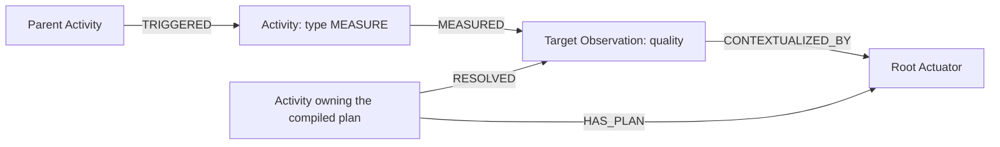

# Classification and characterization implementation

Status: C0-C3 are implemented for collective classification dependencies; C4 characterization and C5 live acceptance remain. This is a
continuation of [OBSERVATION.md](OBSERVATION.md), not a declaration that the staging example runs.

## Contract

Classification resolves an abstract predicate X in a substantial Y. It attributes a concrete
strict specialization Z of X to each selected Y observation. Observation identity, geometry,
parent and cohort membership are preserved. The classification request is an operation, not a
new observation or cohort. Instantiating missing Ys is a separate prerequisite which may create
observations. Characterization then resolves Z of Y in the scope of that particular observation.
Both lifecycle transitions belong to Runtime, not to user-authored continuations.

| Request | Activity | Member source | Successful result |
|---|---|---|---|
| Abstract X of each Y | CLASSIFICATION | Query existing cohort support; resolve missing collective support | Existing/new Ys acquire concrete Z; no classification-result observation |
| Abstract X of Y | CLASSIFICATION | Existing Ys in the contextual scope | Same semantic update, without implicitly demanding an instantiation |
| Concrete Z of Y | CHARACTERIZATION | The classified Y, used as its own contextual scope | Explanation of its attributed predicate; no replacement Y |
| Concrete Z of each Y | CHARACTERIZATION | Distribution across members | Per-member characterization, not classification merely because `each` occurs |
| Predicate of quality Q | TRANSFORMATION | The base quality graph | Existing transformation contract, outside this work |

Abstraction selects classification versus characterization. Collective inherence selects how
members are obtained. `isInstantiation()` historically includes collective predicate processing;
use the new `modifiesExistingObservations()` distinction when deciding whether an observation
result may be registered. Do not equate a successful empty cohort with missing coverage.

The sample is corrected, as confirmed by the maintainer:

```kim
model geography:Tanzania earth:Region
    observing earth:PhysicalEnvironment of each earth:Region;

model earth:PhysicalEnvironment of each earth:Region
    using klab.generators.random.categories();

private model klab:random:objects:polygons
    as each earth:Region;
```

A classifier attached to the Tanzania model would contextualize the parent, not implement its
dependency. The instantiator now directly produces the requested Region collective.

## Source audit

| Boundary | Current path and missing behavior |
|---|---|
| Semantics | `Contextualization.forSemantics` previously classified any collective inherent, even for a concrete predicate. It now distinguishes abstraction and rejects non-substantial/non-quality inherents. |
| Strategy selection | Activity patterns and ordinary producers already parse. Added a Tier-0 member-resolving classification strategy and direct characterization strategy. Lowering accepts the Tier-0 classification members plan and individual characterization. Classification requires an explicit resolved members input; unsupported forms are rejected. |
| Resolver | `ResolutionCompiler` branches to an internal `OperationTarget` before observation query/registration for semantic updates, both at roots and in model dependencies. The existing resolution API remains unchanged. Y uses ordinary collective query and missing-scale resolution. |
| Dataflow | Portable UPDATE actuators carry operation semantics, requested support and typed target bindings, with no result observation. `CompiledDataflow` dispatches CLASSIFICATION updates without allocating observations; other semantic updates remain rejected. |
| Invocation | The generic `ContextualizerExecutor` remains observation-oriented. C2 adds `MemberClassifierExecutor`, which invokes the selected local method with operation semantics and member context, validates returned concepts, and retains pending attributions. |
| Results | `MemberClassifierExecutor` returns pending attributions; `TransactionImpl.stageAttributions` builds detached semantic views and before/after audit records. The observation-oriented result scope is bypassed. |
| Completion | `RuntimeService.submitContextualizationResult` explicitly throws for CLASSIFICATION. Its instantiation branch submits created children and waits for them. Characterization requires a separate, optional-explanation outcome, not a blanket swallowing of execution failures. |
| Transactions | `DigitalTwinImpl.TransactionImpl` shares modified/added state with the root. C3 stages detached observations and publishes semantics only after durable root commit; child failure poisons the root. |
| Provenance | Child contextualization activities formerly wrote CONTEXTUALIZED for every outcome. They now choose typed links. C3 links CLASSIFIED to each affected member with before/after observable URNs, predicate family/result, support and event. |

## Implemented milestone C0

- Added abstraction-aware predicate activity selection and a semantic-update activity predicate.
- Added typed effect relationships and changed the current transaction writer to use them:
  INSTANTIATED, ACKNOWLEDGED, DETECTED, SIMULATED, MEASURED, QUANTIFIED, VALUED,
  CATEGORIZED, VERIFIED, CLASSIFIED, CHARACTERIZED, TRANSFORMED and CONNECTED.
- Removed the generic CONTEXTUALIZATION activity type and CONTEXTUALIZED effect relationship.
  Execution activities use the actual contextualization type; orchestration types such as
  SUBMISSION and RESOLUTION remain. CONTEXTUALIZED_BY remains the observation-to-actuator
  relationship and has a different purpose. Old graph compatibility is not supported.
- Updated Neo4j query visibility to follow all activity effects. New effect edges are deliberately
  absent from deletion ownership. Classifying an existing observation does not make it owned by
  the classifying context. The old CONTEXTUALIZED deletion path is removed; no graph migration is provided.
- Added the two Tier-0 source strategies to the reference corpus and `imod/strategies/observations.obs`.
  These are definitions awaiting the operation-target milestone, not runnable classifiers today.
- Corrected the staging model separation. The resource and live numerical/classifier execution
  have not been exercised.

C0 validation: the eight-module Maven reactor compiled and 22 focused tests passed:
`ClassificationContractTest` (2), `ObservationPipelineTest` (5),
`ObservationStrategyAdaptationTest` (6) and `Neo4jQueryCompilerTest` (9). These verify semantic
dispatch, the expanded corpus and interface serialization, existing Tier-0 behavior, typed effect
visibility and the deletion boundary. They do not exercise classification against live members.

## Activity types and exact graph links

An execution activity's `type` is the corresponding `Contextualization` name. `Activity.Type`
is the canonical enum, also used by the `GraphModel.Activity` record and serialized as the
Neo4j Activity node's `type` property. There is no second, divergent graph-specific activity enum.
`Activity.Type.forContextualization` rejects null and VOID: neither describes executable work.
Submission, resolution and other orchestration activities retain their own types.

| Activity node `type` | Activity → affected Observation relationship |
|---|---|
| INSTANTIATION | INSTANTIATED |
| ACKNOWLEDGEMENT | ACKNOWLEDGED |
| DETECTION | DETECTED |
| SIMULATION | SIMULATED |
| MEASURE | MEASURED |
| QUANTIFICATION | QUANTIFIED |
| VALUATION | VALUED |
| CATEGORIZATION | CATEGORIZED |
| VERIFICATION | VERIFIED |
| CLASSIFICATION | CLASSIFIED |
| CHARACTERIZATION | CHARACTERIZED |
| TRANSFORMATION | TRANSFORMED |
| CONNECTION | CONNECTED |

`CompiledDataflow` creates the execution Activity using its target's contextualization.
`DigitalTwinImpl.TransactionImpl` creates the effect edge when that execution enters a child
transaction. It derives the edge from the **activity type**, not the target's current observable.
This matters when a classification activity changes an ordinary substantial observation.



These edges belong to different parts of the graph:

| Edge | Source → destination | Writer and purpose |
|---|---|---|
| TRIGGERED | Parent Activity → child Activity | Transaction nesting; records causal execution hierarchy |
| Typed effect, e.g. MEASURED | Execution Activity → target Observation | Child contextualization transaction; records the operation's effect |
| CREATED | Submission/creation Activity → new Observation | `TransactionImpl.setTarget`; registration, not a replacement for an effect edge |
| HAS_PLAN | Activity owning the plan → root Actuator | `CompiledDataflow`; identifies the compiled plan |
| RESOLVED | Activity owning the plan → root Observation | `CompiledDataflow`; records resolution of the root |
| CONTEXTUALIZED_BY | Observation → its Actuator | `CompiledDataflow`; links the observation to its executable implementation, including geometry |
| HAS_CHILD / HAS_MEMBER | Parent Observation or Cohort → child/member Observation | Containment/membership; neither is a contextualization effect |

For current instantiation execution, the effect's target is the collective observation being
contextualized. Newly produced individual observations have their own registration and subsequent
acknowledgement activities. This change does not invent additional INSTANTIATED edges to every
individual. In C1–C4, classification and characterization must instead execute against the actual
members and link CLASSIFIED/CHARACTERIZED to each affected member; no directive observation is
created. C3 implements CLASSIFIED member links; CHARACTERIZED execution remains C4 work.

Neo4j visibility follows typed effects; context deletion does not use them as ownership evidence.
The effect edge identifies the kind and target of work; the Activity outcome still determines
success or failure. C3 records before/after attributed semantics for each classified member.

Typed-activity validation (2026-09-11): 18 tests passed across
`ClassificationContractTest`, `DigitalTwinCommitTest`, `Neo4jQueryCompilerTest` and
`Neo4jQueryExecutionTest`. Coverage includes every executable activity/effect pair, interface JSON
round trips, actual transaction edge direction and triggering links, and embedded Neo4j traversal
and context-deletion checks. No live service graph migration was performed or is supported.

## Strategy contract

Classification always consumes observed members. Resolving `each Y` is therefore a mandatory
prerequisite within the Tier-0 strategy, not a Tier-1 fallback. There is no classifier strategy
that bypasses member resolution. Existing complete cohort coverage makes that resolution a query
reuse; partial coverage triggers resolution of the missing support.

```text
strategy 0 named classification.members
  for pattern {
    node {
      activity = CLASSIFICATION;
      inherent = capture members as node { collective = true; };
    }
  }
  ensure context.exists()
  resolve $members to cohort
  observe $this with inputs(members = cohort);

strategy 0 named characterization.direct
  for pattern { node { activity = CHARACTERIZATION; } }
  ensure context.exists()
  observe $this;
```

The classifier model still directly explains X of each Y; its strategy first obtains the members
on which it operates. “No direct classifier strategy” does not remove the separate classifier
model from the namespace. Classification dependency execution is enabled by C3; characterization remains gated.

An abstract classifier request must not use `request.fully_specified` to reject its deliberately
abstract predicate. Validate the inherent and operation signature instead. The `members` port
is compiled as a typed collective/member binding, not an ordinary scalar model argument. The current
classification strategy covers collective inherence; singular-inherent classification needs its
own existing-member binding contract before enabling that form.

The runtime must finish resolution of newly instantiated members before passing them to the
classifier. Characterization is never written as a strategy continuation.

## Progressive implementation and acceptance

### C1 — Resolve operations without registering result observations

**Implemented planning boundary.** No endpoint or alternate request/result DTO was introduced.
`Resolver.resolve(Observation, ContextScope)` still returns `Dataflow`. Its observation-shaped
request may describe a directive, but the Resolver uses an unregistered probe only for the existing
Reasoner selection API; the actual graph vertex is an internal `OperationTarget`. Model dependencies
enter this path before `requireObservation`, and Runtime registration rejects directives.

| Portable actuator field | C1 meaning |
|---|---|
| `actuatorType = UPDATE`, `effect = SEMANTIC_UPDATE` | An operation affecting existing members; no result observation |
| `operationObservable`, `contextualization` | X-of-Y semantics and CLASSIFICATION/CHARACTERIZATION, independent of affected member semantics |
| `observation = null`, `id = 0` | No allocated or transported directive observation; node identity is `transientId` |
| `requestedSupport`, `coverage` | Requested support and resolved plan coverage; neither records that classification has executed |
| `targetBindings: COHORT_MEMBERS` | Named child producers whose member sets must be combined after prerequisite execution |
| `targetBindings: OBSERVATION` | Existing individual context observation for characterization |
| `children` | Prerequisite computations/references, required before the update |

Classification lowers `resolve $members` and terminal `observe $this with inputs(members = cohort)`.
The Resolver selects the classifier model in the requesting scope, retaining lexical constraints,
and attaches the resolved cohort as a prerequisite. Complete cached support is reused; partial support
requires an instantiator for the remainder. If scale subtraction cannot express that remainder, it
conservatively resolves full support instead of upgrading the cached portion to complete coverage.
Compiler-generated member source names are local to the update actuator and are not scalar arguments
passed to the classifier. The entire cohort output, including cached references, supplies members.

`Actuator.TargetBinding` is registered in JacksonConfiguration; implementations remain plain beans
without Jackson dependencies or annotations. Nested Dataflow transport preserves the operation and
bindings. `SemanticUpdateTargets` provides side-effect-free binding of completed producer member
sets, deduplicating positive durable IDs and transaction transient IDs in separate identity spaces.
A completed empty set is valid; an absent producer is an error. C2 uses this helper for supplied
completed member sets. C3 now enumerates completed cohort producers and stages their classifications;
C1 alone did not enumerate or classify live members.

At C1, the old blanket Reasoner lowerer guard was replaced by a Runtime whole-plan preflight guard. It ran
before `requireObservations`, storage preparation or executor construction, so a nested update cannot
partially execute as an observation-producing plan. C3 replaces the classification gate with explicit
operation dispatch and atomic effects; unsupported update kinds still fail preflight.
Individual characterization has a portable target; collective characterization and singular-inherent
classification remain unsupported pending their distribution/member-selection contracts.

The remaining C1 text records the accepted contract and acceptance criteria. The next implementation
stage is now **C4**, adding mandatory characterization to C3 staged attributions.

C1 validation: the eight-module offline Maven reactor passed 18 focused tests:
`ClassificationPipelineTest` (6), `ObservationPipelineTest` (5), `DataflowCompilerTest` (1),
`ClassificationContractTest` (2), and `SemanticUpdateTargetsTest` (4). These cover the actual parsed
reference corpus, Reasoner selection/lowering, strategy and nested Dataflow interface JSON transport,
cached/new/partial cohort planning, rejection of incomplete support, classification as a model
dependency, individual characterization, existing namespace/context propagation regressions,
deduplication, empty-versus-missing producer outputs, and pre-allocation rejection. External model,
query and runtime services are controlled doubles. No live worldview model lookup, cohort enumeration,
classifier execution, graph mutation, provenance extraction or replay was exercised. The test log is
`target/c1-tests.log`; `git diff --check` also passed.

Keep the existing resolution entry points and their Dataflow response. No new resolution or
mutation endpoint is required. All runtime mutations, including classification and characterization,
must occur through execution of a resolved Dataflow. Do not introduce a parallel request/result
service contract for semantic updates.

Extend Dataflow and Actuator interfaces/beans as needed to describe the contextualization explicitly:
operation observable, affected observation or member-graph binding, requested support, dependency
ordering and result/effect kind. Distinguish a newly produced observation from an existing member
whose semantics are changed. A semantic-update node must not register a result observation for
X of Y. Resolver may use internal planning targets, but these are neither a public mutation API
nor persisted observations. Preserve lexical namespace/project/scenario constraints at lookup.

Runtime dispatches from the contextualization declared in the resolved plan and validates the
contextualizer signature against it. It must not infer the plan's meaning solely from Java return
or parameter types. Classification outputs and completion states are internal execution/transaction
results, not an alternative service response replacing Dataflow. Characterization follows the same
resolution-to-Dataflow contract when Runtime schedules the mandatory follow-up.

Maintain interface-based transport: register any added abstract bean types in JacksonConfiguration,
use plain portable fields with no Jackson annotations/dependencies, and test nested Dataflow/Actuator
round trips. Do not serialize ContextScope, live executors or Resolver graph implementations.

This response is a **contextual resolution Dataflow**: it specifies work needed within the existing
knowledge graph and can reference observations already present there. It is not a complete plan
for rebuilding that graph. The latter is a separately extracted **graph-reproduction dataflow**,
assembled from provenance with definitions and dependency closure sufficient to start from an
empty graph. See [the two contracts](DATAFLOW.md#two-distinct-dataflow-contracts).

Implement classifier model selection and the Tier-0 members port, reusing existing query coverage and
missing-scale calculation. Deduplicate members by durable or transaction-local identity. Cohort
support and classification completion are separate quantities. Classifying only the cached members
must not claim completion for an incompletely resolved requested cohort.

Acceptance: no new observation ID/CREATED link for X-of-Y; the member-resolving strategy remains
rank zero; fully covered/partial/empty cohorts; existing and newly instantiated Ys; private model
visibility; interface JSON round trips preserving contextualization and member bindings; no new
resolution/mutation endpoints; all semantic changes occur through Dataflow execution. Planning tests
permitted removal of the lowerer guard; C3 now supplies the classification execution stage.

**Completed-stage prompt (retained for traceability):** “Implement C1 in docs/CLASSIFICATION.md through the existing resolution API returning
Dataflow. Extend its portable nodes to explicitly represent semantic-update contextualizations,
Tier-0 member resolution and typed member bindings. Add no resolution/mutation endpoint, and
ensure classification directives never become observations. Keep all changes within resolved
Dataflow execution and preserve Jackson interface transport. Do not confuse this contextual plan
with the separate provenance-extracted graph-reproduction dataflow. Update the running docs.”

### C2 — Invoke and validate classifiers per member

**Implemented pending-attribution boundary.** `MemberClassifierExecutor.compile` selects one
unambiguous local implementation through ComponentRegistry; `CompiledDataflow.compileMemberClassifier`
exposes this stage for the runtime transaction integration. No endpoint was added. The normal
whole-plan execution path now consumes pending attributions through the C3 transaction stage.

The method must return Concept and accept exactly one Observable and one Scope/ContextScope.
It may additionally request one each of Observation, ServiceCall, Geometry and Scheduler.Event;
unknown, duplicate or ambiguous parameters and non-Concept return types are rejected. An instance
method requires a local receiver. The actual generator currently declares
`Concept generateConcept(Observable, ServiceCall, Scope)`; the executor supports it without inventing
an Observation parameter. Every invocation receives the full X-of-Y operation observable, the
actual member when requested, and `scope.within(member)`. Validation removes only INHERENT from
the operation to obtain the abstract X, preserving other restrictions.

The original model dependency is carried as nullable `Actuator.modelDependency` through interface
JSON transport. Only a non-null original dependency whose `isOptional()` is true permits the
classifier to return null. Root requests and strategy-only recursive requests do not acquire this
permission from their own optional flag. Missing implementations, incomplete cohort producers,
exceptions, and invalid concepts are never treated as optional empty results.

| Classifier outcome | Required dependency or other trigger | Optional original model dependency |
|---|---|---|
| Concrete, satisfiable strict specialization of X | Pending attribution | Pending attribution |
| Null (no concept, e.g. empty generator closure) | Failure | No attribution for that member |
| NOTHING / owl:Nothing | Inconsistency error | Inconsistency error |
| Abstract, equivalent to X, unrelated, unsatisfiable or non-predicate concept | Failure | Failure |
| Invocation exception | Failure | Failure |

The initial Concept-returning contract has no separate empty collection or Optional return wrapper.
A successfully completed cohort with zero members succeeds independently of dependency optionality;
it does not call the classifier. An unavailable producer is not an empty cohort.

Execution binds and deduplicates completed member sets. For a given compiled executor, member identity,
event and support, concurrent/repeated calls share the same result or failure, so the contextualizer
runs once. C3 creates a fresh invocation cache per root transaction attempt and compares persisted
baselines under member locks to coordinate competing transactions. A batch publishes no successful list if any member fails.
PendingAttribution records carry the member, original observable, abstract/concrete predicates,
support and event; no observable, storage, ID, graph or provenance is changed.

C2 rejects any result for a member already bearing an X-family trait or role, including an identical
attribution. It does not silently replace or accumulate classifications. C3 retains this conservative
policy; it also rejects a second staged classification of the same member in one root attempt.
Unrelated predicates and roles remain untouched.

C2 validation: the eight-module offline Maven reactor passed 25 tests, with none skipped:
`MemberClassifierExecutorTest` (8), `SemanticUpdateTargetsTest` (4), `ClassificationPipelineTest`
(8), and `ObservationPipelineTest` (5). The actual sibling generator source was compiled with the
Java compiler and invoked through its real method signature using a singleton closure for a
deterministic result and an empty closure for null-result behavior. Other tests cover typed member
arguments, invalid results including NOTHING for optional dependencies, failed batches, repeated
and concurrent invocation, reclassification rejection, registry selection, and optional dependency
provenance across JSON transport. Reasoner and service boundaries are controlled doubles; this does
not verify deployed component loading, live ontology closure, cohort enumeration or transaction
mutation. Log: `target/c2-tests.log`. To repeat the actual-source test, set
`-Dclassifier.generator.source=<path-to-RandomContextualizers.java>`; without it that one test skips.

Select a classifier executor from the operation contextualization. Resolve the contextualizer's
signature before execution: operation Observable, member Observation and member ContextScope.
Execute once per member per classified support/event, not once per grid cell or data shard. The
operation observable stays X of Y while the Observation argument is the concrete member.

Require a concrete, consistent Concept Z of the appropriate predicate family and a strict semantic
specialization of X (`is(Z, X)` plus exclusion of semantic equivalence with X). A null result is
allowed only for an optional original model dependency after classifier selection and linking.
An abstract, unrelated, NOTHING or otherwise inconsistent result is always an error. Do not guess
category compatibility from URN prefixes. Restrict the first implementation to local concept-
returning contextualizers; report unsupported signatures explicitly.

Acceptance: actual `klab.generators.random.categories` signature; deterministically controlled
choices; mixed existing/new members; zero members with complete support; return validation; no
concurrent duplicate classification. Provide explicit policy/tests for reclassification before
silently replacing an existing X-family predicate. Preserve unrelated predicates and roles.

**Completed-stage prompt:** “Implement C2: a member classifier executor with typed invocation and semantic closure
validation. Retain returned concepts as pending attributions; do not mutate persisted observations
or create result observations. Test the actual generator signature and invalid returns.”

### C3 — Atomic semantic updates and provenance

**Implemented for the Tier-0 collective classification dependency.** The existing resolution API
still returns Dataflow. No resolution or mutation endpoint was added, and neither operation execution
nor audit creates an observation for X-of-Y. Root directive submission, singular-inherent
classification and characterization are not newly enabled by this milestone.

Execution proceeds as follows:

1. `CompiledDataflow` compiles UPDATE nodes through `MemberClassifierExecutor`, with separate
   actuator identities even though their result observation IDs are all zero. UPDATE children are
   explicit prerequisites of their consuming executor. A parent with an empty computation still
   registers its executor when it has an UPDATE dependency. No update receives an observation
   scheduler entry, storage allocation or `AFFECTS` endpoint.
2. Ordinary member producers execute through the scheduler in the current event. Instantiation's
   existing completion path waits for the submitted members. Cached reference producers reuse their
   completed support. Runtime enumerates durable and transaction-local `HAS_MEMBER` links and limits
   membership to the producer/request support intersection. The typed binding deduplicates members;
   a completed empty cohort succeeds, while a missing producer/cohort fails.
3. Classifier invocation validates the full batch before staging. Only null results permitted by an
   optional original model dependency are omitted. Runtime creates a CLASSIFICATION Activity carrying
   its plan FlowChart before execution and nests it under the current transaction Activity.
4. `TransactionImpl.stageAttributions` builds each replacement with the member's Reasoner builder,
   using `withTrait` or `withRole`, and checks consistency of the resulting observable. Detached
   copies preserve observation identity, URN, geometry, parent/cohort links and unrelated predicates.
   Transaction asset/link views expose the replacement; original graph vertices and live objects
   retain their old semantics until durable commit. This is a semantic overlay, not a general
   transaction-isolation implementation for arbitrary observation fields or arbitrary Cypher queries.
5. The root stores new members with final semantics and updates existing members through
   `KnowledgeGraph.Transaction.updateSemantics`. Neo4j locks each existing member and compares its
   stored observable against the recorded baseline. Existing members are locked in ID order. A stale
   or missing target fails the entire transaction. Only semantic properties are replaced, preserving
   unrelated persisted state; indexed `observable`, `semantics` and `semantictype` values change together.
6. Successful durable commit publishes semantics to live member objects and includes existing IDs
   in `Commit.modifiedAssets`; new members remain in `addedObservations` with final semantics.
   A local semantic-cache generation invalidates graph and scope caches across context views.
   Normal commit delivery invalidates client assets and adjacency; no new notification API is used.
   Failed invocations, staging or storage publish no semantic replacements. Even `fail(null)` poisons
   the shared root state. Storage failure is reported before resource closure, so closure cannot
   accidentally commit an earlier successful portion of a failed batch.

The provenance contract is `parent Activity -TRIGGERED-> CLASSIFICATION Activity -CLASSIFIED-> member`.
Each CLASSIFIED edge has `before` and `after` observable URNs, `abstractPredicate`, `predicate`,
encoded `support`, event key, and member transient/local identity. Its endpoint supplies the durable
identity after storage. These links remain outside deletion ownership. The same portable audit list
is available as Activity metadata `Metadata.IM_ATTRIBUTIONS` (`im:attributions`). Known FlowChart
and attribution metadata survive Activity persistence; operation actuators preserve their portable
UPDATE fields for audit. These contextual-plan snapshots are not provenance-extracted reproduction
Dataflows, and persisted scheduler restoration of composite plans is not added here.

A successful child activity means its batch was **staged**. The enclosing root commit determines
whether those changes became durable; a later failure leaves no durable attribution/effect edge.
Client consumers must not treat intermediate ActivityFinished as a commit notification.

Reclassification remains conservative: an existing X-family attribution is rejected, including an
identical result; concurrent or repeated staging of the same member is also rejected. Replacing or
combining classifications requires a separate policy change. C4 must use the staged member views
when adding characterization before the root commit.

Represent pending attributions with member identity, old/new observable, abstract predicate,
concrete result, coverage/event and activity. Construct new observables with the Reasoner builder;
attach traits versus roles correctly. Preserve observation ID, URN, geometry, cohort and parent.
Avoid mutating hash keys while observations are vertices in graphs or members of sets.

Apply replacements within the root transaction, mark existing members modified, and include new
members in their creation records with final semantics. Update persistence indexes and invalidate
client/query caches from commit payloads. Store before/after semantics in provenance so extraction
can reconstruct what was classified; a bare CLASSIFIED edge is insufficient for replay.
Rollback must restore both in-memory views and durable state. Runtime activities must link to all
affected members with CLASSIFIED, without making those effects deletion-ownership edges.

Acceptance: commit.modified contains existing members; no replacement identities/cohorts; optional empty classifier results leave members unchanged; new
members carry final semantics; rollback after a later-member failure; concurrent classifications;
provenance queries and client graph updates; deletion cannot remove independently owned members.

C3 validation: the five-module offline Maven reactor passed **51 focused tests**, none skipped:
ClassificationContractTest (2), ClientKnowledgeGraphTest (15), ClassificationExecutionTest (1),
ClassificationTransactionTest (6), ClassificationPersistenceTest (4), MemberClassifierExecutorTest (8),
SemanticUpdateTargetsTest (4), DigitalTwinCommitTest (4), Neo4jQueryExecutionTest (4),
ContextualizationDiagnosticsTest (1), and ResolutionDiagnosticsTest (2). Coverage includes an empty
parent computation with a classifier dependency, existing/new-member staging and commit, optional
empty results, later failure, concurrent baseline conflicts, before/after edge properties, UPDATE
persistence/transport, typed activity diagnostics, client refresh and deletion ownership boundaries.
The actual generator source signature was compiled and invoked. Persistence tests run production
transaction/Cypher logic against embedded Neo4j through a thin driver adapter: the application's
current Bolt/Netty dependency combination cannot start the harness Bolt connector. This does not
constitute live Bolt, deployed worldview/model lookup, full staging execution, AMQP or IDE validation.
Log: `target/c3-tests.log`. A follow-up run passed both ClassificationExecutionTest cases, including
an additional regression proving scope-cache reload after another context advances the semantic
revision (`target/c3-cache-tests.log`). `git diff --check` passed. The next stage is C4; C5 retains
live acceptance.

**Completed-stage prompt:** “Implement C3: connect MemberClassifierExecutor pending attributions to atomic staged attribution updates and CLASSIFIED provenance, including
before/after semantics, commit propagation, query/client invalidation and rollback tests.”

### C4 — Mandatory characterization scheduling, optional explanation

After each valid classification, Runtime builds concrete Z of singular Y and resolves it in
`scope.within(member)`. The abstract X must not leak into this request. Keep the classification
transaction open until its required child lifecycle work finishes, as for instantiation.

Distinguish no explanatory model from failed resolution infrastructure or failed contextualizer
execution. No characterization model is a successful terminal lifecycle condition; it does not
undo classification. An execution failure follows the normal failure/rollback policy. Do not
reclassify on completion of characterization or resolve the whole member recursively in a loop.
Record CHARACTERIZED for actual characterization work, with a distinct no-model outcome when
only the lifecycle decision was made. Apply the same no-model distinction to acknowledged newly
instantiated members rather than suppressing arbitrary failures.

Acceptance: exactly one characterization request per new attribution; correct concrete semantics
and member scope; no-model success; execution failure propagation; no observation creation;
multiple members/child completion order; explicit provenance of actual work.

**Prompt:** “Implement C4: Runtime-owned characterization after classification, using an explicit
no-model success outcome. Test per-member scopes, no duplicate lifecycle work, commit ordering
and the distinction between missing explanation and failed execution.”

### C5 — Live staging acceptance

Run the corrected staging namespace with the installed worldview and generator. Verify the
classifier model is selected, Regions are queried/instantiated as necessary, each result is a
concrete PhysicalEnvironment specialization, no classification observation appears, and existing
members appear as modified in the commit. This namespace must succeed without characterization
models. Add the forthcoming characterization namespace and check its member-specific execution.

Test cohort partial coverage, zero members, repeat submissions, failure on one member, concurrent
contexts, and provenance extraction/replay inputs. Update OBSERVATION.md, OBSERVABLES.md and the
domain context pack only with runtime claims supported by this evidence.

**Prompt:** “Complete C5 using the staging classification namespaces. Record live model selection,
member identity/coverage, commits and typed provenance; distinguish test doubles from actual
Runtime, Resources and knowledge graph evidence. Close stages only when their acceptance passes.”


## Diagnostic visibility

Accepted classification resolution graphs now travel as FlowChart metadata on the Dataflow and
completed RESOLUTION Activity. Operation nodes expose contextualization and optional-dependency
status; links expose member bindings and coverage. C3 additionally records per-member attribution
audit data and typed effects during execution. See [resolution diagnostics](FLOWCHARTS.md#resolution-diagnostics) for the
transport contract, validation and deferred ActivityCard rendering.
