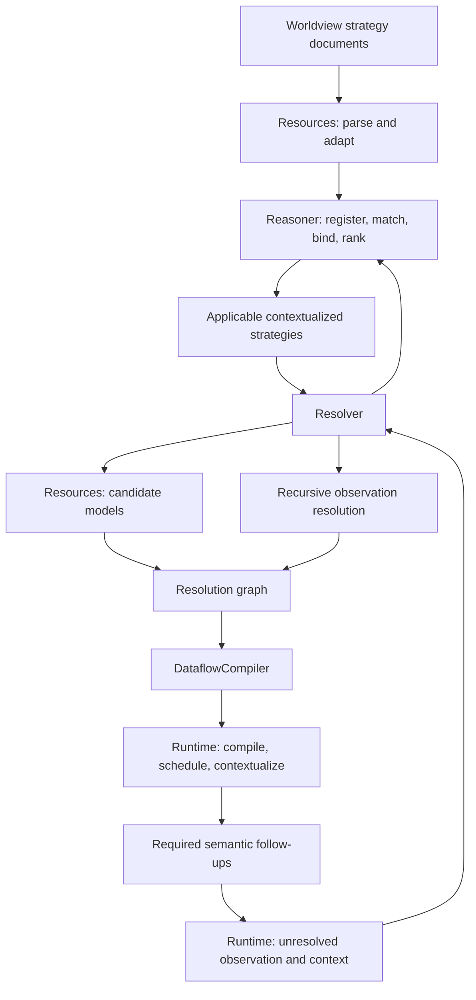

# Observation strategies: resolution contracts and implementation plan

This is the running design document for observation strategies in k.LAB. It connects the
semantic observation process to strategy selection, graph construction, dataflow compilation,
and execution. Read [Observable expressions, Section 1](OBSERVABLES.md#1-observable-observation-and-model)
for contextualization categories and [Resolution](RESOLUTION.md) for the broader Resolver trace,
transport, transactions, and existing tests.

**Status:** the initial source audit/design proposal is complete. The maintainer has generated
the draft grammar on `klab-languages/feature/observation-revision`. The first reported logical-pattern
parse failure was reproduced in the generated lexer. Observation-local overrides then caused
ANTLR unreachable-token errors, so they were removed. With maintainer approval, the three
affected shared Observable identifier ranges are now corrected. The maintainer confirms that
the dependent languages and the new sample compile. See [grammar revision 0.3](grammar/README.md).
Typed Java syntax snapshots and an adapter are implemented in `klab-languages`, with real-parser
tests. Initial strategy semantic beans and Resources/LanguageAdapter adaptation are now implemented
in `klab-services`. Initial structural matching, guarded setup, producer lowering and tier-0
resolution are implemented (S3c). Full lexical validation and the broader composition runtime
remain pending; no deployed worldview strategies were migrated. See the S3 progress record below.
The [running compatibility example](OBSERVATION_STRATEGIES_EXAMPLE.md) preserves the maintainer's
eight currently used strategies, compares each with this design, and supplies a proposed translation
and stable acceptance cases. Its tier-0 source is now exercised through the service boundaries;
the remaining cases are acceptance specifications for subsequent stages.
The [running Observation.xtext sketch](grammar/Observation.xtext) and its
[integration notes](grammar/README.md) make the proposed syntax concrete for review. The running
copy tracks active grammar corrections and separates maintainer generation reports from tested
behavior; it is not itself installed into the active language project.
Section 2 retains the pre-revision source audit as a baseline. The current authored-bean boundary
and its validation evidence are recorded in S3a; S3c supersedes the historical Reasoner/runtime
audit for the initial producer subset. Source inspection does not imply a successful live integration test.
The proposal also covers a strategy-local pattern language and the executable dataflow persistence
form, including provenance reconstruction through a builder. Sections 4–8 are proposed contracts.
Their syntax remains provisional; the three running syntax fixtures now parse and adapt with
the generated grammar. This does not establish their semantic or runtime behavior.
Section 9 supplies staged implementation tasks and continuation prompts.

## 1. Two levels of control

An unresolved observation is a request to realize a meaning in context. Resolution constructs a
plan for doing so; contextualization executes that plan. Neither selecting a strategy nor finding
a model proves that an observation has been produced.

The **semantic lifecycle** determines the primary activity and mandatory follow-ups.
`Contextualization` classifies that activity = for example, a physical quality requires `MEASURE`,
a predicate inherent to a quality requires `TRANSFORMATION`, and a collective substantial requires
`INSTANTIATION`. The enum contract requires instantiation and connection to trigger individual
acknowledgements, and classification to trigger characterization of attributed predicates.
These are semantic obligations of the implementation, not optional worldview strategies.

**Observation strategies** choose ways to fulfil a particular activity. A strategy can seek models
for the whole observable, resolve another observable recursively, or arrange dependent work.
Each recursive resolution again has its own semantic activity and applicable strategies. Numeric
strategy rank orders alternatives; it is distinct from model ranking and from execution order.

The intended coverage contract allows several successful strategies to contribute complementary
parts of one request. Their contributions form a resolution graph, later compiled into a
Dataflow. Combining alternatives' coverage is distinct from composing dependent graphs *inside*
one strategy. A transformation cannot cover a missing measurement simply because both graphs
mention the same geographical area.



## 2. Current source trace

### 2.1 Grammar, parsing, and Resources ownership

The sibling `klab-languages` grammar is
`org.integratedmodelling.languages.observation/src/org/integratedmodelling/languages/Observation.xtext`.
It has two top-level forms, `strategies` and `dataflow`. Sharing a grammar does not make a
strategy an executable dataflow: the former guides planning, while the latter represents its
execution result. Strategy documents have a name, mandatory version, optional imports, metadata,
and coverage. Each strategy has an integer rank and optional name and description; it may be an
observation or identification strategy. Identification strategies address substantial identity
and are outside the graph-composition proposal here.

The current clause surface is:

| Clause | Syntax-level purpose | What reaches the services |
|---|---|---|
| `for` | Concept pattern, uppercase type/activity pattern, or function test, with conditions; comma and semicolon connectors | Filter groups, connector values, semantic patterns, functions, and type tests |
| `let` | Bind one name or a tuple of names to each function result | An ordered macro-variable map whose tuple keys are comma-joined names |
| `resolve … as id` | Recursively resolve an observable and name its result | `RESOLVE` operation with observable and local ID |
| `observe … as id` | Seek models for the target | `OBSERVE` operation with observable and local ID |
| `transform id through …` | Seek a predicate/transformation model referring to an earlier result | An `OBSERVE` operation with a transformation-target string |
| `apply …` | Supply contextualizer functions | `APPLY` bean supports functions; current syntax extraction is incomplete |
| `optional`, operation `if` | Express conditional work | Not a complete executable control-flow contract across the current layers |
| Legacy deferred `{ … }` bodies still visible in the inspected grammar | Former deferred-strategy design, since eliminated | Obsolete remnants, not an available feature; do not restore implicitly |
| `ensure` | Check applicability | Recognized but not implemented in the syntax body's `ensure` branch |
| `mediate` | Dataflow-side unit/currency/range mediation | Not a strategy graph-composition operator |

`ObservationStrategySyntaxImpl` in the sibling project reads clauses into syntax objects.
`WorkspaceManager.readObservationStrategy` parses source, wraps it in
`ObservationStrategiesSyntaxImpl`, invokes `LanguageAdapter.adaptStrategies`, and validates the
semantic asset. Invalid source retains a diagnostic document. `LanguageAdapter.adaptStrategy`
creates `KimObservationStrategy` beans, preserving rank, namespace, source locations, filters,
macro variables, operations, local IDs, and transformation targets.

Resources hosts the documents and includes them in the worldview. `ReasonerService` registers
their statements with `ObservationReasoner` and calls `initializeStrategies`; worldview update
handling also releases/reloads affected strategy namespaces. The default strategy visitor traverses
concepts and calls but provides no substantive default strategy/operation validation rules.
Parser acceptance is therefore substantially weaker than an executable strategy contract.

There is already an `as id` foothold for naming results; named graphs are not starting from a
completely unnamed language. However, the current ID names an edge/input binding, not a typed
graph value. The bare operation-reference path in `LanguageAdapter` only prints a diagnostic;
it does not construct the operation's observable. Deferred adaptation is commented out. The
maintainer confirms that the former deferral facility was eliminated; grammar remnants must not
be documented as supported deferral. The inspected syntax `OperationImpl` also reads operation
predicates into its function list without extracting the clause's `apply` function list, so
function retention needs a parser-to-bean regression test as well as executable lowering. New
syntax must be carried through all these layers, rather than added to Xtext alone.

### 2.2 Matching, setup, contextualization, and rank

`ObservationReasoner.computeMatchingStrategies` currently performs these steps:

1. Iterate registered strategies, skipping identification strategies for observation resolution.
2. Reject a strategy using reserved `context` if no context observation exists.
3. Apply precomputed semantic-type, collective, and activity/type-pattern filters.
4. Populate detected reserved variables `this` and `context` with their observables.
5. Execute macro-variable functions and unpack their results, before full filter matching.
6. Test filter groups; on a match, instantiate operation observables using variable substitution
   and construct an `ObservationStrategyImpl` for the Resolver.

Thus the current order differs from the desired **match, then setup** contract. Macros may execute
for a strategy that later fails its full pattern. Reserved-variable discovery scans semantic
patterns and operation observables, not every function argument. `matchFunction` supplies the
incoming observable when arguments are absent; its explicit-argument substitution is ad hoc and
needs a typed argument contract. Tuple arity errors are reported but do not reliably stop unpacking.

`initializeStrategies` sorts numeric ranks in ascending order. Matching preserves that order.
`getCost` returns zero and is not a contextual tie-break implementation. The contextualized bean
is populated with URN and documentation, but this builder does not copy rank or namespace, despite
the operational API exposing both. Do not use those bean defaults as an explanation of priority.
The current source does not enforce “rank zero means whole-observable resolution only.”

The maintainer confirms that comma-separated match alternatives mean disjunction. The syntax
adapter currently maps commas to `ALL`/intersection, while the evaluator accepts the first
successful member of any group, ignoring connector values. That OR behavior can mask the adapter
bug; changing evaluation to honor the existing connector values would break the supplied direct
strategies. Correct the AST mapping and evaluator together. The legacy semicolon connector needs
a separately reviewed meaning. Multiple function conditions overwrite the boolean result rather than preserving a
conjunction. The separate `getTypeTest()` field is not evaluated by `matchFilter`. Quick-filter
negation and mixed alternatives also need truth-table verification: an optimization must never
reject something accepted by the authoritative matcher.

### 2.3 Syntactic matching is structured, but uses semantic checks inside it

`Reasoner.match` delegates to `SyntacticMatcher`. Its atomic-pattern shortcut uses semantic `is`.
For composed patterns it retrieves `KimObservable` syntax through Resources and checks structure:
collective status, negation, logical operands, semantic modifiers, requested traits/roles, and
semantic clauses. Nested components are matched recursively. A subject-only pattern can accept
a subject carrying additional predicates; a predicate-bearing pattern requires corresponding
predicate structure. This is not a single subsumption test on the complete expression.

Important current limits in `matchConcepts`:

- Logical patterns require exactly two operands and match the candidate's first operand against
  the first pattern operand and its remaining expression against the second. This is ordered
  head/tail matching, not a general commutative logical-equivalence algorithm.
- Trait and role loops overwrite a shared `ok` flag for each requested predicate; an earlier
  failure can be lost when a later predicate matches.
- The composed path does not finish with a general comparison of the base observable/head.
  Its structural checks must not be treated as a complete soundness proof.
- Value-operator matching is a TODO.
- Matching caches must be invalidated with worldview changes.

These gaps warrant small counterexample tests before expanding the strategy language. They do
not justify replacing structural pattern matching with whole-expression semantic `is`.

### 2.4 Functors currently available

The Reasoner loads the `type` library from `functors/TypeFunctors.java`. It provides concrete,
abstract, and collective checks; predicate counting and splitting; lexical-root lookup; and
singular/collective conversion. The declared `KimObservationStrategy.Functor` enum describes a
larger intended inventory, not proof that every functor exists.

`predicates.splitfirst` selects a trait using `findAny`, removes it, and returns the trait plus the
remaining concept. It does not split roles and does not establish a stable lexical “first.”
`operator.splitfirst` is a stub returning the original concept twice. Predicate counting declares
a boolean artifact type although its Java return is an integer. Tuple-producing splitters declare
a concept artifact type without an explicit tuple signature. Production setup needs deterministic,
typed, pure decomposition that preserves every unremoved modifier and observable-level operator.

### 2.5 Resolver execution and coverage

`RuntimeService.submit` establishes transactions and a scope contextualized for the observation,
then calls the Resolver unless predefined contextualization supplies the dataflow directly.
`ResolverService` creates a compiler; `ResolutionCompiler.resolve` starts an isolated attempt
from the context's submitted-resource snapshot. Child graphs share metadata within that attempt,
but concurrent attempts do not share their mutable planning graphs.

The compiler checks geometry, queries existing runtime observations where supported, retains
reference coverage, and attempts resolution for the missing scale. Its intended previous-resolution
catalog is still incomplete (`getResolving` returns an empty list and `accept` does nothing).
It obtains applicable strategies from the Reasoner and processes their operations sequentially:

| Operation | Current Resolver behavior | Important boundary |
|---|---|---|
| `RESOLVE` | Contextualize the scope, query/register the target, recursively seek strategies, then merge a relevant graph under the operation ID | No typed graph symbol table; the result becomes part of the strategy immediately |
| `OBSERVE` | Query Resources for models using observable, context observable, geometry and resolution constraints; rank models; resolve their computations and dependencies | This avoids strategy lookup for the target itself, but model dependencies still resolve recursively |
| `APPLY` | Ask Runtime to resolve contextualizers and record requirements/service prototypes | Validation of availability does not establish executable application or output coverage |

`contextualizeScope` mainly checks for a missing context for dependents and adds a geometry
constraint. It does not implement discovery of alternative inherents, per-member resolution, or
aggregation back to the original subject. `requireObservation` clears the focused context for
collective registration. This is not a general distribution operator.

The current loops fall short of the intended partial-contribution contract. The observation loop
collects relevant strategy graphs but calls `strategyResolution.checkCoverage(strategyResolution)`
and merges them into the observation only after a strategy is individually complete. Two
complementary partial strategies therefore need not complete the request together. The model loop
likewise accumulates model graphs in a list before merging; its stop checks do not see earlier
unmerged model contributions. Within a strategy, generic union coverage can also conceal a missing
mandatory input. Coverage must be defined per operation, not inferred solely from parent node type.

`ResolutionGraph.merge` copies vertices/edges and links parent to child with coverage, local name,
and observation ID. It intersects coverage for model parents and unions it otherwise. It is
**graph assembly with coverage accounting**, not a general semantic composition operation. The
underlying directed graph cannot represent parallel bindings between the same pair of vertices.
Metadata and requirements can be added at attempt scope while a candidate is still speculative;
root-attempt isolation does not by itself provide candidate-level rollback.

### 2.6 Transformation wiring and Dataflow compilation

The existing transformation route carries `transform target through observable` as `OBSERVE`
plus a target string. `ResolutionCompiler` passes that string into graph-edge local names.
`DataflowCompiler.compileStrategy` traverses strategy children: models are compiled into the
current actuator and recursively resolved observations become children. `compileModel` consults
the contextualizer prototype, selects an input tagged `INPUT` or matching the local name, and
overrides that parameter with an identifier for the target. Computations are appended to the
observation actuator.

This couples meaning to edge names, prototype heuristics, and compiler traversal. It does not
represent the base graph, transforming graph, binding, resulting semantics, and composition order
as one validated operation. The compiler also contains a TODO for transformation-target internal
IDs and ends strategy compilation with a TODO to add `APPLY` work. The user-reported working
quality-transformation example is consistent with this route; it was not executed during this audit.

The resulting Dataflow carries requirements and coverage to Runtime. Runtime compiles it into
executors, commits resolution, schedules contextualization, and commits or fails submission.
`submitContextualizationResult` resubmits instantiation outcomes in the collective's scope;
classification and connection follow-up branches currently throw `KlabUnimplementedException`.
Consequently, the semantic lifecycle in Section 1 is a contract with partially implemented paths.

## 3. Design requirements and decisions to review

The proposed solution is a **typed strategy plan with named graph results, explicit binary
composition, and scoped deferred resolution**. It retains `observe` and `resolve` as different
planning operations and keeps semantic lifecycle obligations outside authored strategy logic.

| Decision | Recommendation | Reason |
|---|---|---|
| Graph naming | Single-assignment, strategy-local graph symbols, distinct from semantic variables | Avoids implicit stacks, rebinding, and accidental mixing of observables with graphs |
| Binary merge | Exactly two operands, ordered where the operation requires it | Makes dependencies inspectable and allows chaining, without hiding many-input rules |
| Merge interpretation | Explicit operator kind; infer only when one validated signature applies | Two activity types alone cannot distinguish mosaic, aggregation, transformation, or logical operations |
| Result | A terminal merge without `into`, an explicit `yield`, or the sole graph when no composition exists | No accidental “last graph wins” |
| Context | Bind any independently observed context to a variable; support singular and per-member work with a declared output target | Coverage geometry alone cannot identify a bearer or endpoint |
| Rank zero | Direct whole-observable models; explicit preparation of mandatory contextual inputs permitted; other worldview exceptions documented | The supplied relationship strategy resolves endpoints without decomposing its output meaning |
| Failure | Distinguish no match, insufficient coverage, invalid plan, unsupported capability, and execution failure | Preserves useful fallback without silently accepting malformed strategies |
| Evolution | Version the syntax/plan and migrate legacy forms explicitly | Existing grammar and transport clients must not silently reinterpret new constructs |

Binary composition is valuable, but it does **not** make contextualization unambiguous on its own.
Two `MEASURE` graphs could be alternative coverage contributions, operands of a difference, or
values to aggregate. Even `MEASURE` plus `TRANSFORMATION` needs a declared input/output contract,
bearer compatibility, mediation, and temporal support. `MEASUREMENT` is a current type-pattern
keyword; the activity enum is `MEASURE`.

## 4. Proposed strategy language and intermediate representation

### 4.1 Separate selection, setup, graph production, and composition

Use four explicit phases: match `for`, evaluate ordered pure `let` bindings, produce graph values,
then compose and select an output. Patterns may use reserved `$this` and `$context` and structural
captures; they must not require a later `let`. A post-setup guard may validate a decomposition
before graph production. Absence of context is a typed condition, not an invented observable.

The running fixture proposes `ensure f(), g()` for these pure guards: checks conjunct, execute
after the bindings they reference, and precede graph production. This guard-list comma is a
separator distinct from the confirmed OR connector between legacy match alternatives. Reserved
`$this` and `$context` cannot be rebound by setup, captures, or context/member binders.

The following is **design pseudocode**, not current Xtext syntax. Function names beyond the
audited library illustrate required contracts rather than installed functors:

```text
observation strategy 10 named predicates.quality
  for <quality carrying a removable concrete predicate>
  let predicate, base = split.predicate($this)
  resolve $base to base_graph
  observe $predicate of $base to predicate_graph
  merge base_graph, predicate_graph using transform
    yielding $this
;
```

Choose `to` for graph production and `into` for an intermediate merge result:

```text
merge base_graph, predicate_graph using transform yielding $qualified into intermediate
merge intermediate, other_graph using <validated-kind> yielding $this
```

Graph names are bare identifiers here; `$name` denotes semantic/setup variables. This deliberately
distinguishes the two namespaces. The user's suggested `$graph1` spelling is also possible if
the type checker distinguishes graph and semantic values, but is not needed for the core design.

A merge without `into` is terminal and returns its result. Alternatively `yield graph_name`
returns an existing graph. Exactly one output is required. A single producer with no composition
implicitly returns its graph; two producers without composition are invalid. Reject duplicate
definitions, forward references, cycles, statements after a terminal result, and unused graph
producers. Inputs may be reused by several nodes, but every produced node must reach the output.
These rules permit a DAG without making source order the execution scheduler.

`yielding <observable>` declares the expected output meaning, defaulting to `$this` only at the
strategy boundary. It is an assertion to validate, not permission to relabel arbitrary data.
Intermediate results must carry their own semantics. A single graph implicitly returned must
also satisfy the incoming request's output contract.

### 4.2 Plan values, ports, and bindings

Keep symbolic strategy syntax (`KimObservationStrategy`) separate from the contextualized portable
plan (`ObservationStrategy`). The latter should contain typed nodes and symbol references rather
than a list of redundant nullable fields. Keep Resolver implementation graphs out of API beans.

| Plan element | Required information |
|---|---|
| Strategy envelope | Stable strategy/document identity, version/hash, rank, deterministic tie-break, source location, matched request/context, trace of bindings |
| Semantic binding | Kind (observable, concept, literal, tuple), declared type/arity, dependencies, absence behavior; immutable after evaluation |
| Graph producer | Unique node ID, `OBSERVE` or `RESOLVE`, complete target observable, context/scale binding, required/optional policy, result symbol |
| Graph result | Output observable, primary contextualization, artifact/value kind, cardinality, bearer/endpoints, geometry and time support, units/currency, coverage, provenance and requirements |
| Transformation graph | A declared open input port and its expected observable/value contract, output contract, and other already resolved dependencies |
| Merge node | Operator ID/version, two graph references, explicit port bindings/options, expected output contract, coverage rule, result symbol or terminal marker |
| Scoped plan | Singular context or collection input, observation-variable binding, body plan, completion/coverage policy, and continuation dependencies |

A predicate model consumes the base observation through an **explicit open port**. It must not
recursively request the same base merely because the port has not yet been bound. The merge closes
the port and validates its type. Graphs with unresolved required ports are not executable final
results. When a model exposes several outputs or matching inputs, choose named ports explicitly;
do not select the first `INPUT` tag. Every node and binding occurrence has its own identity even
when two nodes refer to the same model or observable.

Producers may accept already produced graphs through explicit ports, for example
`observe $this with inputs(source = sources, target = targets) to connections`. This is the
proposed translation of the supplied relationship strategy: two named endpoint graphs become
dependencies of one final producer, with no implicit graph union or arbitrary pair generation.
This general input-binding form does not change the two-operand limit on semantic merge. Validate
role contracts during model selection and preserve repeated use of the same graph in distinct ports.

### 4.3 Validation at the right boundary

Validate names, operation shapes, guard dependencies, and unique output statically in the language
adapter/visitor. The Reasoner validates substituted semantics and emits a typed plan. The Resolver
validates actual graph contracts, coverage, cycles, and bindings when composing resolved inputs.
Runtime validates installed operator capabilities, dataflow ports, and execution constraints before
execution, and checks dynamic cardinality/support during execution. Unsupported combinations
produce explicit diagnostics; they never fall through to a generic graph union.

An operator registry should define each accepted signature, result derivation, scope rule, coverage
algebra, and lowering implementation. Prefer a closed set of core operator kinds initially, with
versioned, declared extension signatures later. Operator selection must not become arbitrary
worldview code mutating Resolver graphs.

### 4.4 Recommended syntax for arbitrary observed contexts and deferred resolution

Do not reinstate the eliminated anonymous deferred-strategy bodies attached to `resolve`,
`observe`, or function calls. Introduce **graph-bound context blocks**, with explicit inputs,
context variables, and outputs. The primitive is resolution inside an arbitrary independently
observable context, not iteration over basins or any particular domain. Recommended syntax is:

```text
resolve $context_observable to context_graph
within context_graph as target_context {
  resolve $target within $target_context to result
  yield result
} into contextual_result
```

`context_graph` resolves an independently specified context observable in the caller's scope.
Once its single context observation is available, the block binds that observation to
`$target_context`. The target may be any observable valid in that context: a quality, process,
event, relationship request with the required endpoint scope, or another substantial. The
context's ontology type is unrestricted by this syntax; ordinary k.LAB context admissibility
rules still apply. A quality value cannot become a context merely through assignment.

The block establishes the default context for its body, so `resolve $target to result` has the
same context as the explicit form above. Keeping `within $target_context` in examples makes the
binding visible. Operation-level `within` also accepts an already available observation variable,
without requiring a new context graph or block. `observe` can replace either `resolve` when the
strategy intentionally requires direct model lookup rather than recursive strategy search.

The context observation, its concept, and the graph that produces it are different values.
`$context_observable` is semantic input; `context_graph` is a plan; `$target_context` is an
observation-reference binding available when that plan produces its context. The binder never
chooses an arbitrary member of a collection. `within graph as name` requires exactly one eligible
context observation; use the collection form when there are zero or more contexts:

```text
resolve each earth:RiverBasin to basins
for each basin in basins {
  resolve earth:RunoffWaterVolume of earth:RiverBasin within $basin to runoff
  yield runoff
} into basin_results
reference $context to region_support
merge region_support, basin_results using aggregate
  with <approved reducer and support mapping>
  yielding $this
```

These are syntax proposals, not currently supported syntax. The collection form replaces the preliminary
`for each … to … { … }` sketch with `{ … } into …`, placing the block result after its body.
The complete proposed graph-operation shapes are:

```text
observe <observable> [within <observation-reference>] to <graph-name>
resolve <observable> [within <observation-reference>] to <graph-name>
reference <observation-reference> to <graph-name>
within <context-graph-name> as <context-variable> {
  <graph operations>
  yield <body-graph-name>
} into <graph-name>
for each <member-name> in <collection-graph-name> {
  <graph operations>
  yield <body-graph-name>
} into <member-results-name>
merge <left-graph>, <right-graph> using <operator>
  [with <typed-options>] yielding <observable> [into <graph-name>]
yield <graph-name>
```

Square brackets denote optional grammar elements, not literal syntax. One terminal merge or
`yield` is allowed in each body; the general sole-producer implicit-output rule also applies.
Final grammar work must explicitly distinguish operation-level `within` from any observable
modifier, for example by requiring parentheses around a composed observable when necessary.
`for each` must also be a distinct clause alternative from the existing strategy-selection `for`.

The context variable `$target_context`, or member variable `$basin`, is an **observation reference**,
not its concept or graph. Operation-level `within` explicitly establishes its context. Graph identifiers remain bare;
the variable type checker distinguishes observation references from semantic values such as
`$this` and `$predicate`. `$context` retains its existing meaning as the context observable in
semantic expressions; `reference $context` is a dedicated operation that resolves that reserved
binding to the existing context observation and fails if none exists. It must not manufacture an
observation merely from a concept. Other reference operands must be observation-reference values.

Rules shared by both block forms:

- The input graph must be defined earlier. Its output contract determines whether the singular
  or collection binder is appropriate. Context validity and cardinality are checked statically
  where possible and dynamically before the body starts.
- Each body inherits observer, permissions, scenario and resolution constraints from the caller,
  changing only the explicitly selected context and its compatible scale binding. It must not
  silently use the caller's geometry for a differently supported context. The result retains
  its actual context identity; returning it does not recontextualize it into the caller.
- Outer observation variables remain available by name inside nested blocks. Reserved semantic
  `$context` denotes the currently bound context's observable in the body; capture an outer
  context explicitly if needed. `$this` retains the enclosing strategy request. A recursive
  strategy invocation receives its own `$this` for the recursively requested observable.
- A body needing data from the observed context waits for its required contextualization and
  lifecycle completion, not just registration or geometry discovery. Existing resolved contexts
  can be bound immediately. This supplies general singular-context deferral as well as iteration.

Collection-specific rules:

1. The collection graph must be defined earlier and expose substantial members with stable
   identities. A scalar quality graph is not iterable.
2. The body is lexically scoped, may capture immutable outer semantic values and read-only graph
   references, and cannot overwrite outer symbols. Each invocation has fresh local graph names.
3. The body produces one result per member under the declared failure/optionality policy.
   `basin_results` is a member-keyed result collection, not an automatically merged regional
   quality. Aggregation or selection remains explicit.
4. Each iteration binds its member as the default context, just as the singular block does.
   Execution waits for member availability and required lifecycle completion. If members are
   already resolved, planning may expand the body immediately; otherwise the Dataflow retains
   the body as a typed continuation. These are two implementations of the same source semantics.
5. A complete empty collection yields a complete empty result collection. Failed discovery or
   unresolved member work must not be reported as that empty success.
6. Nested blocks require explicit variable scopes, bounded work, and captured version/constraint
   information. They use the ordinary resolver for each request, not a private alternative list
   embedded in anonymous deferral syntax.

Both forms avoid a separate `defer` keyword: the named graph dependency determines when the work can
proceed. Deferral is a scheduling consequence, while the language describes the semantic dependency.
Do not add an unrestricted `after { … }` or arbitrary callback facility until a concrete scenario
requires one. Ordinary data dependencies use graph ports and merge nodes; singular and collection
context binders cover independently observed contexts, including runtime-discovered contexts in
`whose` and distribution. Reject a plan before execution when the Runtime lacks the required
context-binding/continuation capability.

For `whose`, the same block resolves a boolean condition per member and returns a member-keyed
condition collection; `merge subjects, conditions using select yielding $this` then selects
identities. This reuses one mechanism instead of introducing a second filtering-specific deferral
syntax. Comparison functions and options still require the typed operator contracts of Section 5.

### 4.5 A dedicated pattern language, with ordinary observable matches retained

**Recommendation:** keep ordinary observable syntax as a match alternative, and add a delimited
`pattern { … }` language defined only in Observation.xtext. Match a typed, normalized observable
structure rather than constructing a partially substituted observable and hoping it behaves as
a pattern. The pattern AST, captures, wildcards, and logical matching rules must not become
worldview concepts or additions to the shared Observable grammar.

The current `ConceptReference` rule accepts `PATTERN_VARIABLE` alongside concept and authority
references; the `$` terminal is consequently available throughout the shared grammar. Strategies
also embed `ConceptExpression` in `SemanticPattern` and offer function tests as an alternative.
These are migration inputs, not the desired modular boundary. Audit consumers before removing
strategy-specific variable alternatives: ordinary `any`/`all`/`no` selectors, value operators,
logical observables, and k.Actors semantic literals retain their existing meanings and must not
be removed simply because strategies also use them.

Recommended matching alternatives, all **proposed syntax** except the existing bare observable form:

```text
for earth:Region

for pattern on $this {
  node {
    kind = quality;
    predicates = contains(capture predicate as node { kind = attribute; });
  }
}

for pattern on $context {
  semantic(is, {{ earth:Region }})
}

for matcher domain.match_special_structure($this, $context)
```

`pattern` is a unique entry keyword and braces delimit the entire pattern. `on` selects a typed
semantic input, defaulting to `$this`; an absent `$context` gives no match unless absence is
explicitly tested. `matcher` selects the external-functor contract described below. A bare
observable keeps the documented structural matching behavior, including the atomic semantic-`is`
shortcut, with no implicit capture variables. Explicit `semantic(exact, {{ … }})` and
`semantic(is, {{ … }})` remove ambiguity when an author wants whole-expression equality or
subsumption. Exact means normalized full semantic equality, not source-string equality.

The draft grammar uses `field = value;` and `capture name as pattern` to avoid the shared lexer's
name-with-colon tokens. Earlier colon-based notation is superseded in the translated fixture.
See [the grammar notes](grammar/README.md) for lexical boundaries, scope rules, and remaining
generator checks; this is a proposed surface revision rather than an active language change.

#### Pattern vocabulary and matching rules

Use a small closed vocabulary over an immutable observable view, with extension points in the
functor registry rather than arbitrary field names or Java reflection:

| Pattern construct | Meaning and proposed contract |
|---|---|
| `node { … }` | Conjunction of structural field constraints; omitted fields are unconstrained |
| `one_of(subject, agent, …)` | Disjunction of typed field alternatives; overlapping inherited kinds do not duplicate a match |
| `kind`, `activity`, `collective`, `abstract`, `negated` | Separate semantic category, contextualization, arity, and flags; `MEASUREMENT` must not be confused with `MEASURE` |
| `head`, `predicates`, `roles`, `inherent`, `clauses` | Typed structural children; a constrained head must actually match, regardless of predicate success |
| `semantic_operator`, `value_operators` | Separate operator families with typed operands, parameters, comparison units, and ordering |
| `semantic(exact, {{ observable }})`, `semantic(is, {{ observable }})` | Explicit semantic relation on the selected node; embedded ordinary observable syntax has no captures |
| `any` | Any present node of the required structural type; not the observable selector `any Concept` |
| `absent`, `present(pattern)` | Explicit absence/presence tests; a missing field does not satisfy `any` |
| `contains(pattern)` | At least one matching collection element; extra elements permitted |
| `every(pattern)`, `exactly [ … ]` | All elements, or complete collection shape; define empty-collection behavior explicitly |
| `all( … )`, `either( … )`, `not( … )` | Boolean pattern composition, separate from semantic `and`/`or` nodes |
| `capture name as pattern` | Bind the matched typed subtree after success; never mutate the candidate |
| `same(name)` | Require equality with an earlier capture; a second declaration of the name is an error |
| `logical(and, …)`, `logical(or, …)` | Match semantic intersection/union nodes, not boolean combinations of match conditions |

Captures are immutable semantic values visible to later `let` and graph producers. They are
not observed instances or graph variables. Export bindings only after the whole pattern succeeds.
Branches of `either` must export the same names and compatible types; `not` exports no bindings.
Repeated collection matches with different captures are **ambiguous**, not permission to pick
the first hash-set element. Reject with a diagnostic or require an explicit deterministic
selection/decomposition rule. Do not expand an unbounded number of matches into strategies.

`contains(capture predicate as …)` is therefore appropriate when the predicate is unique or
otherwise constrained. For generic “remove one predicate” use a pure deterministic splitter with
a declared ordering after the pattern establishes applicability. Preserve the complete remainder
with a structural subtraction/rebuild operation; do not reconstruct it from the lexical head.

#### Logical and value-operator patterns

Represent logical operands as typed lists. Support two explicit modes: `unordered [ … ]` for
semantic operand matching without positional significance, and `canonical [ … ]` for deterministic
decomposition when no operand has a distinguished semantic role. An unordered matcher uses
distinct operand occurrences, rejects ambiguous captured assignments, and has a bounded search
budget. Canonical ordering is versioned and independent of source spelling.

```text
for pattern {
  logical(and, operands = canonical [capture first as any, rest remaining])
}

for pattern {
  node {
    value_operators = contains(
      operator(whose, condition = capture condition = any)
    );
  }
}
```

`rest remaining` captures the remaining operands together with their logical connector, exposing
a rebuilt observable expression to later setup. Require at least one remaining operand; never
invent an empty conjunction or silently lose parentheses. Flatten associative logical nodes only
where semantic scope permits. Do not reorder value transformations, comparisons, or context clauses
under a general normalization rule. Predicate occurrence identity, authority identities, units,
currencies, and modifier scope must survive matching and decomposition.

A `whose` pattern recognizes the request's structure and captures its condition. It does not
evaluate that condition against observations; the scoped resolution plan still does that work.
The same separation applies to logical matching versus runtime membership/quality operations.

#### External matcher contract and semantic construction

An external matcher accepts the same immutable observable/context view and returns a typed
`MatchResult`: match/no-match, a declared capture schema and values, diagnostics, and optional
explanation. Invalid results, exceptions, or budget exhaustion are diagnostic failures, not
successful matches. Functors must be deterministic for a declared worldview/version and free of
observation creation or graph mutation. Register signatures and capabilities; do not execute
arbitrary source supplied by a pattern. A legacy boolean matcher adapts to a result with no captures.
Built-in and external matchers must feed the same setup and validation pipeline.

Keep construction separate from matching too. Strategy-local expressions may contain variable
references, ordinary observable literals, and typed constructors such as
`inherent($predicate, $base)` or `without_predicate($this, $predicate)`. Constructors operate on
semantic objects and preserve unrelated structure. Thus a producer can be written
`observe inherent($predicate, $base) to predicate_graph` without adding variable placeholders
inside Observable's `ConceptReference`. Earlier `$predicate of $base` sketches in this proposal
express the intended composition; the recommended final spelling uses these typed constructors.
Ordinary closed observable expressions remain accepted directly in producers and matches.

Implementation should share semantic AST/view utilities rather than duplicate the Observable
grammar. Add distinct Observation-owned `Pattern`, `StrategyExpression`, and `MatchResult`
contracts, with an explicit adapter from ordinary observable syntax. Remove old shared-grammar
pattern plumbing only after its host consumers and legacy strategies have migration coverage.
S1 must freeze the vocabulary, exact-match definition, ambiguity policy, and normalization version;
S2 tests matcher semantics and S3 implements the grammar/API boundary.

## 5. Composition contracts

### 5.1 Initial binary operator families

| Proposed operator | Left / right input roles | Output and validation | Coverage/completion rule |
|---|---|---|---|
| `transform` | Base quality graph / predicate transformation graph with open input | Quality expressing the predicate; validate bearer, input value type, mediators, and target semantics | Require both on the output support; intersect after declared support conversion |
| `attribute` | Substantial/member graph / classification or characterization plan | Same individuals with attributed/explained predicates; preserve identity | Track member availability and attribution completion separately; invoke mandatory characterization lifecycle |
| `select` | Collection graph / member-keyed boolean condition graph | Selected members with original identities and provenance | Completed evaluation can legitimately select zero members; unresolved conditions are not false |
| `logical-union` / `logical-intersection` | Two compatible membership or predicate-result graphs | Union/intersection by substantial identity, or a separately declared quality operation | Set algebra on members is distinct from spatial validity/knownness coverage |
| `mosaic` | Two alternative graphs for the same full output meaning | One observation assembled with an explicit overlap precedence policy | Union of accepted valid support; count only new coverage gain |
| `aggregate` | Target/support graph / member-keyed quality results | Target quality using a declared reducer and support mapping | Output coverage follows contribution completeness and mapping, not raw union of basin footprints |

This is an initial signature family list, not permission to combine every enum pair. `attribute`
has separate concrete signatures for classification and characterization. Quality logical operators
need value-space-specific signatures: boolean conjunction/disjunction, categorical set operations,
and numerical operations are different contracts. There is no generic rule “and means add” or
“or means maximum.” Reject combinations without a scientifically justified interpretation.

Unary value operations do not need a fabricated second observation. Represent a typed unary
operation node with an explicit input graph, or a transformation graph exposing an input port
and merge it with the operand. Keep binary *merge* binary; do not force every computation to have
two graph operands. Multi-input operations can use typed operand bundles or a reviewed sequence
of binary nodes whose intermediate type is explicit. Reduction order matters for non-associative
operators and floating-point reproducibility.

### 5.2 Coverage, fallback, and speculative state

At an observation boundary, maintain an accepted contribution graph and its accumulated coverage.
Attempt strategies in deterministic priority order against the remaining support. After a strategy
has a valid terminal result, calculate its incremental gain, apply overlap precedence, and accept
the contribution atomically. Stop when accumulated coverage satisfies the request. Apply the same
principle to alternative models. Higher-priority coverage wins by default; another overlap policy
must be explicit. Keep strategy rank and model ranking as separate recorded decisions.

Inside a strategy, mandatory dependencies restrict support. A base graph covering the whole region
and a transformation covering half produce a transformed result for at most that half; the
untransformed remainder does not satisfy the predicate-qualified request. An optional input has
a declared absence policy, such as a typed fallback or a missing value, and cannot silently make
an invalid output complete.

Distinguish **no applicable solution**, **valid zero-member result**, **partial solution**, and
**failed execution**. In particular, an empty tree collection or a `whose` query selecting no trees
may be a complete answer. Geometry coverage alone cannot express membership completeness or an
unresolved condition. Preserve both support coverage and task/member completion where needed.

Each candidate should own a speculative graph/requirements/registration delta. Rejecting it must
not publish observations or leave requirements attached to an accepted plan. Root-attempt isolation
already exists; extend it to candidate acceptance and runtime provisional registration. Cancellation
and exceptions must discard unaccepted deltas. Do not blindly retry another strategy after a
partially executed effect without rollback or an explicitly idempotent continuation contract.

### 5.3 Termination and reuse

Track active resolution keys including normalized full observable, contextualization, context and
observer identity, scale/time support, and relevant constraints/worldview version. Detect a repeated
active request and report the strategy/node path. Recursive predicate/operator decomposition should
also demonstrate structural progress. Add bounded depth/work limits as a final safeguard, not as
the definition of correctness. Context-changing distribution must not revisit the same request
indefinitely through alternate inherents.

Cache only complete, compatible plan results or explicit partial contributions with their validity
envelope. A pending shared request is not a resolved reference. Preserve bindings when one model
or observation is used in two roles; use occurrence nodes or a suitable multigraph rather than
relying on the current single-edge representation.

## 6. Scenario walkthroughs

### 6.1 Direct whole-observable resolution

The default rank-zero strategy matches concrete, consistent, fully specified requests with an
observable activity and calls `observe $this`. The single graph is its output. “Whole” includes
predicates, operators, inherency, collective status, and other semantic clauses; it is not a lexical
head match. Scientific unit mediation may be permitted without weakening the requested meaning.
`type.concrete()` alone is insufficient to establish all these conditions.

```text
observation strategy 0 named core.direct
  for <resolvable complete observable>
  observe $this to direct
;
```

The direct path should require a model explaining the full requested meaning, with exact semantic
matching policy specified separately from string equality. Decomposition fallbacks use positive
ranks. Preparation of mandatory contextual inputs is permitted at rank zero when the terminal
producer still observes the full requested meaning: the supplied relationship strategy resolves
endpoint collections before direct connection lookup. This is not output decomposition, and its
bindings must be explicit. A specialized worldview rank-zero exception needs an explicit scope, rationale, and
deterministic precedence. Current Resources model lookup does not receive a distinct “exact whole
observable only” flag from `queryModels`; define and test that contract before claiming this rule
is enforced. If direct models cover only part, fallback strategies can complete the residual.

### 6.2 Predicate decomposition

For a concrete predicate on a quality, split the predicate and remainder without losing context,
units, operators, or other predicates. Resolve the remainder, seek or recursively resolve the
predicate model, bind its input to the base graph, and merge with `transform`. Repeated decomposition
must preserve the intended order where transformations do not commute.

For a predicate on substantials, distinguish attribution from numeric transformation. Collective
inherency first resolves the requested collection, then applies the predicate plan to members.
Individual inherency uses the existing inherent observation/context; it must not instantiate a
new collection as a side effect. An abstract predicate requests concrete classification outcomes;
each successful attribution triggers characterization through the semantic lifecycle. Preserve
individual IDs and cohort rules. A concrete predicate requires characterization rather than an
abstract-classification shortcut. Review the current enum's predicate dispatch limitations alongside
these cases before implementing them.

### 6.3 Value operators, including `whose`

Distinguish semantic operators that change the head (`count of`, `presence of`, `type of`, etc.)
from observable value filters and arithmetic transformations. A decomposition result must identify
the operator family, operands, parameters, comparator, and expected output kind, not return two
untyped concepts. Validate units and missing-data behavior for arithmetic and comparisons.

For “trees whose height exceeds a threshold,” the plan must:

1. Resolve the tree collection with an explicit discovery-completeness policy.
2. Resolve height within each tree's context, retaining member identity in every result.
3. Compare each value after compatible unit mediation, retaining true, false, and unknown states.
4. Use `select` to produce the original tree identities whose conditions are true; report unknowns
   according to the request's completeness policy.

Do not evaluate the condition once in the enclosing region and reuse it for every tree. If member
identities emerge only after instantiation executes, store a scoped continuation in the Dataflow;
the Resolver cannot enumerate those future observations during initial planning.

### 6.4 `and` and `or`

For substantials, normalize membership by identity and explicitly represent conjunctive or
disjunctive predicates. Intersection requires evidence for both properties on the same individual;
union must not duplicate an individual observed by both branches. Unknown attribution is not
negative evidence. For qualities, select a signature appropriate to the value space and the
semantic operator. Never infer a numeric aggregation from a logical connector alone.

Use deterministic head/tail decomposition for more than two operands only when it preserves
meaning. Match normalization and execution order are separate decisions: commutative semantics
must not depend accidentally on source spelling, while non-commutative transformations must retain
their order. Tests must distinguish set membership algebra from coverage union/intersection.

### 6.5 Arbitrary context resolution, distribution, and aggregation

The general case first resolves an independently observable context, binds the resulting
observation using `within context_graph as target_context`, and resolves another observable
`within $target_context`. Nothing in this operation depends on the context being a basin,
geographical object, or even spatial. It applies to an admissible person, organization, event,
experimental system, or other context. An event context also carries its relevant temporal frame.
The target's inherency and other semantic dependencies must be compatible with that context;
changing scope cannot erase an incompatible `of` clause.

Use `for each` when context discovery produces a collection. Both forms produce observations
in the selected contexts. If the enclosing request instead asks for a result in its original
context, an explicit, validated composition/support mapping must bring those results back.
The two operations—resolving in another context and deriving an answer for the original
context—must not be conflated. The following basin case illustrates this second, stricter case.

Suppose the request is `earth:RunoffWaterVolume` in an `earth:Region`, while available models
explain `earth:RunoffWaterVolume of earth:RiverBasin`. This requires a contextual bridge, not
dropping the `of` clause during model matching.

The proposed plan identifies an allowed Region-to-RiverBasin bridge, resolves relevant basins,
resolves runoff within each basin, maps those results to the requested region/support, and reduces
them under a declared hydrological aggregation rule. A scoped-plan sketch is:

```text
resolve each earth:RiverBasin to basins
for each basin in basins {
  resolve earth:RunoffWaterVolume of earth:RiverBasin within $basin to runoff
  yield runoff
} into basin_results
reference $context to region_support
merge region_support, basin_results using aggregate
  with <approved runoff support mapping and reducer>
  yielding $this
```

Here `within`, `for each`, `reference`, and reducer notation describe proposed plan operations;
they are not a grammar patch. The per-member result collection is one typed operand of the binary
merge. The reference supplies target support, not a second set of values to add.

The bridge must specify intersecting versus contained basins, boundary clipping, time interval,
units, missing basins, overlaps/nested basins, identity deduplication, and conservation assumptions.
Runoff volume is extensive, but summing arbitrary basin totals can double-count routed water or
include water outside the region. Area-weighting basin totals is not generally justified either.
If the model output and support mapping cannot justify region-level volume, this strategy fails
with an explanatory diagnostic rather than fabricating a regional answer.

To control search, use declared, ranked bridge candidates rather than enumerating every possible
subject in the worldview. Where basin identities are known, a scoped plan can expand during
planning. Otherwise it becomes a bounded runtime continuation: instantiate, resolve per member
under the same observer/constraints, then aggregate after the required member work completes.

## 7. Deferred work and semantic lifecycle

There are two reasons for later work, and they need separate representations:

- **Mandatory lifecycle follow-ups:** acknowledgement after instantiation/connection and
  characterization after classification. Runtime owns these obligations and their completion.
- **Strategy-authored scoped work:** arbitrary observable resolution within an independently
  observed context, or per-context conditions/aggregation over a collection discovered by an
  earlier graph. The strategy plan carries this continuation explicitly.

A continuation captures stable semantic bindings, context/observer identity, worldview/strategy
version, constraints, and a context variable (or member variable for iteration). It must not
serialize a live Java scope or a closure. Runtime invokes ordinary resolution in each bound context, links resulting fragments and
provenance to the parent plan, and releases the dependent merge when the completion contract is
met. Define cancellation, member failure, retries, batching, and time transitions. Zero members
must terminate successfully when discovery is complete. Repeated schedule transitions need
idempotent identities and invalidation rules rather than repeated untracked appends.

General process scheduling and configuration detection are governed by their semantic lifecycles;
the strategy language must not override them with a generic “execute all children immediately.”
Complete the classification/connection lifecycle gaps before claiming collective predicate and
relationship strategies work end to end.

### 7.1 Observation language as planning and execution source

Keep the two document forms in one observation language: `strategies` describes how to obtain an
observation plan; `dataflow` records the executable realization of chosen observation activities.
They share ordinary observables, typed values, identities, computation signatures, and source
provenance, but have separate ASTs and validators. Patterns and selection ranks belong only to
strategies. Executable bindings and submitted-object definitions belong to dataflows. Named plan
graphs lower into executable nodes and ports; no Resolver-specific graph implementation is serialized.

**Do not remove executable `apply` merely because implicit strategy `apply` is being replaced.**
The dataflow form needs an explicit sequence of contextualizer calls with named input/output
bindings and versions. Retaining `apply` for that purpose is the recommended spelling. Strategy
`observe` means model search; dataflow `observe` declares an executable observation actuator with
already selected computations. A recorded strategy URN is provenance, not an instruction to run
strategy selection again. Legacy dataflow `resolve` must have a distinct, validated actuator
meaning and must not silently invoke strategy-level recursive search.

Current `Observation.xtext` already has separate `StrategiesPreamble` and `DataflowPreamble`,
`DefinitionBody`, actuators, requirements, and function calls. `DataflowImpl` is used for compiled
service transport, but the provenance-backed `DataflowGraph` and source reconstruction path remain
largely unfinished. `DataflowGraph.adapt()` returns null, while the current `DataflowEncoder` has
an empty `encodeDefinitions` and an incomplete preamble. Existing JSON tests do not prove source
replay, Resource persistence, or reconstruction from provenance.

### 7.2 Provenance-to-dataflow builder

Make reconstruction a first-class builder workflow rather than another string encoder or a
wrapper around the most recent resolution fragment:

```text
selected knowledge-graph roots + consistent committed snapshot
  -> scan observation/activity provenance and executable bindings
  -> reconstruction builder: assemble fragments, close references, validate completeness
  -> typed portable Dataflow with definitions, nodes, ports, requirements, validity envelope
  -> canonical observation-language source + external payload manifest
  -> Resource descriptor with semantic annotations and versioned dependencies
  -> load, parse, validate, bind identities, compile and execute in a target digital twin
```

Proposed builder inputs are selection roots, snapshot/revision, replay mode, external-reference
policy, and payload export policy. Builder output is either a complete validated artifact or an
explicit report of missing provenance/dependencies; it must not invent computations from model
names or infer execution order from timestamps. An interactive partial diagnostic export may be
useful, but must be marked non-executable. Keep the builder independent of source formatting so
the Resolver compiler and provenance reconstruction can share the same executable validation.

The scanner must distinguish causal/executable edges from descriptive annotations. Capture at
execution time the information reconstruction will need: observation identities and contexts,
chosen model/strategy versions, actual contextualizer calls and parameters, input/output bindings,
composition operator versions, support/coverage and mediation, submitted inputs, scheduler events,
and resolved continuation fragments. Activity success and transaction boundaries determine which
fragments can enter an exported snapshot. A failed candidate or partially committed run is not
a valid recorded plan merely because it has provenance nodes.

Reference closure follows executable dependencies, with cycle detection and explicit feedback/time
transition nodes for supported temporal cycles. References inside the export become local symbols.
References intentionally supplied by the target remain declared prerequisites with identity and
validity conditions. Unknown references, omitted context observations, or missing payloads prevent
an executable export. Local aliases replace runtime database IDs; import establishes a mapping
that preserves identity relationships without requiring the target to reuse source database keys.

### 7.3 `define`, source fidelity, and Resource persistence

Use dataflow `define` sections for pre-defined submitted observations/objects that have no producing
computation. Define typed records, not opaque Java serialization: full observable, identity,
context/endpoints or member links, geometry/time, metadata, and supplied value or payload reference.
Literal definitions and structured object definitions need distinct schemas. Large payloads may
live in immutable resource-backed objects, but checksums, representation, and dependency references
must make the package complete. An unresolved external URL is not a self-contained definition.

The existing `define <class> <name> as <value>` production is a syntactic starting point; S1 must
choose supported definition kinds and payload representations. Keep required definitions within
the dataflow package, allowing explicit versioned imports for reusable definitions. Do not require
an implicit sibling k.IM document just to reconstruct submitted inputs. k.IM may subsequently
annotate or expose the persisted Resource using ordinary semantic models.

The canonical source must encode every executable field: document/schema version, requirements,
definitions, named observations, ordered computations and ports, references, composition,
geometry/temporal validity, continuation policy, and provenance identity. Preserve optionality,
missing-data semantics, mediators, operator parameters, and distinction between a failed/empty
plan and a valid zero-member result. Comments and formatting may normalize; executable meaning
may not. Require `decode(encode(bean))` semantic equivalence, deterministic re-encoding, and
equivalent execution on representative fixtures. Unknown required node/definition kinds fail
validation rather than disappearing during parsing or JSON adaptation.

The Resource descriptor declares its executable entry points and output observable meanings,
artifact type, coverage/validity, observation-language version, dependency/payload manifest,
checksums, provenance lineage, and access conditions. Resource registration, semantic annotation,
catalogue discovery, loading, and execution are separate operations with explicit adapters and
capability checks. A source file on disk is not yet a registered or runnable Resource. Replication
must carry or declare dependencies and validate target capabilities; it does not imply bit-identical
numeric results across unpinned components or external data versions.

### 7.4 Replay versus a reusable adaptive plan

Declare two distinct modes rather than promising that every exported continuation can replay
without resolution:

| Mode | Recorded choices | Unresolved/deferred work | Intended guarantee |
|---|---|---|---|
| `replay` | Models, computations, bindings, member contexts, and executed continuation fragments are fixed for the selected snapshot | No fresh semantic strategy/model search; missing fragments make export incomplete | Reconstruct the selected executed plan subject to its explicit inputs and validity envelope |
| `adaptive` | Fixed portions are retained; explicit typed context blocks may request later resolution | Declared continuations may invoke Resolver/Reasoner under pinned policies/versions | Reuse a plan in admissible contexts; chosen future computations may differ and acquire new provenance |

These are proposed manifest values. Strict replay materializes completed context blocks as their
recorded executable fragments, or uses an equivalent fully bound iteration with no unresolved
search. Adaptive plans retain the typed binders from Section 4.4 and declare resolution-service
requirements. Never silently downgrade replay to adaptive when recorded data or bindings are
missing. Saving values as a snapshot and recomputing them are also different payload policies;
the export must state which inputs/results are materialized and which are recomputed.

The first persistence target should be strict replay of finite completed observations, including
submitted-object definitions. Schedule/history reconstruction, future process evolution, external
resources, and adaptive continuations expand that target only with explicit tests. This limits the
first implementation without limiting the general observation-language architecture.

## 8. Compatibility and unresolved decisions

Recommended migration: retain legacy parsing for a declared version, lower only unambiguous
legacy forms into the new plan, and issue source-located errors for ambiguous combinations.
A single `observe`/`resolve` maps directly. A named resolution followed by a uniquely bound
`transform` can map to producers plus `transform` merge. Legacy `apply` requires a declared input
and output contract; arbitrary multi-graph implicit-stack behavior must not be guessed.

The `strategies` and `dataflow` alternatives in Observation.xtext require coordinated but separate
changes. Version the portable plan/JSON representation and executable Dataflow nodes; update
encoding/decoding and capability negotiation. A newer Reasoner must not send unknown merge nodes
to an older Resolver and receive apparent success after fields are discarded.

Before implementation, record decisions on:

1. Final spelling: keep existing `as` for graph production or adopt `to`; retain `into` for merge
   results and explicit `yielding` for output meaning as proposed, or select equivalent syntax.
   Adopt the singular `within graph as context_variable { … } into result` and collection
   `for each member in graph { … } into results` blocks from Section 4.4 for general observed-context
   resolution; do not restore the eliminated anonymous deferral facility.
2. The first supported operator signatures and exact whole-observable model-match contract.
3. Whether unresolved `whose` conditions fail completeness or are returned as explicitly unknown;
   the default should not silently exclude unknown members as false.
4. Initial domain-specific aggregation rules and where approved bridge declarations live.
5. Plan-version migration window and minimum Resolver/Runtime capability requirements.
6. The strategy-local pattern vocabulary, capture typing, logical normalization and ambiguity
   policy, external matcher signature, and migration of shared Observable pattern variables.
7. Separate strategy/dataflow ASTs; dataflow `apply` bindings; supported `define` kinds; builder
   provenance requirements; replay/adaptive modes; canonical source and Resource package contract.

These choices are deliberately visible review items. The recommended architecture can be reviewed
now without treating provisional examples as accepted grammar or executable semantics.

## 9. Progressive implementation ledger and continuation prompts

Every implementation stage must update this document: change its status, record approved decisions,
link changed code and tests, list validation actually performed, and revise affected examples and
the next prompt. Keep source behavior in Section 2 separate from proposal text. Coordinate
`RESOLUTION.md`, `OBSERVABLES.md`, and README links whenever their contracts change. A stage is
complete only when its acceptance criteria pass; source inspection, mocked contracts, and live
execution must be reported separately. Do not mark a later stage complete merely because its
grammar parses.

| Stage | Status | Prerequisite | Deliverable |
|---|---|---|---|
| S0 | Complete: source audit and initial proposal | Current source | Sections 1–8 and this ledger; no implementation claim |
| S1 | Pending review | S0 | Approved pattern, plan, executable-source, reconstruction, and Resource contracts with fixtures |
| S2 | Pending | S1 | Reliable structural matching/captures, external matcher contract, setup, rank, and semantic lifecycle classification baseline |
| S3 | In progress: semantic adaptation and initial tier-0 Reasoner/Resolver boundary implemented; complete validation and composition pending | S1; align with S2 | Observation-local patterns/expressions, named-plan API, separate dataflow AST, validators, versioned transport |
| S4 | Pending | S2–S3 | Correct candidate coverage, graph identities, failure isolation, termination |
| S5 | Pending | S4 | Direct resolution and quality transformation through typed composition |
| S6 | Pending | S5 | Substantial predicate composition and mandatory lifecycle completion |
| S7 | Pending | S6 | Arbitrary observed-context binding, scoped continuations, value operators, and `whose` |
| S8 | Pending | S7 | Logical union/intersection with value-space contracts |
| S9 | Pending | S7–S8 | Context bridges, per-inherent resolution, and validated aggregation |
| S10 | Pending; substeps S10a–S10c below | S5–S9 | Builder-based reconstruction, source/Resource persistence, migration, and integrated validation |

### S1 — Review and freeze the first contract

Produce a decision record for Section 8, typed operation and matcher signatures, and positive/negative
fixtures for all five scenarios plus pattern captures/logical matching and reconstruction/persistence.
Use [the supplied eight-strategy corpus](OBSERVATION_STRATEGIES_EXAMPLE.md) and its EX00–EX09
acceptance matrix as the mandatory running baseline. Confirm its proposed translation, including
comma disjunction, endpoint prerequisites, acknowledgement eligibility, and categorical operations.
Freeze the Observation-local pattern boundary, external matcher result contract, dataflow `apply`
and `define` contracts, builder inputs, provenance capture requirements, and replay/adaptive modes.
Define exact-match policy, rank-zero exceptions, optionality,
unknown results, graph output rules, and default overlap precedence. Decide which runtime
capabilities are required for each fixture. Acceptance: every fixture has an expected semantic
output, context, coverage/completion result, and rejection behavior; unresolved scientific choices
are explicitly excluded from the first implementation.

**Continuation prompt:** “Continue S1 in docs/OBSERVATION.md. Review the proposed contracts against
the current source and my feedback. Produce a decision record and acceptance fixtures for patterns,
matching functors, named graphs, context binding, executable dataflow apply/define, provenance
reconstruction, and Resource persistence, using docs/OBSERVATION_STRATEGIES_EXAMPLE.md and its
translation/EX00–EX09 cases as the required baseline. Highlight remaining semantic choices.
Update the ledger and next prompt. Do not
change grammar or runtime behavior in this review stage.”

### S2 — Establish a trustworthy selection baseline

Define the normalized pattern view, typed captures/MatchResult, logical operand modes, ambiguity
rules, and external matcher adapter from Section 4.5 before extending syntax. Test ordinary
observable matches alongside the new pattern engine; retain host-language compatibility.
Work in `SyntacticMatcher`, `ObservationReasoner`, `TypeFunctors`, and semantic classification
contracts. Preserve the intended structural matcher while fixing required-head/predicate checks,
filter boolean evaluation, type tests, quick-filter soundness, reserved variables, ordered setup,
tuple arity, and deterministic decomposition. Copy rank/namespace into contextualized plans and
make ties deterministic. Define direct-match eligibility independently of abstractness alone.

Acceptance: tests cover extra predicates, absent required predicates, different heads, roles,
collective versus singular, negation, nested clauses, logical operands, value operators, context
absence, AND/OR filters, failing guards, and setup not running for rejected patterns. Prove the
quick filter has no false negatives against the full evaluator on these fixtures. Preserve full
observable meaning through split/recombine tests. Check enum dispatch against the reviewed
classification/characterization distinctions; do not silently rewrite the semantic contract.

**Continuation prompt:** “Implement S2 from docs/OBSERVATION.md using the approved S1 decisions.
Add focused matcher, capture, logical normalization, external MatchResult, setup, functor, and
priority regression tests before extending graph syntax.
Preserve structural matching and full observable expressions. Update the source trace, validation
evidence, stage status, and next prompt.”

### S3 — Add named plans through every language and service layer

**Progress, 2026-09-08:** the maintainer reports successful compilation of the shared-grammar
consumers and the Observation sample. The new
[`ObservationSyntax` API](../../klab-languages/org.integratedmodelling.languages.observation/src/org/integratedmodelling/languages/api/ObservationSyntax.java)
and [`ObservationSyntaxAdapter`](../../klab-languages/org.integratedmodelling.languages.observation/src/org/integratedmodelling/languages/ObservationSyntaxAdapter.java)
cover all 68 generated node types and 15 enums. Both live alongside the grammar in the Observation
module, retaining their Java packages (`org.integratedmodelling.languages.api` and
`org.integratedmodelling.languages`). Observation exports the API package. Every syntax node implements `ParsedObject`, and both
document types also implement `ParsedDocument`. No shared grammar or existing shared adapter
behavior was changed for this step.

The syntax adapter copies ordered declarations, match alternatives, tuple bindings, arguments, patterns,
plans, definitions, and executable continuations. It reuses `ObservableSyntaxImpl`,
`ParsedLiteralImpl`, and shared map/number parsing. Graph and declaration cross-references become
typed `SymbolReference<T>` source occurrences, with names and spans; adaptation neither resolves
EMF proxies nor retains graph targets. Lexical visibility, undefined names, type compatibility,
and replay/adaptive legality still require validation. The commented legacy implementations and
their old public APIs are preserved; the new API is an explicit migration boundary.

`getSourceCode()` preserves the source fragment, including document comments;
`encode()` returns a stable token-normalized encoding of the parsed snapshot. It is not a builder
or serializer for newly synthesized dataflows. Existing shared literal/observable contracts remain
in force, including their mutable properties. Java serialization was checked on a valid strategy
snapshot; this is not the versioned JSON transport contract. In particular, the inherited URI is
transient, and inherited diagnostic records may contain EMF objects. Portable semantic beans must
copy source locations and diagnostics into transport-safe records explicitly.

**Verification:** compiled the new code and current generated Observation/Observable Java with
JDK 21 targeting Java 17, using cached Xtext 2.36, Guice 5.1, and ANTLR 3.2. Seven Java contract tests
pass through a standalone runner, including an audit that every concrete Observation node rule
is exercised. The eight-strategy corpus, arbitrary-context fixture, and dataflow fixture all
parse, adapt, and reparse their normalized encodings. Tests cover source spans, detached snapshots,
serialization, unresolved references without forced linking, patterns, ports, and continuations.
The obsolete starter Xtend test now names `ObservationDocument` and uses a valid document.
Full Tycho/Xtext regeneration, the Xtend test launcher, and service/runtime integration were not
run for this syntax-bean step. The copied fixtures in the Observation test project must stay
coordinated with this repository's running examples.

#### S3a — Initial strategy semantic boundary

The maintainer installed the revised language artifacts and authorized an initial, non-operational
semantic model. The implemented boundary is now:

`ObservationSyntax.StrategyDocument → LanguageAdapter.adaptStrategies → KimObservationStrategyDocument`

[`KimObservationStrategy`](../klab.core.api/src/main/java/org/integratedmodelling/klab/api/lang/kim/KimObservationStrategy.java)
replaces legacy filters, macro maps, and implicit operations with selection, ordered setup, and a
plan. [`KimObservationPlan`](../klab.core.api/src/main/java/org/integratedmodelling/klab/api/lang/kim/KimObservationPlan.java)
contains the typed nested contracts; its implementation classes are ordinary mutable, no-argument
beans in `KimObservationPlanImpl`. The 47 strategy-plan forms include 42 concrete language variants;
portable source records and graph-symbol occurrences are additional bean types.

| Concern | Semantic representation | Initial behavior |
|---|---|---|
| Document header | `KimObservationStrategyDocument`: authored version, imports, coverage, metadata, source, project, timestamp | Preserved; ontology dependencies collected from adapted semantic expressions |
| Strategy | `KimObservationStrategy`: type, rank, namespace, name/URN, description, source, selection, setup, plan | Transportable independently of its containing document |
| Selection | `StrategySelection` and `MatchAlternative` | Alternatives remain OR; each guard list is AND; no matching is performed |
| Patterns | Distinct node, boolean, collection, semantic, capture, logical, and operator interfaces | Ordered tree retained; activity constraints reuse API `Contextualization` |
| Setup/expressions | `LetSetup`, `EnsureSetup`, tuple bindings, variable/call/scalar/closed-observable variants | No tuple keys encoded as strings; calls retain ordered arguments and remain unevaluated; scalar booleans and pattern flags become nullable `Boolean` values |
| Plans | Producer, reference, input port, merge, context/member block, yield variants | Names, context variables, optional fallback, composition kind and terminal/named output preserved |
| Graph symbols | `SymbolReference` with name and source | No parser proxy or runtime graph; undefined names survive for later lexical validation |
| Locations/diagnostics | `Source` with string URI, code fragment, offset, length, service notifications | No EMF objects or syntax callback references on the wire; fragments may include trivia outside the semantic token span |

`LanguageAdapter` delegates the exhaustive node copying to `ObservationPlanAdapter`, while reusing
the existing observable/literal conversion methods. That shared observable boundary now copies
units, currencies, optionality, and numeric ranges, which were previously omitted. The document visitor now traverses nested
selection/setup/plan observables. Strategy calls remain distinct from `ServiceCall`: traversal does
not invent service signatures or flatten duplicate/named arguments. Resources parser entry points
use the new document root and explicitly reject executable documents in strategy-only ingestion.

**JSON contract:** all new source/node interfaces, including abstract families, are registered in
[`JacksonConfiguration`](../klab.core.common/src/main/java/org/integratedmodelling/common/data/jackson/JacksonConfiguration.java).
The existing interface serializer/deserializer and `@CLASS` protocol are retained. No Jackson
annotations or dependencies were added to the API or bean classes; no global deserializer changes
were needed. `modelVersion = 2` identifies this transport model, separately from the version written
in the source document. This preserves the serialization mechanism, not the old filters/operations
wire schema: old strategy JSON needs explicit migration or regeneration. Version rejection and
migration policy remain a subsequent validation task.

Metadata and coverage objects use string keys; adaptation rejects numeric keys rather than
silently converting potentially colliding keys. Their values use existing literal/semantic beans.
This stage does not broaden all existing `KimObservable` semantics: for example, independently
declared observer semantics still need a shared API decision. Original source remains available.

**Verification:** the Maven reactor compiled API, common, core-services, Resources, resolver, and
modeler against the maintainer-installed Observation artifact. All 12 selected tests passed:
two interface-registration/serialization tests, four real-parser adaptation tests, five semantic
visitor tests, and one Resources semantic-validation test. The populated corpus covers every
concrete plan variant, source locations, headers, dependencies, tuple bindings, scalar values,
logical remainders, context blocks, graph references, and interface-root JSON reconstruction.
Only fields declared as sets are compared without order; argument, pattern, setup, and plan lists
must retain order. No serialization annotations, new dependencies, or shared Jackson behavior
changes were introduced. The command used was:

```powershell
mvn -o -pl klab.services.resources,klab.modeler,klab.services.resolver -am `
  '-Dtest=ObservationPlanSerializationTest,ObservationStrategyAdaptationTest,KimVisitorsTest,WorkspaceManagerSemanticValidationTest' `
  '-Dsurefire.failIfNoSpecifiedTests=false' test
```

The relevant tests are `ObservationPlanSerializationTest`, `ObservationStrategyAdaptationTest`,
`KimVisitorsTest`, and `WorkspaceManagerSemanticValidationTest`. Resources test fixtures under
`src/test/resources/observation` mirror the running strategy/context examples and add pattern/tuple
cases from the language syntax tests. Keep these copies synchronized. No live Reasoner/Resolver
resolution or dataflow execution was tested; modeler/resolver compilation does not imply migration
of the authored-plan execution contract.

**S3a historical integration limit:** this stage initially left `ObservationReasoner` on the old
Filter/Operation API. S3c below replaces that consumer and implements the initial producer subset.
The operational enum belongs to `ObservationStrategy.Operation`, independently of the authored AST.

#### S3b — Executable dataflow semantic API proposal (not implemented)

Use a distinct `KimObservationDataflowDocument`, rather than putting executable declarations in
`KimObservationStrategiesImpl` or treating a persisted source document as runtime `Dataflow`.
Keep all implementations annotation-free and register every public interface in
`JacksonConfiguration`, just as for strategies. A starting interface outline is:

```java
interface KimObservationDataflowDocument
    extends KlabDocument<KimObservationDataflow.Declaration> {
  int getModelVersion();
  KimObservationPlan.Source getSource();
  KimObservationDataflow.Mode getMode(); // REPLAY or ADAPTIVE
  List<KimObservationDataflow.Requirement> getRequirements();
  Map<String, Object> getCoverage();
}
```

`KimObservationDataflow` would group these typed interfaces and their local enum vocabularies:

| Interface family | Fields to retain from `ObservationSyntax` |
|---|---|
| `Requirement` | Kind, identity, version, checksum, source |
| `Declaration extends KlabStatement` | Local name/URN and portable source; project/namespace from the containing document |
| `ObservationDefinition` | Closed `KimObservable`, identity, named context reference, geometry, metadata, definition links, optional stored value |
| `ValueDefinition` | Declared type and `StoredValue` |
| `StoredValue` | Separate `InlineValue` (adapted common literal) and `PayloadValue` (resource, checksum, media type) |
| `ExecutionObservation` | Observable, named context, strategy provenance ID, geometry, metadata, ordered computations |
| `ExecutionApply` | Implementation ID, version, ordered named arguments, explicit output port |
| `ExecutionValue` | Separate port-reference, stored-value, and closed-observable variants; no free strategy variables |
| `ExecutionReference` | Observation identity, asserted observable, local name |
| `ExecutionMerge` | Two named inputs, composition kind/version, options, asserted output observable, local name |
| `ExecutionContinuation` | Input declaration, single/each cardinality, bound variable, closed request, explicit captures, reusable `KimObservationPlan.PlanBody` |

Execution references should be source-located symbol occurrences, not object links. Keep execution
values separate from strategy expressions: a captured literal/observable/reference is closed data;
an unevaluated strategy variable or call requires the explicit continuation boundary.

The future `LanguageAdapter.adaptObservationDocument(...)` should dispatch by the syntax root to
`adaptStrategies(...)` or a new `adaptDataflow(...)`, returning a `KlabDocument<?>`. The dataflow
adapter should reuse common literal/observable conversion and the plan adapter for continuation
bodies. A separate validator must reject continuations in replay mode, undefined references,
incompatible ports and captures, missing implementation versions, and invalid payload descriptors.
Reconstruction from provenance will produce the same semantic document through a builder;
source generation and Resource persistence then become separate tested transformations.

#### S3c — Initial tier-0 Reasoner and Resolver integration

`ObservationReasoner` now consumes `KimObservationPlan` directly. It selects comma-separated
alternatives by disjunction, evaluates each alternative's guards conjunctively, and only then
executes ordered `ensure`/`let` setup. `$this` and `$context` are always defined; the latter is null
without a context observation. Captures cannot replace reserved variables. Failed branches discard
their captures; `not` never exports captures. Tuple bindings require the exact destination arity.
Registration replaces strategies by namespace plus URN, and initialization preserves ascending
rank order. Compiled beans retain rank, namespace, documentation, metadata and annotations.

| Initial supported construct | Behavior and boundary |
|---|---|
| `node` | Kind/`one_of`, collective and abstract flags, contextualization activity, head, direct predicates, direct roles and direct inherent |
| `all`, `either`, `not`, `capture`, `same` | Transactional captures; `same` requires an existing binding |
| `any`, `absent`, presence and scalar tests | Absence is distinct from `false`; absent collections are empty collections |
| Collections and logical operands | `contains`, `every`, exact unordered collections; canonical URN ordering or unordered backtracking for logical operands; remainder is the remaining semantic expression, not a list |
| Semantic tests and ordinary observable alternatives | Explicit `is` invokes semantic subsumption; exact compares URNs; ordinary observable alternatives retain `SyntacticMatcher` and its historical limits |
| Tier-0 setup | `context.exists`, `request.fully_specified`, concrete/abstract/collective checks, relationship source/target extraction, and `collective` |
| `resolve`/`observe ... to name` | Concrete target observables and graph IDs are recorded in operational beans; the Reasoner performs no observation resolution |
| `observe ... with inputs(port = graph)` | Earlier recursive-resolution graphs are prerequisites, bound to model inputs by port name |
| Terminal result | The final producer, optionally selected by a final `yield`; earlier producers must be consumed explicitly |

This initial lowering accepts recursive producers followed by a final observe, or a single
recursive producer. Intermediate observe, resolve inputs, arbitrary context blocks, member loops,
fallback, graph references and merges remain unsupported. Negation flags, clause/operator projections,
value-operator patterns and unimplemented/external functors also fail explicitly. A matching but
unsupported strategy produces a scope warning and is omitted from candidates; it never contributes
a partially lowered plan. Full document-wide validation, extension-functor dispatch and capability
negotiation remain subsequent work. Version-2 authored beans are required at selection.

The operational transport remains `ObservationStrategy` / `ObservationStrategy.Operation` through
their existing registrations in `JacksonConfiguration`. `Operation.getInputs()` is an ordered
port-to-graph-name map on a mutable no-argument bean. There are no Jackson annotations or new
dependencies in these beans. Graph IDs are local to one candidate, not identifiers of runtime
observations, and the last output is implicit in this initial execution subset.

The Resolver holds earlier recursive results in a per-strategy table. Their coverage cannot resolve
the requested output. Explicit inputs are attached to the selected model and intersect its coverage;
the dataflow carries child actuator names and contextualizer argument identifiers for the ports.
The resolution graph now permits parallel edges, including source and target ports referencing the
same observation. Direct model contributions accumulate before completeness is tested. Accepted
strategies are merged into the requested observation before the next strategy is tested. General
partial-strategy completion and rollback still need the S4 contract and dedicated tests.

`ObservationPipelineTest` uses the running source fixture, real Xtext/syntax/semantic adaptation,
interface JSON transport, Reasoner selection/lowering, Resolver graph assembly and DataflowCompiler.
Model search, ontology services and existing endpoint observations are service doubles; it does not
run a deployed worldview or execute runtime contextualizers. It checks all four tier-0 forms,
recursive strategy selection for missing endpoints, and rejects a relationship when only its
endpoints resolve. Compiled strategies travel both individually and as `List<ObservationStrategy>`;
every populated operation also round-trips through its own interface. `ObservationPatternMatcherTest` covers
capture isolation, absence/false, reserved names, `same`, canonical remainders and backtracking.

**Validation (2026-09-08):** the full 18-project reactor compiled main and test sources and passed
20 focused tests, including the existing Resolver query, concurrency, transport and dataflow tests:

```powershell
mvn -o '-Dtest=ObservationPipelineTest,ObservationPatternMatcherTest,ObservationPlanSerializationTest,ObservationStrategyAdaptationTest,ResolutionCompilerQueryTest,ResolutionGraphConcurrencyTest,DataflowCompilerTest,ResolverTransportSerializationTest' '-Dsurefire.failIfNoSpecifiedTests=false' test
```

The existing dataflow coverage test used universal geometry with an expected fraction of 0.75,
although universal coverage is defined as 1. Its fixture now uses a temporal extent to test actual
fractional coverage. No coverage semantics were changed for that correction. The complete test
suite and a live distributed/runtime execution were not run.

**Next bounded prompt:** “Continue S3/S4 from the initial tier-0 pipeline. Run the fixture against
a deployed worldview and record any failures. Add document-wide lexical validation and typed
functor dispatch, then complete syntax projections for negation, clauses and operators. Validate
model input compatibility and prevent duplicate resolution of explicit inputs. Add recursion guards,
candidate rollback and complementary partial-coverage tests before introducing intermediate observe
graphs and typed binary merges. Preserve interface-based Jackson transport and update this ledger
after each bounded stage. Keep persisted dataflow semantics at proposal level.”

Change Observation.xtext and its syntax APIs/implementations in `klab-languages`, then API beans,
starting from the reviewed [grammar sketch](grammar/Observation.xtext) and its fixture set,
Resources adaptation/visitors, and Reasoner contextualization in `klab-services`. Introduce typed
producers, graph references, ports, merges, and terminal outputs. Preserve source spans and encode
the reviewed version/capabilities. Avoid exposing JGraphT in the public API. Legacy syntax gets
explicit lowering rules and diagnostics.

Add the dedicated pattern and strategy-expression grammar in Observation, preserving bare
observables and shared host-language syntax. Implement a distinct executable dataflow AST/bean
contract, including typed definitions and explicit `apply` ports. Record required provenance
fields in this contract now; implementing reconstruction later must not require guessing data
that earlier execution failed to capture. Delay removal of legacy pattern plumbing until consumer
compatibility tests pass.

Acceptance: parse/adapt/serialize fixtures retain graph names, targets, scopes, rank, merge kind,
output assertions, and port bindings. Reject undefined/rebound symbols, incompatible values,
multiple implicit outputs, dangling graphs, and unsupported versions. Round-trip the portable plan
through the same JSON boundary used by Reasoner/Resolver. A parser-only pass is insufficient.

**Continuation prompt:** “Implement S3 of docs/OBSERVATION.md across klab-languages and
klab-services, using the approved Observation-local patterns, typed plans, and separate executable
dataflow/definition contracts. Preserve dataflow apply and shared Observable consumers. Add parser, adaptation,
validation, and transport tests, with explicit legacy diagnostics. Update the document and build
instructions; report separately which sibling artifacts and service tests were verified.”

### S4 — Make graph evaluation and coverage correct

Add graph symbol evaluation, explicit occurrence/port bindings, operator-aware coverage,
candidate deltas, accumulated model/strategy contributions, recursion detection, and cancellation
cleanup. Preserve existing query-reference coverage and isolated root attempts. Coordinate
provisional Runtime registrations with rejected candidates; do not claim graph isolation alone
rolls them back.

Acceptance: two partial models and two partial strategies can each complete a target; overlapping
support is not counted twice; missing transformation support restricts the result; rejected
candidates leave no accepted requirements or registrations; two uses of one model preserve both
bindings. Exercise cycle paths, optional inputs, positive-ID references, concurrent attempts, and
cancellation using controlled service fakes.

**Continuation prompt:** “Implement S4 in docs/OBSERVATION.md. Correct cumulative coverage and
candidate isolation, evaluate named graph plans, and preserve repeated bindings and reference
coverage. Add focused coverage, rollback, recursion, and concurrency tests. Update RESOLUTION.md
and this ledger with verified behavior and remaining limitations.”

### S5 — Deliver the first executable composition

Implement rank-zero direct resolution and positive-rank quality predicate transformation. Add
the initial operator registry and typed open-port binding, lower the result to explicit Dataflow
dependencies, and execute it without edge-name or first-input heuristics. Resolve legacy `apply`
by typed lowering where unambiguous or reject it clearly. Remove obsolete transformation wiring
only after equivalent fixtures pass.

Acceptance: a direct full-meaning model wins; absent/partial direct coverage permits the correct
fallback; a transformation consumes the intended base exactly once; multiple inputs require
explicit bindings; units, context, output semantics, and coverage are checked. Verify execution
order and a numerical result, not merely the shape of the graph. Verify the transformation route
contains no special-case graph surgery for the example.

**Continuation prompt:** “Implement S5 from docs/OBSERVATION.md: the direct strategy and typed
quality transformation through explicit graph composition, including Dataflow lowering and Runtime
execution. Replace legacy heuristic wiring only with tested equivalents. Record graph, transport,
and executable-result evidence and revise the example to actual accepted syntax.”

### S6 — Complete substantial predicate and lifecycle behavior

Implement collective and individual inherency, classification/characterization signatures, and
Runtime's missing classification and connection follow-ups. Preserve cohort and identity contracts.
Keep mandatory follow-ups distinct from authored continuations and ensure parent completion waits
for required children.

Acceptance: individual requests use existing inherents; collective requests discover members first;
classification attributes concrete predicates and characterizes them; connections acknowledge
their instances; zero outcomes terminate; child failure prevents false parent success. Use fake
contracts plus a representative runtime integration fixture.

**Continuation prompt:** “Implement S6 of docs/OBSERVATION.md with the approved predicate and
lifecycle contracts. Cover collective and existing individual inherents, identity/cohort
preservation, mandatory follow-ups, zero outcomes, and child failure. Coordinate OBSERVABLES.md
with the now-implemented enum lifecycle and update the stage ledger.”

### S7 — Add operators and scoped continuations

Implement general `within graph as context_variable` binding before its `for each` collection
form, then typed semantic/value-operator decomposition, unary operation nodes, member-keyed scoped
resolution, and `select`. Persist continuation bindings and validate capability support. Start
with a target resolved inside an independently observed non-basin context, then a simple numeric
transformation and a `whose` condition requiring a quality of newly instantiated subjects. Add
bounded execution and propagation of failures/cancellation.

Acceptance: singular and nested context blocks retain observation identity and correct scope;
wrong cardinality and incompatible inherency are rejected; already resolved and deferred contexts
produce equivalent results; returning a graph never silently maps it to the outer context.
Operator parameters survive parsing to execution; member qualities use the correct
context; unknown differs from false; empty selections are complete when appropriate; deferred
plans resume without duplicating identities or losing provenance. Test known members and members
discovered only at runtime.

**Continuation prompt:** “Implement S7 in docs/OBSERVATION.md, beginning with an arbitrary observable
resolved within an independently observed context bound to a variable. Implement singular and
collection context blocks, including nested and deferred binding, then a simple value operator
and a whose query over newly discovered subjects. Implement typed decomposition, selection,
and unknown/empty-result semantics.
Validate execution and cancellation, then update syntax examples, evidence, and next prompt.”

### S8 — Define and implement logical composition

Implement identity-preserving substantial union/intersection and only the reviewed quality
signatures. Normalize logical decomposition without losing meaning, and retain deterministic
execution. Acceptance: duplicate identities, unknown predicates, three or more operands, reversed
commutative operands, incompatible quality value spaces, and coverage/membership distinctions
all have explicit tests. Reject unsupported numeric interpretations.

**Continuation prompt:** “Implement S8 from docs/OBSERVATION.md using the approved logical
operator signatures. Test identity deduplication, conjunction/disjunction evidence, unknowns,
multi-operand expressions, and quality value-space rejection. Keep membership algebra distinct
from coverage accounting and update the running documentation.”

### S9 — Add contextual bridges and aggregation

Define a bounded registry of allowed inherent bridges, resolve member contexts, and add reducer
signatures with scientific support mappings. Implement the Region/RunoffWaterVolume/RiverBasin
case only for reviewed model semantics and aggregation assumptions.

Acceptance: contained and crossing basins, overlapping/nested basins, missing outputs, incompatible
time support, conservation, no valid bridge, and recursive bridge cycles are tested. Demonstrate
one valid regional result and reject a plausible but scientifically invalid summation. Record the
exact assumptions in strategy provenance.

**Continuation prompt:** “Implement S9 of docs/OBSERVATION.md using approved basin-to-region
support and aggregation rules. Add bounded bridge selection, per-basin resolution, and typed
aggregation; test conservation, overlaps, boundaries, missing coverage, and cycle rejection.
Do not infer an aggregation law from extensivity alone. Update the worked example and ledger.”

### S10 — Reconstruct, persist, migrate, and validate the complete path

Keep S10 as the existing stage ID, with three individually reviewable substeps. The source/bean
contracts are designed in S1/S3 and execution provenance is recorded during S5–S9; S10 integrates
them rather than postponing their requirements until after implementation.

**S10a — Provenance reconstruction builder.** Implement selection at a committed snapshot,
dependency traversal, reference closure, stable local identities, submitted-object definitions,
and executable-plan validation as in Sections 7.2–7.4. Begin with finite strict replay. Test a
multi-fragment graph, shared dependencies, a submitted root without a producing actuator, external
prerequisites, completed continuations, and missing/failed provenance. Acceptance: a valid portable
Dataflow is reconstructed or an explicit incompleteness report is returned; no semantic search is
used to fill missing recorded choices.

**Continuation prompt:** “Implement S10a in docs/OBSERVATION.md using the approved provenance
and Dataflow contracts. Build a snapshot-scoped reconstruction builder that closes references,
preserves bindings, and encodes submitted inputs. Test complete and deliberately incomplete
graphs. Update the source trace, evidence, ledger, and next prompt.”

**S10b — Canonical source and Resource round-trip.** Complete source encoding, parsing/adaptation,
typed `define` and dataflow `apply`, manifest/payload packaging, and Resource registration/loading.
Acceptance: bean-to-source-to-bean equivalence; deterministic encoding; no lost ports, geometry,
mediators or versions; missing payload/version/capability rejection; Resource export/import into
a fresh compatible context followed by an equivalent executable result. Test identity remapping
without relying on source database IDs. Treat snapshot restoration and recomputation separately.

**Continuation prompt:** “Implement S10b in docs/OBSERVATION.md. Complete canonical observation
dataflow source, typed definitions and computations, and Resource packaging/loading. Verify
round-trip fidelity and execution after import, including submitted inputs and external payloads.
Preserve strict replay and report unsupported adaptive capabilities. Update coordinated docs.”

**S10c — Migration and integrated validation.** Complete the following release checks after S10a
and S10b. Adaptive replay support requires its own declared capabilities and continuation tests;
it must not be inferred from successful finite replay.

Migrate the selected worldview strategies, remove deprecated implicit composition paths, and
complete encoding/decoding for the new executable nodes. Verify strategy/plan version negotiation,
provenance, incremental references, continuation replay, and failures across service boundaries.
Review process/configuration scheduling compatibility before broadening claims beyond the tested
scenarios. Add missing scenario families to the ledger rather than silently declaring universality.

Acceptance: run the five scenario families end to end, with reproducible fixtures and expected
results; reject old clients lacking required capabilities; replay supported dataflows without
losing bindings or changing semantics. Document any remaining reconstruction/export limits.

**Continuation prompt:** “Complete S10c from docs/OBSERVATION.md after S10a and S10b: migrate the reviewed worldview
strategies, validate plan/dataflow compatibility and replay, and run all five scenario families
across the relevant services. Remove superseded paths only after verification. Reconcile this
document, RESOLUTION.md, OBSERVABLES.md, and README.md, and list remaining unsupported cases.”

## 10. Source map and audit evidence

Paths below are relative to the repository root; method names are stable navigation anchors.
The grammar and syntax implementation listed in Section 2.1 are in the sibling repository.

| Layer | Source |
|---|---|
| Semantic activity | [Contextualization.java](../klab.core.api/src/main/java/org/integratedmodelling/klab/api/knowledge/Contextualization.java) |
| Parsed strategy contract | [KimObservationStrategy.java](../klab.core.api/src/main/java/org/integratedmodelling/klab/api/lang/kim/KimObservationStrategy.java) |
| Operational contract | [ObservationStrategy.java](../klab.core.api/src/main/java/org/integratedmodelling/klab/api/knowledge/ObservationStrategy.java) |
| Parsing/worldview assembly | [WorkspaceManager.java](../klab.services.resources/src/main/java/org/integratedmodelling/klab/services/resources/storage/WorkspaceManager.java): `readObservationStrategy`, `getStrategyDocuments`, worldview assembly |
| Adaptation | [LanguageAdapter.java](../klab.services.resources/src/main/java/org/integratedmodelling/klab/services/resources/lang/LanguageAdapter.java): `adaptStrategies`, `adaptStrategy` |
| Validation seam | [KimObservationStrategyDocumentVisitor.java](../klab.core.services/src/main/java/org/integratedmodelling/klab/runtime/language/KimObservationStrategyDocumentVisitor.java) |
| Worldview registration | [ReasonerService.java](../klab.services.reasoner/src/main/java/org/integratedmodelling/klab/services/reasoner/ReasonerService.java): `computeObservationStrategies`, `registerStrategy` call sites |
| Selection and setup | [ObservationReasoner.java](../klab.services.reasoner/src/main/java/org/integratedmodelling/klab/services/reasoner/ObservationReasoner.java): `computeMatchingStrategies`, selection/setup/lowering; `ObservationPatternMatcher` for structural matching |
| Structural matching | [SyntacticMatcher.java](../klab.services.reasoner/src/main/java/org/integratedmodelling/klab/services/reasoner/SyntacticMatcher.java): `doMatch`, `matchConcepts` |
| Setup library | [TypeFunctors.java](../klab.services.reasoner/src/main/java/org/integratedmodelling/klab/services/reasoner/functors/TypeFunctors.java) |
| Resolver entry | [ResolverService.java](../klab.services.resolver/src/main/java/org/integratedmodelling/klab/services/resolver/ResolverService.java): `resolve` |
| Recursive planning | [ResolutionCompiler.java](../klab.services.resolver/src/main/java/org/integratedmodelling/klab/services/resolver/ResolutionCompiler.java): `resolve` overloads, `queryModels`, `contextualizeScope` |
| Graph assembly | [ResolutionGraph.java](../klab.services.resolver/src/main/java/org/integratedmodelling/klab/services/resolver/ResolutionGraph.java): `createAttempt`, `merge`, `checkCoverage` |
| Executable lowering | [DataflowCompiler.java](../klab.services.resolver/src/main/java/org/integratedmodelling/klab/services/resolver/DataflowCompiler.java): `compileStrategy`, `compileModel` |
| Execution/lifecycle | [RuntimeService.java](../klab.services.runtime/src/main/java/org/integratedmodelling/klab/services/runtime/RuntimeService.java): `submit`, `compile`, `submitContextualizationResult` |
| Provenance-backed dataflow placeholder | [DataflowGraph.java](../klab.core.services/src/main/java/org/integratedmodelling/klab/runtime/knowledge/DataflowGraph.java): `adapt`, `getComputation` |
| Executable dataflow API | [Dataflow.java](../klab.core.api/src/main/java/org/integratedmodelling/klab/api/services/runtime/Dataflow.java) |
| Current source encoder | [DataflowEncoder.java](../klab.core.common/src/main/java/org/integratedmodelling/common/services/client/resolver/DataflowEncoder.java): `encodeDefinitions`, `encodeActuator` |

S0 validation consisted of reading these source paths and the sibling grammar/syntax adapter,
reviewing the existing resolution guide, and checking documentation links and whitespace. No
parser suite, Java test suite, or connected worldview/runtime scenario was run for this
documentation-only stage. Existing query/concurrency tests described in RESOLUTION.md provide
starting fixtures; they do not establish the proposed composition contracts.
